Plasma Analysis on PTSD Project
================
YI XIAO
1/17/2019

``` r
plasma=read.csv('/Users/xiaoyi/Documents/2018Fall/Clinical/PTSD/plasma.csv',na.strings=c("","NA"))
#?blood pressure have many columns,skip it for now
grep("pressure",colnames(plasma),value = TRUE)
```

    ##  [1] "blood_pressure_1"     "blood_pressure_2"     "blood_pressure_3"    
    ##  [4] "blood_pressure_4"     "blood_pressure_5"     "blood_pressure_6"    
    ##  [7] "blood_pressure_7"     "blood_pressure_8"     "blood_pressure_9"    
    ## [10] "blood_pressure_10"    "blood_pressure_1_v2"  "blood_pressure_2_v2" 
    ## [13] "blood_pressure_3_v2"  "blood_pressure_4_v2"  "blood_pressure_5_v2" 
    ## [16] "blood_pressure_6_v2"  "blood_pressure_7_v2"  "blood_pressure_8_v2" 
    ## [19] "blood_pressure_9_v2"  "blood_pressure_10_v2"

``` r
col=c("id","Timepoints","PTSDorNot","Treatment", "Batch_A","Batch_S", "age" , "biol_sex" , "ethnicity_id", "bmi", "education", "marital_status", grep("Mean",colnames(plasma),value = TRUE))
#prepare data
dat1=plasma[,col]
colnames(dat1)
```

    ##  [1] "id"             "Timepoints"     "PTSDorNot"      "Treatment"     
    ##  [5] "Batch_A"        "Batch_S"        "age"            "biol_sex"      
    ##  [9] "ethnicity_id"   "bmi"            "education"      "marital_status"
    ## [13] "BDNF_Mean"      "IFNgamma_Mean"  "IL1beta_Mean"   "IL2_Mean"      
    ## [17] "IL6_Mean"       "TNFa_Mean"      "Ghrelin_Mean"   "IL12p70_Mean"  
    ## [21] "IL13_Mean"      "IL22_Mean"      "IL5_Mean"       "MIF_Mean"

``` r
biom=grep("Mean",colnames(plasma),value = TRUE)
options(scipen=10000)
#
#RECODE  the 1,0 into PTSD active 
dat1$Group=ifelse(dat1$PTSDorNot==1,'PTSD','non-PTSD')
dat1$Treatment_new=ifelse(dat1$Treatment==1,'active','sham')
dat1$PTSDorNot=factor(dat1$PTSDorNot)
#col1,col2 combination to split data 
```

## Descriptive Table

``` r
library(table1)
```

    ## 
    ## Attaching package: 'table1'

    ## The following objects are masked from 'package:base':
    ## 
    ##     units, units<-

``` r
library(dplyr)
```

    ## 
    ## Attaching package: 'dplyr'

    ## The following objects are masked from 'package:stats':
    ## 
    ##     filter, lag

    ## The following objects are masked from 'package:base':
    ## 
    ##     intersect, setdiff, setequal, union

``` r
library(knitr)

#check demographic variable for each subject (not for each observaion)
dat1_subject=dat1[!duplicated(dat1$id), ]
table1::table1(~age+biol_sex+PTSDorNot+ethnicity_id+bmi+education+marital_status |Treatment_new,data=dat1_subject,format = "markdown")
```

    ## [1] "<table class=\"Rtable1\">\n<thead>\n<tr>\n<th class='rowlabel firstrow lastrow'></th>\n<th class='firstrow lastrow'><span class='stratlabel'>active<br><span class='stratn'>(n=19)</span></span></th>\n<th class='firstrow lastrow'><span class='stratlabel'>sham<br><span class='stratn'>(n=17)</span></span></th>\n<th class='firstrow lastrow'><span class='stratlabel'>Overall<br><span class='stratn'>(n=40)</span></span></th>\n</tr>\n</thead>\n<tbody>\n<tr>\n<td class='rowlabel firstrow'><span class='varlabel'>age</span></td>\n<td class='firstrow'></td>\n<td class='firstrow'></td>\n<td class='firstrow'></td>\n</tr>\n<tr>\n<td class='rowlabel'>Mean (SD)</td>\n<td>28.9 (8.14)</td>\n<td>32.5 (10.3)</td>\n<td>31.5 (10.4)</td>\n</tr>\n<tr>\n<td class='rowlabel'>Median [Min, Max]</td>\n<td>24.0 [21.0, 48.0]</td>\n<td>28.5 [23.0, 53.0]</td>\n<td>27.0 [21.0, 61.0]</td>\n</tr>\n<tr>\n<td class='rowlabel lastrow'>Missing</td>\n<td class='lastrow'>1 (5.3%)</td>\n<td class='lastrow'>1 (5.9%)</td>\n<td class='lastrow'>5 (12.5%)</td>\n</tr>\n<tr>\n<td class='rowlabel firstrow'><span class='varlabel'>biol_sex</span></td>\n<td class='firstrow'></td>\n<td class='firstrow'></td>\n<td class='firstrow'></td>\n</tr>\n<tr>\n<td class='rowlabel'>Female</td>\n<td>11 (57.9%)</td>\n<td>9 (52.9%)</td>\n<td>20 (50.0%)</td>\n</tr>\n<tr>\n<td class='rowlabel'>Male</td>\n<td>7 (36.8%)</td>\n<td>6 (35.3%)</td>\n<td>13 (32.5%)</td>\n</tr>\n<tr>\n<td class='rowlabel lastrow'>Missing</td>\n<td class='lastrow'>1 (5.3%)</td>\n<td class='lastrow'>2 (11.8%)</td>\n<td class='lastrow'>7 (17.5%)</td>\n</tr>\n<tr>\n<td class='rowlabel firstrow'><span class='varlabel'>PTSDorNot</span></td>\n<td class='firstrow'></td>\n<td class='firstrow'></td>\n<td class='firstrow'></td>\n</tr>\n<tr>\n<td class='rowlabel'>0</td>\n<td>12 (63.2%)</td>\n<td>12 (70.6%)</td>\n<td>26 (65.0%)</td>\n</tr>\n<tr>\n<td class='rowlabel'>1</td>\n<td>7 (36.8%)</td>\n<td>5 (29.4%)</td>\n<td>13 (32.5%)</td>\n</tr>\n<tr>\n<td class='rowlabel lastrow'>Missing</td>\n<td class='lastrow'>0 (0%)</td>\n<td class='lastrow'>0 (0%)</td>\n<td class='lastrow'>1 (2.5%)</td>\n</tr>\n<tr>\n<td class='rowlabel firstrow'><span class='varlabel'>ethnicity_id</span></td>\n<td class='firstrow'></td>\n<td class='firstrow'></td>\n<td class='firstrow'></td>\n</tr>\n<tr>\n<td class='rowlabel'>Hispanic / Latino</td>\n<td>2 (10.5%)</td>\n<td>1 (5.9%)</td>\n<td>3 (7.5%)</td>\n</tr>\n<tr>\n<td class='rowlabel'>Non Hispanic / Latino</td>\n<td>16 (84.2%)</td>\n<td>14 (82.4%)</td>\n<td>30 (75.0%)</td>\n</tr>\n<tr>\n<td class='rowlabel lastrow'>Missing</td>\n<td class='lastrow'>1 (5.3%)</td>\n<td class='lastrow'>2 (11.8%)</td>\n<td class='lastrow'>7 (17.5%)</td>\n</tr>\n<tr>\n<td class='rowlabel firstrow'><span class='varlabel'>bmi</span></td>\n<td class='firstrow'></td>\n<td class='firstrow'></td>\n<td class='firstrow'></td>\n</tr>\n<tr>\n<td class='rowlabel'>Mean (SD)</td>\n<td>26.2 (6.52)</td>\n<td>27.7 (4.89)</td>\n<td>26.9 (5.73)</td>\n</tr>\n<tr>\n<td class='rowlabel'>Median [Min, Max]</td>\n<td>23.6 [19.0, 38.8]</td>\n<td>26.4 [20.8, 34.5]</td>\n<td>25.0 [19.0, 38.8]</td>\n</tr>\n<tr>\n<td class='rowlabel lastrow'>Missing</td>\n<td class='lastrow'>4 (21.1%)</td>\n<td class='lastrow'>3 (17.6%)</td>\n<td class='lastrow'>11 (27.5%)</td>\n</tr>\n<tr>\n<td class='rowlabel firstrow'><span class='varlabel'>education</span></td>\n<td class='firstrow'></td>\n<td class='firstrow'></td>\n<td class='firstrow'></td>\n</tr>\n<tr>\n<td class='rowlabel'>Associate's degree</td>\n<td>3 (15.8%)</td>\n<td>2 (11.8%)</td>\n<td>5 (12.5%)</td>\n</tr>\n<tr>\n<td class='rowlabel'>Bachelor's degree</td>\n<td>7 (36.8%)</td>\n<td>8 (47.1%)</td>\n<td>15 (37.5%)</td>\n</tr>\n<tr>\n<td class='rowlabel'>College - not complete</td>\n<td>5 (26.3%)</td>\n<td>2 (11.8%)</td>\n<td>7 (17.5%)</td>\n</tr>\n<tr>\n<td class='rowlabel'>High school - graduate</td>\n<td>1 (5.3%)</td>\n<td>0 (0%)</td>\n<td>1 (2.5%)</td>\n</tr>\n<tr>\n<td class='rowlabel'>Master's degree</td>\n<td>2 (10.5%)</td>\n<td>3 (17.6%)</td>\n<td>5 (12.5%)</td>\n</tr>\n<tr>\n<td class='rowlabel lastrow'>Missing</td>\n<td class='lastrow'>1 (5.3%)</td>\n<td class='lastrow'>2 (11.8%)</td>\n<td class='lastrow'>7 (17.5%)</td>\n</tr>\n<tr>\n<td class='rowlabel firstrow'><span class='varlabel'>marital_status</span></td>\n<td class='firstrow'></td>\n<td class='firstrow'></td>\n<td class='firstrow'></td>\n</tr>\n<tr>\n<td class='rowlabel'>Divorced / Separated</td>\n<td>2 (10.5%)</td>\n<td>3 (17.6%)</td>\n<td>5 (12.5%)</td>\n</tr>\n<tr>\n<td class='rowlabel'>Married / Civil Partnership</td>\n<td>3 (15.8%)</td>\n<td>3 (17.6%)</td>\n<td>6 (15.0%)</td>\n</tr>\n<tr>\n<td class='rowlabel'>Never married</td>\n<td>13 (68.4%)</td>\n<td>8 (47.1%)</td>\n<td>21 (52.5%)</td>\n</tr>\n<tr>\n<td class='rowlabel'>Widowed</td>\n<td>0 (0%)</td>\n<td>1 (5.9%)</td>\n<td>1 (2.5%)</td>\n</tr>\n<tr>\n<td class='rowlabel lastrow'>Missing</td>\n<td class='lastrow'>1 (5.3%)</td>\n<td class='lastrow'>2 (11.8%)</td>\n<td class='lastrow'>7 (17.5%)</td>\n</tr>\n</tbody>\n</table>\n"

``` r
#check biomarker baseline level for active/sham
options(knitr.table.format = 'markdown')
dat1_baseline=dat1%>%filter(Timepoints==0)

table1::table1(~BDNF_Mean+IFNgamma_Mean+IL1beta_Mean+IL2_Mean+IL6_Mean+TNFa_Mean+Ghrelin_Mean+IL12p70_Mean+IL13_Mean+IL22_Mean+IL5_Mean+MIF_Mean |Treatment_new,data=dat1_baseline,format = "markdown")
```

    ## [1] "<table class=\"Rtable1\">\n<thead>\n<tr>\n<th class='rowlabel firstrow lastrow'></th>\n<th class='firstrow lastrow'><span class='stratlabel'>active<br><span class='stratn'>(n=18)</span></span></th>\n<th class='firstrow lastrow'><span class='stratlabel'>sham<br><span class='stratn'>(n=13)</span></span></th>\n<th class='firstrow lastrow'><span class='stratlabel'>Overall<br><span class='stratn'>(n=31)</span></span></th>\n</tr>\n</thead>\n<tbody>\n<tr>\n<td class='rowlabel firstrow'><span class='varlabel'>BDNF_Mean</span></td>\n<td class='firstrow'></td>\n<td class='firstrow'></td>\n<td class='firstrow'></td>\n</tr>\n<tr>\n<td class='rowlabel'>Mean (SD)</td>\n<td>273 (320)</td>\n<td>270 (332)</td>\n<td>272 (319)</td>\n</tr>\n<tr>\n<td class='rowlabel'>Median [Min, Max]</td>\n<td>129 [9.31, 1060]</td>\n<td>153 [13.0, 1030]</td>\n<td>145 [9.31, 1060]</td>\n</tr>\n<tr>\n<td class='rowlabel lastrow'>Missing</td>\n<td class='lastrow'>2 (11.1%)</td>\n<td class='lastrow'>0 (0%)</td>\n<td class='lastrow'>2 (6.5%)</td>\n</tr>\n<tr>\n<td class='rowlabel firstrow'><span class='varlabel'>IFNgamma_Mean</span></td>\n<td class='firstrow'></td>\n<td class='firstrow'></td>\n<td class='firstrow'></td>\n</tr>\n<tr>\n<td class='rowlabel'>Mean (SD)</td>\n<td>4.93 (11.3)</td>\n<td>2.46 (1.81)</td>\n<td>3.82 (8.48)</td>\n</tr>\n<tr>\n<td class='rowlabel'>Median [Min, Max]</td>\n<td>2.25 [0.528, 47.3]</td>\n<td>2.42 [0.00, 5.77]</td>\n<td>2.38 [0.00, 47.3]</td>\n</tr>\n<tr>\n<td class='rowlabel lastrow'>Missing</td>\n<td class='lastrow'>2 (11.1%)</td>\n<td class='lastrow'>0 (0%)</td>\n<td class='lastrow'>2 (6.5%)</td>\n</tr>\n<tr>\n<td class='rowlabel firstrow'><span class='varlabel'>IL1beta_Mean</span></td>\n<td class='firstrow'></td>\n<td class='firstrow'></td>\n<td class='firstrow'></td>\n</tr>\n<tr>\n<td class='rowlabel'>Mean (SD)</td>\n<td>0.0497 (0.0334)</td>\n<td>0.0794 (0.0624)</td>\n<td>0.0630 (0.0499)</td>\n</tr>\n<tr>\n<td class='rowlabel'>Median [Min, Max]</td>\n<td>0.0463 [0.00, 0.104]</td>\n<td>0.0705 [0.00, 0.234]</td>\n<td>0.0544 [0.00, 0.234]</td>\n</tr>\n<tr>\n<td class='rowlabel lastrow'>Missing</td>\n<td class='lastrow'>2 (11.1%)</td>\n<td class='lastrow'>0 (0%)</td>\n<td class='lastrow'>2 (6.5%)</td>\n</tr>\n<tr>\n<td class='rowlabel firstrow'><span class='varlabel'>IL2_Mean</span></td>\n<td class='firstrow'></td>\n<td class='firstrow'></td>\n<td class='firstrow'></td>\n</tr>\n<tr>\n<td class='rowlabel'>Mean (SD)</td>\n<td>0.0396 (0.0553)</td>\n<td>0.0759 (0.106)</td>\n<td>0.0559 (0.0824)</td>\n</tr>\n<tr>\n<td class='rowlabel'>Median [Min, Max]</td>\n<td>0.00672 [0.00, 0.166]</td>\n<td>0.0680 [0.00, 0.348]</td>\n<td>0.0134 [0.00, 0.348]</td>\n</tr>\n<tr>\n<td class='rowlabel lastrow'>Missing</td>\n<td class='lastrow'>2 (11.1%)</td>\n<td class='lastrow'>0 (0%)</td>\n<td class='lastrow'>2 (6.5%)</td>\n</tr>\n<tr>\n<td class='rowlabel firstrow'><span class='varlabel'>IL6_Mean</span></td>\n<td class='firstrow'></td>\n<td class='firstrow'></td>\n<td class='firstrow'></td>\n</tr>\n<tr>\n<td class='rowlabel'>Mean (SD)</td>\n<td>0.730 (0.545)</td>\n<td>0.682 (0.408)</td>\n<td>0.709 (0.481)</td>\n</tr>\n<tr>\n<td class='rowlabel'>Median [Min, Max]</td>\n<td>0.584 [0.244, 2.43]</td>\n<td>0.510 [0.127, 1.51]</td>\n<td>0.556 [0.127, 2.43]</td>\n</tr>\n<tr>\n<td class='rowlabel lastrow'>Missing</td>\n<td class='lastrow'>2 (11.1%)</td>\n<td class='lastrow'>0 (0%)</td>\n<td class='lastrow'>2 (6.5%)</td>\n</tr>\n<tr>\n<td class='rowlabel firstrow'><span class='varlabel'>TNFa_Mean</span></td>\n<td class='firstrow'></td>\n<td class='firstrow'></td>\n<td class='firstrow'></td>\n</tr>\n<tr>\n<td class='rowlabel'>Mean (SD)</td>\n<td>2.81 (1.28)</td>\n<td>2.37 (0.904)</td>\n<td>2.61 (1.13)</td>\n</tr>\n<tr>\n<td class='rowlabel'>Median [Min, Max]</td>\n<td>2.38 [1.90, 7.15]</td>\n<td>2.16 [1.48, 4.89]</td>\n<td>2.35 [1.48, 7.15]</td>\n</tr>\n<tr>\n<td class='rowlabel lastrow'>Missing</td>\n<td class='lastrow'>2 (11.1%)</td>\n<td class='lastrow'>0 (0%)</td>\n<td class='lastrow'>2 (6.5%)</td>\n</tr>\n<tr>\n<td class='rowlabel firstrow'><span class='varlabel'>Ghrelin_Mean</span></td>\n<td class='firstrow'></td>\n<td class='firstrow'></td>\n<td class='firstrow'></td>\n</tr>\n<tr>\n<td class='rowlabel'>Mean (SD)</td>\n<td>468 (345)</td>\n<td>462 (337)</td>\n<td>465 (334)</td>\n</tr>\n<tr>\n<td class='rowlabel'>Median [Min, Max]</td>\n<td>365 [103, 1130]</td>\n<td>377 [82.7, 1070]</td>\n<td>377 [82.7, 1130]</td>\n</tr>\n<tr>\n<td class='rowlabel lastrow'>Missing</td>\n<td class='lastrow'>4 (22.2%)</td>\n<td class='lastrow'>2 (15.4%)</td>\n<td class='lastrow'>6 (19.4%)</td>\n</tr>\n<tr>\n<td class='rowlabel firstrow'><span class='varlabel'>IL12p70_Mean</span></td>\n<td class='firstrow'></td>\n<td class='firstrow'></td>\n<td class='firstrow'></td>\n</tr>\n<tr>\n<td class='rowlabel'>Mean (SD)</td>\n<td>2.39 (1.71)</td>\n<td>4.01 (0.939)</td>\n<td>3.10 (1.62)</td>\n</tr>\n<tr>\n<td class='rowlabel'>Median [Min, Max]</td>\n<td>2.46 [0.221, 6.01]</td>\n<td>4.02 [2.44, 5.48]</td>\n<td>3.04 [0.221, 6.01]</td>\n</tr>\n<tr>\n<td class='rowlabel lastrow'>Missing</td>\n<td class='lastrow'>4 (22.2%)</td>\n<td class='lastrow'>2 (15.4%)</td>\n<td class='lastrow'>6 (19.4%)</td>\n</tr>\n<tr>\n<td class='rowlabel firstrow'><span class='varlabel'>IL13_Mean</span></td>\n<td class='firstrow'></td>\n<td class='firstrow'></td>\n<td class='firstrow'></td>\n</tr>\n<tr>\n<td class='rowlabel'>Mean (SD)</td>\n<td>36.5 (18.5)</td>\n<td>54.0 (14.1)</td>\n<td>44.2 (18.6)</td>\n</tr>\n<tr>\n<td class='rowlabel'>Median [Min, Max]</td>\n<td>33.7 [0.00, 69.9]</td>\n<td>52.1 [35.9, 78.5]</td>\n<td>44.1 [0.00, 78.5]</td>\n</tr>\n<tr>\n<td class='rowlabel lastrow'>Missing</td>\n<td class='lastrow'>4 (22.2%)</td>\n<td class='lastrow'>2 (15.4%)</td>\n<td class='lastrow'>6 (19.4%)</td>\n</tr>\n<tr>\n<td class='rowlabel firstrow'><span class='varlabel'>IL22_Mean</span></td>\n<td class='firstrow'></td>\n<td class='firstrow'></td>\n<td class='firstrow'></td>\n</tr>\n<tr>\n<td class='rowlabel'>Mean (SD)</td>\n<td>2.08 (1.16)</td>\n<td>2.67 (1.01)</td>\n<td>2.34 (1.11)</td>\n</tr>\n<tr>\n<td class='rowlabel'>Median [Min, Max]</td>\n<td>2.08 [0.467, 4.47]</td>\n<td>2.74 [0.655, 4.12]</td>\n<td>2.30 [0.467, 4.47]</td>\n</tr>\n<tr>\n<td class='rowlabel lastrow'>Missing</td>\n<td class='lastrow'>4 (22.2%)</td>\n<td class='lastrow'>2 (15.4%)</td>\n<td class='lastrow'>6 (19.4%)</td>\n</tr>\n<tr>\n<td class='rowlabel firstrow'><span class='varlabel'>IL5_Mean</span></td>\n<td class='firstrow'></td>\n<td class='firstrow'></td>\n<td class='firstrow'></td>\n</tr>\n<tr>\n<td class='rowlabel'>Mean (SD)</td>\n<td>2.19 (1.10)</td>\n<td>2.16 (0.895)</td>\n<td>2.17 (0.993)</td>\n</tr>\n<tr>\n<td class='rowlabel'>Median [Min, Max]</td>\n<td>2.14 [0.444, 4.83]</td>\n<td>1.90 [0.863, 3.62]</td>\n<td>2.09 [0.444, 4.83]</td>\n</tr>\n<tr>\n<td class='rowlabel lastrow'>Missing</td>\n<td class='lastrow'>4 (22.2%)</td>\n<td class='lastrow'>2 (15.4%)</td>\n<td class='lastrow'>6 (19.4%)</td>\n</tr>\n<tr>\n<td class='rowlabel firstrow'><span class='varlabel'>MIF_Mean</span></td>\n<td class='firstrow'></td>\n<td class='firstrow'></td>\n<td class='firstrow'></td>\n</tr>\n<tr>\n<td class='rowlabel'>Mean (SD)</td>\n<td>23900 (5390)</td>\n<td>15700 (11900)</td>\n<td>20300 (9580)</td>\n</tr>\n<tr>\n<td class='rowlabel'>Median [Min, Max]</td>\n<td>25100 [13100, 31700]</td>\n<td>19000 [0.00, 31900]</td>\n<td>21700 [0.00, 31900]</td>\n</tr>\n<tr>\n<td class='rowlabel lastrow'>Missing</td>\n<td class='lastrow'>4 (22.2%)</td>\n<td class='lastrow'>2 (15.4%)</td>\n<td class='lastrow'>6 (19.4%)</td>\n</tr>\n</tbody>\n</table>\n"

## check missing patterns

``` r
 library(visdat)
vis_miss(dat1)
```

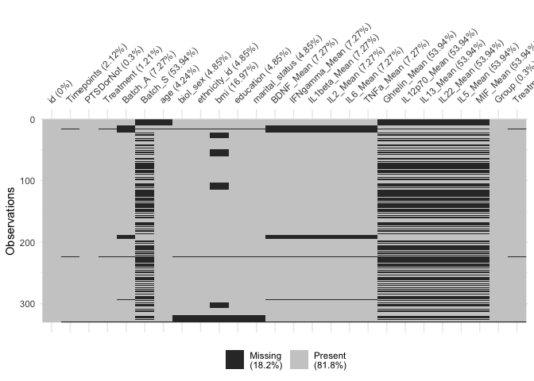<!-- -->

## Distribution plots for the biomarkers

``` r
histbio_sep=function(biom,data,col1,col2){
  dat=NULL
  for (j in na.omit(unique(data[[col1]]))){
    for (h in na.omit(unique(data[[col2]]))){
      gpname=paste0(j,h)      
      gp=data.frame(subset(data,(data[[col1]]==j&data[[col2]]==h))[[biom]],gpname=paste0(j,h))
      colnames(gp)=c('biom','gpname')
      #assign(gpname,gp)
      dat=rbind(dat,gp)
    }
  }
  #allname=apply(expand.grid(c('PTSD','non-PTSD'), c('active','sham')), 1, function(x) paste0(x[1], x[2])) 
  
  #aa=mget(allname)
  #aaa=do.call(qpcR:::cbind.na,aa)
  #pdf(paste0('group_hist_',biom,'.pdf'))
  library(ggplot2)
  par(mfrow=c(3,4))
  print(ggplot(dat, aes(biom,fill=gpname)) + 
          geom_histogram(alpha = 0.5, position = 'identity')+ggtitle(paste0('Histogram of ',biom)))
  #dev.off()
  
}


for( i in biom){
  histbio_sep(i,dat1,col1 = 'Group',col2='Treatment_new')
}
```

    ## `stat_bin()` using `bins = 30`. Pick better value with `binwidth`.

    ## Warning: Removed 20 rows containing non-finite values (stat_bin).

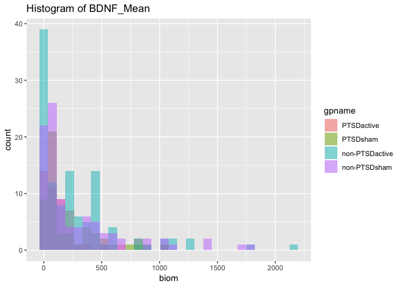<!-- -->

    ## `stat_bin()` using `bins = 30`. Pick better value with `binwidth`.

    ## Warning: Removed 20 rows containing non-finite values (stat_bin).

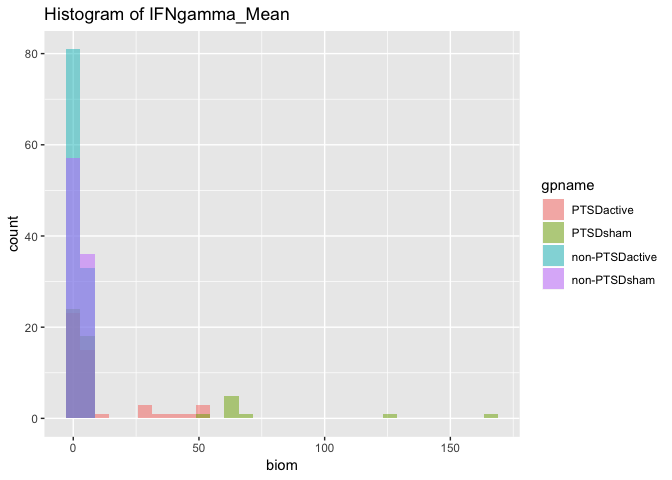<!-- -->

    ## `stat_bin()` using `bins = 30`. Pick better value with `binwidth`.

    ## Warning: Removed 20 rows containing non-finite values (stat_bin).

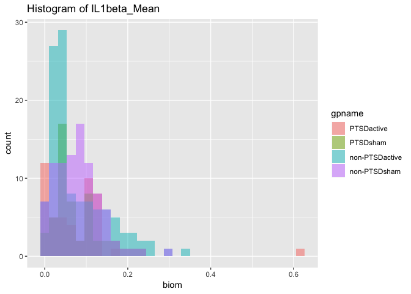<!-- -->

    ## `stat_bin()` using `bins = 30`. Pick better value with `binwidth`.

    ## Warning: Removed 20 rows containing non-finite values (stat_bin).

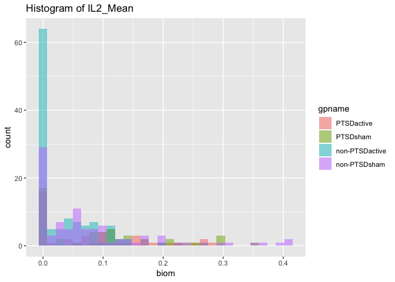<!-- -->

    ## `stat_bin()` using `bins = 30`. Pick better value with `binwidth`.

    ## Warning: Removed 20 rows containing non-finite values (stat_bin).

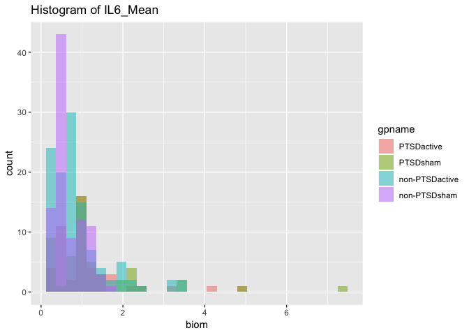<!-- -->

    ## `stat_bin()` using `bins = 30`. Pick better value with `binwidth`.

    ## Warning: Removed 20 rows containing non-finite values (stat_bin).

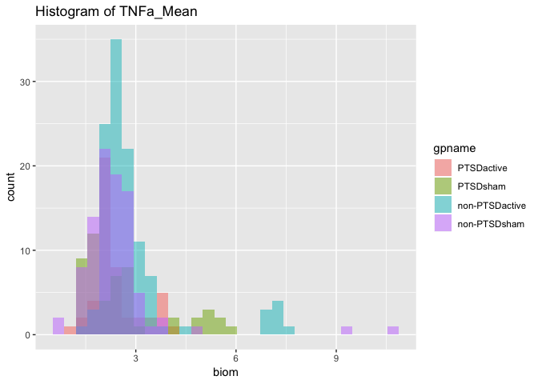<!-- -->

    ## `stat_bin()` using `bins = 30`. Pick better value with `binwidth`.

    ## Warning: Removed 174 rows containing non-finite values (stat_bin).

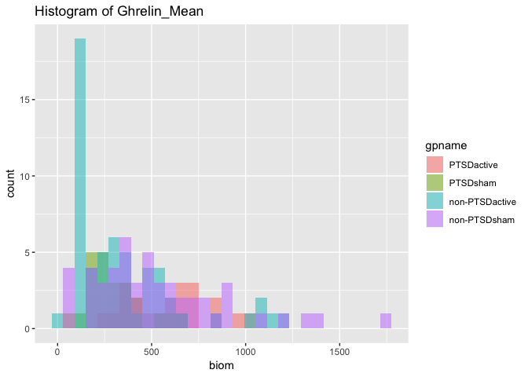<!-- -->

    ## `stat_bin()` using `bins = 30`. Pick better value with `binwidth`.

    ## Warning: Removed 174 rows containing non-finite values (stat_bin).

<!-- -->

    ## `stat_bin()` using `bins = 30`. Pick better value with `binwidth`.

    ## Warning: Removed 174 rows containing non-finite values (stat_bin).

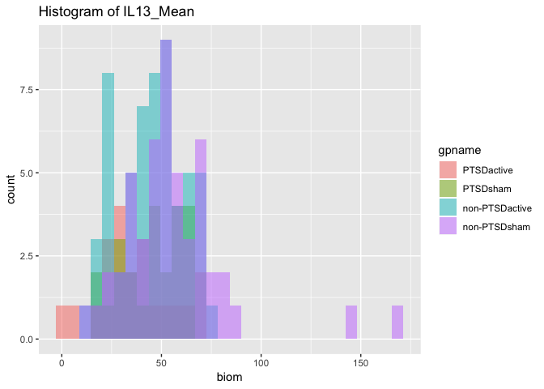<!-- -->

    ## `stat_bin()` using `bins = 30`. Pick better value with `binwidth`.

    ## Warning: Removed 174 rows containing non-finite values (stat_bin).

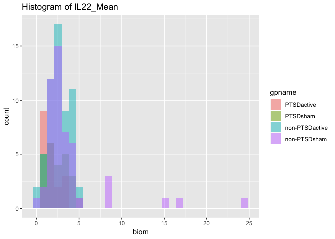<!-- -->

    ## `stat_bin()` using `bins = 30`. Pick better value with `binwidth`.

    ## Warning: Removed 174 rows containing non-finite values (stat_bin).

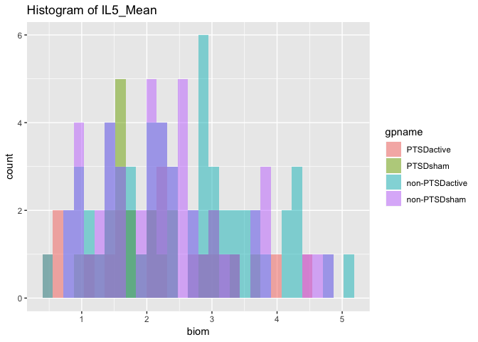<!-- -->

    ## `stat_bin()` using `bins = 30`. Pick better value with `binwidth`.

    ## Warning: Removed 174 rows containing non-finite values (stat_bin).

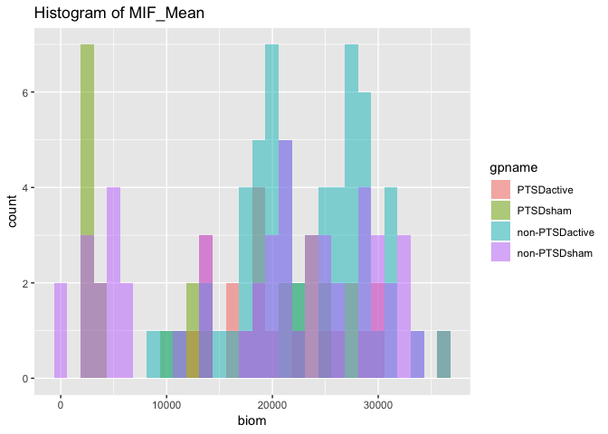<!-- -->

## The Frequency table group by ID

``` r
#how many id have 1,2... obs 
dat1%>% group_by(`id`)%>% summarise(Freq=n())%>%arrange(Freq)%>% group_by(Freq)%>% summarise(number_id=n())
```

    ## # A tibble: 7 x 2
    ##    Freq number_id
    ##   <int>     <int>
    ## 1     1         7
    ## 2     5         2
    ## 3     6         1
    ## 4     8         1
    ## 5     9         6
    ## 6    10         8
    ## 7    11        15

``` r
# the obs for each subject
dat1%>% group_by(`id`)%>% summarise(Obs=n())%>%arrange(Obs)
```

    ## # A tibble: 40 x 2
    ##       id   Obs
    ##    <int> <int>
    ##  1   103     1
    ##  2   112     1
    ##  3   115     1
    ##  4   127     1
    ##  5   136     1
    ##  6   139     1
    ##  7   140     1
    ##  8   102     5
    ##  9   104     5
    ## 10   123     6
    ## # … with 30 more rows

## Create Regression Model

### Model 1

### Model 1 Paremeter estimates :regress on treatment,group(PTSD),trauma,baseline biomarker+random subject intercept

``` r
library(sjPlot)

tab_model(fitvec,dv.labels=names(fitvec),show.se = TRUE)
```

<table style="border-collapse:collapse; border:none;">

<tr>

<th style="border-top: double; text-align:center; font-style:normal; font-weight:bold; padding:0.2cm;  text-align:left; ">

 

</th>

<th colspan="4" style="border-top: double; text-align:center; font-style:normal; font-weight:bold; padding:0.2cm; ">

BDNF\_Mean

</th>

<th colspan="4" style="border-top: double; text-align:center; font-style:normal; font-weight:bold; padding:0.2cm; ">

IFNgamma\_Mean

</th>

<th colspan="4" style="border-top: double; text-align:center; font-style:normal; font-weight:bold; padding:0.2cm; ">

IL1beta\_Mean

</th>

<th colspan="4" style="border-top: double; text-align:center; font-style:normal; font-weight:bold; padding:0.2cm; ">

IL2\_Mean

</th>

<th colspan="4" style="border-top: double; text-align:center; font-style:normal; font-weight:bold; padding:0.2cm; ">

IL6\_Mean

</th>

<th colspan="4" style="border-top: double; text-align:center; font-style:normal; font-weight:bold; padding:0.2cm; ">

TNFa\_Mean

</th>

<th colspan="4" style="border-top: double; text-align:center; font-style:normal; font-weight:bold; padding:0.2cm; ">

Ghrelin\_Mean

</th>

<th colspan="4" style="border-top: double; text-align:center; font-style:normal; font-weight:bold; padding:0.2cm; ">

IL12p70\_Mean

</th>

<th colspan="4" style="border-top: double; text-align:center; font-style:normal; font-weight:bold; padding:0.2cm; ">

IL13\_Mean

</th>

<th colspan="4" style="border-top: double; text-align:center; font-style:normal; font-weight:bold; padding:0.2cm; ">

IL22\_Mean

</th>

<th colspan="4" style="border-top: double; text-align:center; font-style:normal; font-weight:bold; padding:0.2cm; ">

IL5\_Mean

</th>

<th colspan="4" style="border-top: double; text-align:center; font-style:normal; font-weight:bold; padding:0.2cm; ">

MIF\_Mean

</th>

</tr>

<tr>

<td style=" text-align:center; border-bottom:1px solid; font-style:italic; font-weight:normal;  text-align:left; ">

Predictors

</td>

<td style=" text-align:center; border-bottom:1px solid; font-style:italic; font-weight:normal;  ">

Estimates

</td>

<td style=" text-align:center; border-bottom:1px solid; font-style:italic; font-weight:normal;  ">

std.
Error

</td>

<td style=" text-align:center; border-bottom:1px solid; font-style:italic; font-weight:normal;  ">

CI

</td>

<td style=" text-align:center; border-bottom:1px solid; font-style:italic; font-weight:normal;  ">

p

</td>

<td style=" text-align:center; border-bottom:1px solid; font-style:italic; font-weight:normal;  ">

Estimates

</td>

<td style=" text-align:center; border-bottom:1px solid; font-style:italic; font-weight:normal;  col7">

std.
Error

</td>

<td style=" text-align:center; border-bottom:1px solid; font-style:italic; font-weight:normal;  col8">

CI

</td>

<td style=" text-align:center; border-bottom:1px solid; font-style:italic; font-weight:normal;  col9">

p

</td>

<td style=" text-align:center; border-bottom:1px solid; font-style:italic; font-weight:normal;  0">

Estimates

</td>

<td style=" text-align:center; border-bottom:1px solid; font-style:italic; font-weight:normal;  1">

std.
Error

</td>

<td style=" text-align:center; border-bottom:1px solid; font-style:italic; font-weight:normal;  2">

CI

</td>

<td style=" text-align:center; border-bottom:1px solid; font-style:italic; font-weight:normal;  3">

p

</td>

<td style=" text-align:center; border-bottom:1px solid; font-style:italic; font-weight:normal;  4">

Estimates

</td>

<td style=" text-align:center; border-bottom:1px solid; font-style:italic; font-weight:normal;  5">

std.
Error

</td>

<td style=" text-align:center; border-bottom:1px solid; font-style:italic; font-weight:normal;  6">

CI

</td>

<td style=" text-align:center; border-bottom:1px solid; font-style:italic; font-weight:normal;  7">

p

</td>

<td style=" text-align:center; border-bottom:1px solid; font-style:italic; font-weight:normal;  8">

Estimates

</td>

<td style=" text-align:center; border-bottom:1px solid; font-style:italic; font-weight:normal;  9">

std.
Error

</td>

<td style=" text-align:center; border-bottom:1px solid; font-style:italic; font-weight:normal;  0">

CI

</td>

<td style=" text-align:center; border-bottom:1px solid; font-style:italic; font-weight:normal;  1">

p

</td>

<td style=" text-align:center; border-bottom:1px solid; font-style:italic; font-weight:normal;  2">

Estimates

</td>

<td style=" text-align:center; border-bottom:1px solid; font-style:italic; font-weight:normal;  3">

std.
Error

</td>

<td style=" text-align:center; border-bottom:1px solid; font-style:italic; font-weight:normal;  4">

CI

</td>

<td style=" text-align:center; border-bottom:1px solid; font-style:italic; font-weight:normal;  5">

p

</td>

<td style=" text-align:center; border-bottom:1px solid; font-style:italic; font-weight:normal;  6">

Estimates

</td>

<td style=" text-align:center; border-bottom:1px solid; font-style:italic; font-weight:normal;  7">

std.
Error

</td>

<td style=" text-align:center; border-bottom:1px solid; font-style:italic; font-weight:normal;  8">

CI

</td>

<td style=" text-align:center; border-bottom:1px solid; font-style:italic; font-weight:normal;  9">

p

</td>

<td style=" text-align:center; border-bottom:1px solid; font-style:italic; font-weight:normal;  0">

Estimates

</td>

<td style=" text-align:center; border-bottom:1px solid; font-style:italic; font-weight:normal;  1">

std.
Error

</td>

<td style=" text-align:center; border-bottom:1px solid; font-style:italic; font-weight:normal;  2">

CI

</td>

<td style=" text-align:center; border-bottom:1px solid; font-style:italic; font-weight:normal;  3">

p

</td>

<td style=" text-align:center; border-bottom:1px solid; font-style:italic; font-weight:normal;  4">

Estimates

</td>

<td style=" text-align:center; border-bottom:1px solid; font-style:italic; font-weight:normal;  5">

std.
Error

</td>

<td style=" text-align:center; border-bottom:1px solid; font-style:italic; font-weight:normal;  6">

CI

</td>

<td style=" text-align:center; border-bottom:1px solid; font-style:italic; font-weight:normal;  7">

p

</td>

<td style=" text-align:center; border-bottom:1px solid; font-style:italic; font-weight:normal;  8">

Estimates

</td>

<td style=" text-align:center; border-bottom:1px solid; font-style:italic; font-weight:normal;  9">

std.
Error

</td>

<td style=" text-align:center; border-bottom:1px solid; font-style:italic; font-weight:normal;  0">

CI

</td>

<td style=" text-align:center; border-bottom:1px solid; font-style:italic; font-weight:normal;  1">

p

</td>

<td style=" text-align:center; border-bottom:1px solid; font-style:italic; font-weight:normal;  2">

Estimates

</td>

<td style=" text-align:center; border-bottom:1px solid; font-style:italic; font-weight:normal;  3">

std.
Error

</td>

<td style=" text-align:center; border-bottom:1px solid; font-style:italic; font-weight:normal;  4">

CI

</td>

<td style=" text-align:center; border-bottom:1px solid; font-style:italic; font-weight:normal;  5">

p

</td>

<td style=" text-align:center; border-bottom:1px solid; font-style:italic; font-weight:normal;  6">

Estimates

</td>

<td style=" text-align:center; border-bottom:1px solid; font-style:italic; font-weight:normal;  7">

std.
Error

</td>

<td style=" text-align:center; border-bottom:1px solid; font-style:italic; font-weight:normal;  8">

CI

</td>

<td style=" text-align:center; border-bottom:1px solid; font-style:italic; font-weight:normal;  9">

p

</td>

</tr>

<tr>

<td style=" padding:0.2cm; text-align:left; vertical-align:top; text-align:left; ">

(Intercept)

</td>

<td style=" padding:0.2cm; text-align:left; vertical-align:top; text-align:center;  ">

285.84

</td>

<td style=" padding:0.2cm; text-align:left; vertical-align:top; text-align:center;  ">

131.97

</td>

<td style=" padding:0.2cm; text-align:left; vertical-align:top; text-align:center;  ">

27.18 – 544.50

</td>

<td style=" padding:0.2cm; text-align:left; vertical-align:top; text-align:center;  ">

<strong>0.042</strong>

</td>

<td style=" padding:0.2cm; text-align:left; vertical-align:top; text-align:center;  ">

14.06

</td>

<td style=" padding:0.2cm; text-align:left; vertical-align:top; text-align:center;  col7">

10.75

</td>

<td style=" padding:0.2cm; text-align:left; vertical-align:top; text-align:center;  col8">

\-7.01 – 35.14

</td>

<td style=" padding:0.2cm; text-align:left; vertical-align:top; text-align:center;  col9">

0.205

</td>

<td style=" padding:0.2cm; text-align:left; vertical-align:top; text-align:center;  0">

0.07

</td>

<td style=" padding:0.2cm; text-align:left; vertical-align:top; text-align:center;  1">

0.04

</td>

<td style=" padding:0.2cm; text-align:left; vertical-align:top; text-align:center;  2">

0.00 – 0.14

</td>

<td style=" padding:0.2cm; text-align:left; vertical-align:top; text-align:center;  3">

0.056

</td>

<td style=" padding:0.2cm; text-align:left; vertical-align:top; text-align:center;  4">

\-0.01

</td>

<td style=" padding:0.2cm; text-align:left; vertical-align:top; text-align:center;  5">

0.03

</td>

<td style=" padding:0.2cm; text-align:left; vertical-align:top; text-align:center;  6">

\-0.06 – 0.04

</td>

<td style=" padding:0.2cm; text-align:left; vertical-align:top; text-align:center;  7">

0.700

</td>

<td style=" padding:0.2cm; text-align:left; vertical-align:top; text-align:center;  8">

0.10

</td>

<td style=" padding:0.2cm; text-align:left; vertical-align:top; text-align:center;  9">

0.22

</td>

<td style=" padding:0.2cm; text-align:left; vertical-align:top; text-align:center;  0">

\-0.33 – 0.53

</td>

<td style=" padding:0.2cm; text-align:left; vertical-align:top; text-align:center;  1">

0.650

</td>

<td style=" padding:0.2cm; text-align:left; vertical-align:top; text-align:center;  2">

0.16

</td>

<td style=" padding:0.2cm; text-align:left; vertical-align:top; text-align:center;  3">

0.38

</td>

<td style=" padding:0.2cm; text-align:left; vertical-align:top; text-align:center;  4">

\-0.59 – 0.91

</td>

<td style=" padding:0.2cm; text-align:left; vertical-align:top; text-align:center;  5">

0.681

</td>

<td style=" padding:0.2cm; text-align:left; vertical-align:top; text-align:center;  6">

92.01

</td>

<td style=" padding:0.2cm; text-align:left; vertical-align:top; text-align:center;  7">

100.99

</td>

<td style=" padding:0.2cm; text-align:left; vertical-align:top; text-align:center;  8">

\-105.93 – 289.95

</td>

<td style=" padding:0.2cm; text-align:left; vertical-align:top; text-align:center;  9">

0.374

</td>

<td style=" padding:0.2cm; text-align:left; vertical-align:top; text-align:center; modelcolumn8 0">

1.13

</td>

<td style=" padding:0.2cm; text-align:left; vertical-align:top; text-align:center; modelcolumn8 1">

1.03

</td>

<td style=" padding:0.2cm; text-align:left; vertical-align:top; text-align:center; modelcolumn8 2">

\-0.89 – 3.15

</td>

<td style=" padding:0.2cm; text-align:left; vertical-align:top; text-align:center; modelcolumn8 3">

0.286

</td>

<td style=" padding:0.2cm; text-align:left; vertical-align:top; text-align:center; modelcolumn9 4">

8.01

</td>

<td style=" padding:0.2cm; text-align:left; vertical-align:top; text-align:center; modelcolumn9 5">

10.58

</td>

<td style=" padding:0.2cm; text-align:left; vertical-align:top; text-align:center; modelcolumn9 6">

\-12.73 – 28.75

</td>

<td style=" padding:0.2cm; text-align:left; vertical-align:top; text-align:center; modelcolumn9 7">

0.458

</td>

<td style=" padding:0.2cm; text-align:left; vertical-align:top; text-align:center; modelcolumn0 8">

1.17

</td>

<td style=" padding:0.2cm; text-align:left; vertical-align:top; text-align:center; modelcolumn0 9">

0.91

</td>

<td style=" padding:0.2cm; text-align:left; vertical-align:top; text-align:center; modelcolumn0 0">

\-0.61 – 2.95

</td>

<td style=" padding:0.2cm; text-align:left; vertical-align:top; text-align:center; modelcolumn0 1">

0.215

</td>

<td style=" padding:0.2cm; text-align:left; vertical-align:top; text-align:center;  2">

0.61

</td>

<td style=" padding:0.2cm; text-align:left; vertical-align:top; text-align:center;  3">

0.57

</td>

<td style=" padding:0.2cm; text-align:left; vertical-align:top; text-align:center;  4">

\-0.51 – 1.72

</td>

<td style=" padding:0.2cm; text-align:left; vertical-align:top; text-align:center;  5">

0.300

</td>

<td style=" padding:0.2cm; text-align:left; vertical-align:top; text-align:center;  6">

13252.37

</td>

<td style=" padding:0.2cm; text-align:left; vertical-align:top; text-align:center;  7">

4137.26

</td>

<td style=" padding:0.2cm; text-align:left; vertical-align:top; text-align:center;  8">

5143.49 – 21361.25

</td>

<td style=" padding:0.2cm; text-align:left; vertical-align:top; text-align:center;  9">

<strong>0.005</strong>

</td>

</tr>

<tr>

<td style=" padding:0.2cm; text-align:left; vertical-align:top; text-align:left; ">

age

</td>

<td style=" padding:0.2cm; text-align:left; vertical-align:top; text-align:center;  ">

0.85

</td>

<td style=" padding:0.2cm; text-align:left; vertical-align:top; text-align:center;  ">

3.18

</td>

<td style=" padding:0.2cm; text-align:left; vertical-align:top; text-align:center;  ">

\-5.37 – 7.08

</td>

<td style=" padding:0.2cm; text-align:left; vertical-align:top; text-align:center;  ">

0.791

</td>

<td style=" padding:0.2cm; text-align:left; vertical-align:top; text-align:center;  ">

\-0.30

</td>

<td style=" padding:0.2cm; text-align:left; vertical-align:top; text-align:center;  col7">

0.27

</td>

<td style=" padding:0.2cm; text-align:left; vertical-align:top; text-align:center;  col8">

\-0.83 – 0.22

</td>

<td style=" padding:0.2cm; text-align:left; vertical-align:top; text-align:center;  col9">

0.266

</td>

<td style=" padding:0.2cm; text-align:left; vertical-align:top; text-align:center;  0">

0.00

</td>

<td style=" padding:0.2cm; text-align:left; vertical-align:top; text-align:center;  1">

0.00

</td>

<td style=" padding:0.2cm; text-align:left; vertical-align:top; text-align:center;  2">

\-0.00 – 0.00

</td>

<td style=" padding:0.2cm; text-align:left; vertical-align:top; text-align:center;  3">

0.728

</td>

<td style=" padding:0.2cm; text-align:left; vertical-align:top; text-align:center;  4">

0.00

</td>

<td style=" padding:0.2cm; text-align:left; vertical-align:top; text-align:center;  5">

0.00

</td>

<td style=" padding:0.2cm; text-align:left; vertical-align:top; text-align:center;  6">

\-0.00 – 0.00

</td>

<td style=" padding:0.2cm; text-align:left; vertical-align:top; text-align:center;  7">

0.108

</td>

<td style=" padding:0.2cm; text-align:left; vertical-align:top; text-align:center;  8">

0.00

</td>

<td style=" padding:0.2cm; text-align:left; vertical-align:top; text-align:center;  9">

0.01

</td>

<td style=" padding:0.2cm; text-align:left; vertical-align:top; text-align:center;  0">

\-0.01 – 0.01

</td>

<td style=" padding:0.2cm; text-align:left; vertical-align:top; text-align:center;  1">

0.362

</td>

<td style=" padding:0.2cm; text-align:left; vertical-align:top; text-align:center;  2">

0.00

</td>

<td style=" padding:0.2cm; text-align:left; vertical-align:top; text-align:center;  3">

0.01

</td>

<td style=" padding:0.2cm; text-align:left; vertical-align:top; text-align:center;  4">

\-0.01 – 0.02

</td>

<td style=" padding:0.2cm; text-align:left; vertical-align:top; text-align:center;  5">

0.558

</td>

<td style=" padding:0.2cm; text-align:left; vertical-align:top; text-align:center;  6">

\-0.94

</td>

<td style=" padding:0.2cm; text-align:left; vertical-align:top; text-align:center;  7">

2.95

</td>

<td style=" padding:0.2cm; text-align:left; vertical-align:top; text-align:center;  8">

\-6.72 – 4.85

</td>

<td style=" padding:0.2cm; text-align:left; vertical-align:top; text-align:center;  9">

0.755

</td>

<td style=" padding:0.2cm; text-align:left; vertical-align:top; text-align:center; modelcolumn8 0">

0.02

</td>

<td style=" padding:0.2cm; text-align:left; vertical-align:top; text-align:center; modelcolumn8 1">

0.02

</td>

<td style=" padding:0.2cm; text-align:left; vertical-align:top; text-align:center; modelcolumn8 2">

\-0.03 – 0.06

</td>

<td style=" padding:0.2cm; text-align:left; vertical-align:top; text-align:center; modelcolumn8 3">

0.477

</td>

<td style=" padding:0.2cm; text-align:left; vertical-align:top; text-align:center; modelcolumn9 4">

0.29

</td>

<td style=" padding:0.2cm; text-align:left; vertical-align:top; text-align:center; modelcolumn9 5">

0.23

</td>

<td style=" padding:0.2cm; text-align:left; vertical-align:top; text-align:center; modelcolumn9 6">

\-0.16 – 0.74

</td>

<td style=" padding:0.2cm; text-align:left; vertical-align:top; text-align:center; modelcolumn9 7">

0.225

</td>

<td style=" padding:0.2cm; text-align:left; vertical-align:top; text-align:center; modelcolumn0 8">

\-0.01

</td>

<td style=" padding:0.2cm; text-align:left; vertical-align:top; text-align:center; modelcolumn0 9">

0.03

</td>

<td style=" padding:0.2cm; text-align:left; vertical-align:top; text-align:center; modelcolumn0 0">

\-0.06 – 0.04

</td>

<td style=" padding:0.2cm; text-align:left; vertical-align:top; text-align:center; modelcolumn0 1">

0.670

</td>

<td style=" padding:0.2cm; text-align:left; vertical-align:top; text-align:center;  2">

0.01

</td>

<td style=" padding:0.2cm; text-align:left; vertical-align:top; text-align:center;  3">

0.01

</td>

<td style=" padding:0.2cm; text-align:left; vertical-align:top; text-align:center;  4">

\-0.02 – 0.03

</td>

<td style=" padding:0.2cm; text-align:left; vertical-align:top; text-align:center;  5">

0.667

</td>

<td style=" padding:0.2cm; text-align:left; vertical-align:top; text-align:center;  6">

\-237.90

</td>

<td style=" padding:0.2cm; text-align:left; vertical-align:top; text-align:center;  7">

88.93

</td>

<td style=" padding:0.2cm; text-align:left; vertical-align:top; text-align:center;  8">

\-412.20 – -63.60

</td>

<td style=" padding:0.2cm; text-align:left; vertical-align:top; text-align:center;  9">

<strong>0.015</strong>

</td>

</tr>

<tr>

<td style=" padding:0.2cm; text-align:left; vertical-align:top; text-align:left; ">

Male

</td>

<td style=" padding:0.2cm; text-align:left; vertical-align:top; text-align:center;  ">

\-78.17

</td>

<td style=" padding:0.2cm; text-align:left; vertical-align:top; text-align:center;  ">

67.01

</td>

<td style=" padding:0.2cm; text-align:left; vertical-align:top; text-align:center;  ">

\-209.50 – 53.16

</td>

<td style=" padding:0.2cm; text-align:left; vertical-align:top; text-align:center;  ">

0.256

</td>

<td style=" padding:0.2cm; text-align:left; vertical-align:top; text-align:center;  ">

\-6.90

</td>

<td style=" padding:0.2cm; text-align:left; vertical-align:top; text-align:center;  col7">

5.30

</td>

<td style=" padding:0.2cm; text-align:left; vertical-align:top; text-align:center;  col8">

\-17.29 – 3.48

</td>

<td style=" padding:0.2cm; text-align:left; vertical-align:top; text-align:center;  col9">

0.206

</td>

<td style=" padding:0.2cm; text-align:left; vertical-align:top; text-align:center;  0">

\-0.01

</td>

<td style=" padding:0.2cm; text-align:left; vertical-align:top; text-align:center;  1">

0.02

</td>

<td style=" padding:0.2cm; text-align:left; vertical-align:top; text-align:center;  2">

\-0.04 – 0.03

</td>

<td style=" padding:0.2cm; text-align:left; vertical-align:top; text-align:center;  3">

0.671

</td>

<td style=" padding:0.2cm; text-align:left; vertical-align:top; text-align:center;  4">

\-0.01

</td>

<td style=" padding:0.2cm; text-align:left; vertical-align:top; text-align:center;  5">

0.01

</td>

<td style=" padding:0.2cm; text-align:left; vertical-align:top; text-align:center;  6">

\-0.04 – 0.02

</td>

<td style=" padding:0.2cm; text-align:left; vertical-align:top; text-align:center;  7">

0.402

</td>

<td style=" padding:0.2cm; text-align:left; vertical-align:top; text-align:center;  8">

\-0.14

</td>

<td style=" padding:0.2cm; text-align:left; vertical-align:top; text-align:center;  9">

0.10

</td>

<td style=" padding:0.2cm; text-align:left; vertical-align:top; text-align:center;  0">

\-0.34 – 0.06

</td>

<td style=" padding:0.2cm; text-align:left; vertical-align:top; text-align:center;  1">

0.173

</td>

<td style=" padding:0.2cm; text-align:left; vertical-align:top; text-align:center;  2">

0.03

</td>

<td style=" padding:0.2cm; text-align:left; vertical-align:top; text-align:center;  3">

0.18

</td>

<td style=" padding:0.2cm; text-align:left; vertical-align:top; text-align:center;  4">

\-0.31 – 0.38

</td>

<td style=" padding:0.2cm; text-align:left; vertical-align:top; text-align:center;  5">

0.859

</td>

<td style=" padding:0.2cm; text-align:left; vertical-align:top; text-align:center;  6">

32.41

</td>

<td style=" padding:0.2cm; text-align:left; vertical-align:top; text-align:center;  7">

55.48

</td>

<td style=" padding:0.2cm; text-align:left; vertical-align:top; text-align:center;  8">

\-76.32 – 141.14

</td>

<td style=" padding:0.2cm; text-align:left; vertical-align:top; text-align:center;  9">

0.566

</td>

<td style=" padding:0.2cm; text-align:left; vertical-align:top; text-align:center; modelcolumn8 0">

1.44

</td>

<td style=" padding:0.2cm; text-align:left; vertical-align:top; text-align:center; modelcolumn8 1">

0.47

</td>

<td style=" padding:0.2cm; text-align:left; vertical-align:top; text-align:center; modelcolumn8 2">

0.53 – 2.36

</td>

<td style=" padding:0.2cm; text-align:left; vertical-align:top; text-align:center; modelcolumn8 3">

<strong>0.006</strong>

</td>

<td style=" padding:0.2cm; text-align:left; vertical-align:top; text-align:center; modelcolumn9 4">

13.34

</td>

<td style=" padding:0.2cm; text-align:left; vertical-align:top; text-align:center; modelcolumn9 5">

4.92

</td>

<td style=" padding:0.2cm; text-align:left; vertical-align:top; text-align:center; modelcolumn9 6">

3.71 – 22.98

</td>

<td style=" padding:0.2cm; text-align:left; vertical-align:top; text-align:center; modelcolumn9 7">

<strong>0.014</strong>

</td>

<td style=" padding:0.2cm; text-align:left; vertical-align:top; text-align:center; modelcolumn0 8">

0.54

</td>

<td style=" padding:0.2cm; text-align:left; vertical-align:top; text-align:center; modelcolumn0 9">

0.50

</td>

<td style=" padding:0.2cm; text-align:left; vertical-align:top; text-align:center; modelcolumn0 0">

\-0.43 – 1.51

</td>

<td style=" padding:0.2cm; text-align:left; vertical-align:top; text-align:center; modelcolumn0 1">

0.290

</td>

<td style=" padding:0.2cm; text-align:left; vertical-align:top; text-align:center;  2">

0.75

</td>

<td style=" padding:0.2cm; text-align:left; vertical-align:top; text-align:center;  3">

0.26

</td>

<td style=" padding:0.2cm; text-align:left; vertical-align:top; text-align:center;  4">

0.23 – 1.26

</td>

<td style=" padding:0.2cm; text-align:left; vertical-align:top; text-align:center;  5">

<strong>0.010</strong>

</td>

<td style=" padding:0.2cm; text-align:left; vertical-align:top; text-align:center;  6">

\-658.62

</td>

<td style=" padding:0.2cm; text-align:left; vertical-align:top; text-align:center;  7">

1927.90

</td>

<td style=" padding:0.2cm; text-align:left; vertical-align:top; text-align:center;  8">

\-4437.25 – 3120.00

</td>

<td style=" padding:0.2cm; text-align:left; vertical-align:top; text-align:center;  9">

0.736

</td>

</tr>

<tr>

<td style=" padding:0.2cm; text-align:left; vertical-align:top; text-align:left; ">

Treatment

</td>

<td style=" padding:0.2cm; text-align:left; vertical-align:top; text-align:center;  ">

\-14.00

</td>

<td style=" padding:0.2cm; text-align:left; vertical-align:top; text-align:center;  ">

71.13

</td>

<td style=" padding:0.2cm; text-align:left; vertical-align:top; text-align:center;  ">

\-153.42 – 125.42

</td>

<td style=" padding:0.2cm; text-align:left; vertical-align:top; text-align:center;  ">

0.846

</td>

<td style=" padding:0.2cm; text-align:left; vertical-align:top; text-align:center;  ">

\-0.68

</td>

<td style=" padding:0.2cm; text-align:left; vertical-align:top; text-align:center;  col7">

5.88

</td>

<td style=" padding:0.2cm; text-align:left; vertical-align:top; text-align:center;  col8">

\-12.20 – 10.84

</td>

<td style=" padding:0.2cm; text-align:left; vertical-align:top; text-align:center;  col9">

0.909

</td>

<td style=" padding:0.2cm; text-align:left; vertical-align:top; text-align:center;  0">

0.00

</td>

<td style=" padding:0.2cm; text-align:left; vertical-align:top; text-align:center;  1">

0.02

</td>

<td style=" padding:0.2cm; text-align:left; vertical-align:top; text-align:center;  2">

\-0.03 – 0.04

</td>

<td style=" padding:0.2cm; text-align:left; vertical-align:top; text-align:center;  3">

0.823

</td>

<td style=" padding:0.2cm; text-align:left; vertical-align:top; text-align:center;  4">

\-0.01

</td>

<td style=" padding:0.2cm; text-align:left; vertical-align:top; text-align:center;  5">

0.02

</td>

<td style=" padding:0.2cm; text-align:left; vertical-align:top; text-align:center;  6">

\-0.04 – 0.02

</td>

<td style=" padding:0.2cm; text-align:left; vertical-align:top; text-align:center;  7">

0.683

</td>

<td style=" padding:0.2cm; text-align:left; vertical-align:top; text-align:center;  8">

0.13

</td>

<td style=" padding:0.2cm; text-align:left; vertical-align:top; text-align:center;  9">

0.11

</td>

<td style=" padding:0.2cm; text-align:left; vertical-align:top; text-align:center;  0">

\-0.09 – 0.35

</td>

<td style=" padding:0.2cm; text-align:left; vertical-align:top; text-align:center;  1">

0.256

</td>

<td style=" padding:0.2cm; text-align:left; vertical-align:top; text-align:center;  2">

\-0.15

</td>

<td style=" padding:0.2cm; text-align:left; vertical-align:top; text-align:center;  3">

0.18

</td>

<td style=" padding:0.2cm; text-align:left; vertical-align:top; text-align:center;  4">

\-0.51 – 0.21

</td>

<td style=" padding:0.2cm; text-align:left; vertical-align:top; text-align:center;  5">

0.416

</td>

<td style=" padding:0.2cm; text-align:left; vertical-align:top; text-align:center;  6">

\-36.00

</td>

<td style=" padding:0.2cm; text-align:left; vertical-align:top; text-align:center;  7">

60.86

</td>

<td style=" padding:0.2cm; text-align:left; vertical-align:top; text-align:center;  8">

\-155.29 – 83.29

</td>

<td style=" padding:0.2cm; text-align:left; vertical-align:top; text-align:center;  9">

0.561

</td>

<td style=" padding:0.2cm; text-align:left; vertical-align:top; text-align:center; modelcolumn8 0">

\-0.21

</td>

<td style=" padding:0.2cm; text-align:left; vertical-align:top; text-align:center; modelcolumn8 1">

0.56

</td>

<td style=" padding:0.2cm; text-align:left; vertical-align:top; text-align:center; modelcolumn8 2">

\-1.31 – 0.88

</td>

<td style=" padding:0.2cm; text-align:left; vertical-align:top; text-align:center; modelcolumn8 3">

0.707

</td>

<td style=" padding:0.2cm; text-align:left; vertical-align:top; text-align:center; modelcolumn9 4">

2.45

</td>

<td style=" padding:0.2cm; text-align:left; vertical-align:top; text-align:center; modelcolumn9 5">

5.75

</td>

<td style=" padding:0.2cm; text-align:left; vertical-align:top; text-align:center; modelcolumn9 6">

\-8.83 – 13.73

</td>

<td style=" padding:0.2cm; text-align:left; vertical-align:top; text-align:center; modelcolumn9 7">

0.675

</td>

<td style=" padding:0.2cm; text-align:left; vertical-align:top; text-align:center; modelcolumn0 8">

\-0.14

</td>

<td style=" padding:0.2cm; text-align:left; vertical-align:top; text-align:center; modelcolumn0 9">

0.55

</td>

<td style=" padding:0.2cm; text-align:left; vertical-align:top; text-align:center; modelcolumn0 0">

\-1.22 – 0.94

</td>

<td style=" padding:0.2cm; text-align:left; vertical-align:top; text-align:center; modelcolumn0 1">

0.804

</td>

<td style=" padding:0.2cm; text-align:left; vertical-align:top; text-align:center;  2">

0.18

</td>

<td style=" padding:0.2cm; text-align:left; vertical-align:top; text-align:center;  3">

0.28

</td>

<td style=" padding:0.2cm; text-align:left; vertical-align:top; text-align:center;  4">

\-0.37 – 0.73

</td>

<td style=" padding:0.2cm; text-align:left; vertical-align:top; text-align:center;  5">

0.536

</td>

<td style=" padding:0.2cm; text-align:left; vertical-align:top; text-align:center;  6">

99.59

</td>

<td style=" padding:0.2cm; text-align:left; vertical-align:top; text-align:center;  7">

2116.73

</td>

<td style=" padding:0.2cm; text-align:left; vertical-align:top; text-align:center;  8">

\-4049.12 – 4248.29

</td>

<td style=" padding:0.2cm; text-align:left; vertical-align:top; text-align:center;  9">

0.963

</td>

</tr>

<tr>

<td style=" padding:0.2cm; text-align:left; vertical-align:top; text-align:left; ">

Trauma

</td>

<td style=" padding:0.2cm; text-align:left; vertical-align:top; text-align:center;  ">

\-161.50

</td>

<td style=" padding:0.2cm; text-align:left; vertical-align:top; text-align:center;  ">

40.84

</td>

<td style=" padding:0.2cm; text-align:left; vertical-align:top; text-align:center;  ">

\-241.53 – -81.46

</td>

<td style=" padding:0.2cm; text-align:left; vertical-align:top; text-align:center;  ">

<strong>\<0.001

</td>

<td style=" padding:0.2cm; text-align:left; vertical-align:top; text-align:center;  ">

1.47

</td>

<td style=" padding:0.2cm; text-align:left; vertical-align:top; text-align:center;  col7">

1.21

</td>

<td style=" padding:0.2cm; text-align:left; vertical-align:top; text-align:center;  col8">

\-0.91 – 3.85

</td>

<td style=" padding:0.2cm; text-align:left; vertical-align:top; text-align:center;  col9">

0.228

</td>

<td style=" padding:0.2cm; text-align:left; vertical-align:top; text-align:center;  0">

\-0.02

</td>

<td style=" padding:0.2cm; text-align:left; vertical-align:top; text-align:center;  1">

0.01

</td>

<td style=" padding:0.2cm; text-align:left; vertical-align:top; text-align:center;  2">

\-0.04 – -0.01

</td>

<td style=" padding:0.2cm; text-align:left; vertical-align:top; text-align:center;  3">

<strong>0.001</strong>

</td>

<td style=" padding:0.2cm; text-align:left; vertical-align:top; text-align:center;  4">

0.00

</td>

<td style=" padding:0.2cm; text-align:left; vertical-align:top; text-align:center;  5">

0.01

</td>

<td style=" padding:0.2cm; text-align:left; vertical-align:top; text-align:center;  6">

\-0.01 – 0.01

</td>

<td style=" padding:0.2cm; text-align:left; vertical-align:top; text-align:center;  7">

0.755

</td>

<td style=" padding:0.2cm; text-align:left; vertical-align:top; text-align:center;  8">

0.04

</td>

<td style=" padding:0.2cm; text-align:left; vertical-align:top; text-align:center;  9">

0.07

</td>

<td style=" padding:0.2cm; text-align:left; vertical-align:top; text-align:center;  0">

\-0.10 – 0.18

</td>

<td style=" padding:0.2cm; text-align:left; vertical-align:top; text-align:center;  1">

0.618

</td>

<td style=" padding:0.2cm; text-align:left; vertical-align:top; text-align:center;  2">

\-0.17

</td>

<td style=" padding:0.2cm; text-align:left; vertical-align:top; text-align:center;  3">

0.09

</td>

<td style=" padding:0.2cm; text-align:left; vertical-align:top; text-align:center;  4">

\-0.35 – 0.02

</td>

<td style=" padding:0.2cm; text-align:left; vertical-align:top; text-align:center;  5">

0.075

</td>

<td style=" padding:0.2cm; text-align:left; vertical-align:top; text-align:center;  6">

\-95.62

</td>

<td style=" padding:0.2cm; text-align:left; vertical-align:top; text-align:center;  7">

33.04

</td>

<td style=" padding:0.2cm; text-align:left; vertical-align:top; text-align:center;  8">

\-160.38 – -30.85

</td>

<td style=" padding:0.2cm; text-align:left; vertical-align:top; text-align:center;  9">

<strong>0.005</strong>

</td>

<td style=" padding:0.2cm; text-align:left; vertical-align:top; text-align:center; modelcolumn8 0">

\-0.94

</td>

<td style=" padding:0.2cm; text-align:left; vertical-align:top; text-align:center; modelcolumn8 1">

0.29

</td>

<td style=" padding:0.2cm; text-align:left; vertical-align:top; text-align:center; modelcolumn8 2">

\-1.52 – -0.36

</td>

<td style=" padding:0.2cm; text-align:left; vertical-align:top; text-align:center; modelcolumn8 3">

<strong>0.002</strong>

</td>

<td style=" padding:0.2cm; text-align:left; vertical-align:top; text-align:center; modelcolumn9 4">

\-9.06

</td>

<td style=" padding:0.2cm; text-align:left; vertical-align:top; text-align:center; modelcolumn9 5">

3.69

</td>

<td style=" padding:0.2cm; text-align:left; vertical-align:top; text-align:center; modelcolumn9 6">

\-16.30 – -1.82

</td>

<td style=" padding:0.2cm; text-align:left; vertical-align:top; text-align:center; modelcolumn9 7">

<strong>0.016</strong>

</td>

<td style=" padding:0.2cm; text-align:left; vertical-align:top; text-align:center; modelcolumn0 8">

0.17

</td>

<td style=" padding:0.2cm; text-align:left; vertical-align:top; text-align:center; modelcolumn0 9">

0.49

</td>

<td style=" padding:0.2cm; text-align:left; vertical-align:top; text-align:center; modelcolumn0 0">

\-0.79 – 1.13

</td>

<td style=" padding:0.2cm; text-align:left; vertical-align:top; text-align:center; modelcolumn0 1">

0.725

</td>

<td style=" padding:0.2cm; text-align:left; vertical-align:top; text-align:center;  2">

\-0.57

</td>

<td style=" padding:0.2cm; text-align:left; vertical-align:top; text-align:center;  3">

0.16

</td>

<td style=" padding:0.2cm; text-align:left; vertical-align:top; text-align:center;  4">

\-0.88 – -0.25

</td>

<td style=" padding:0.2cm; text-align:left; vertical-align:top; text-align:center;  5">

<strong>0.001</strong>

</td>

<td style=" padding:0.2cm; text-align:left; vertical-align:top; text-align:center;  6">

1082.32

</td>

<td style=" padding:0.2cm; text-align:left; vertical-align:top; text-align:center;  7">

1200.80

</td>

<td style=" padding:0.2cm; text-align:left; vertical-align:top; text-align:center;  8">

\-1271.19 – 3435.84

</td>

<td style=" padding:0.2cm; text-align:left; vertical-align:top; text-align:center;  9">

0.370

</td>

</tr>

<tr>

<td style=" padding:0.2cm; text-align:left; vertical-align:top; text-align:left; ">

PTS Dor Not
1

</td>

<td style=" padding:0.2cm; text-align:left; vertical-align:top; text-align:center;  ">

\-125.98

</td>

<td style=" padding:0.2cm; text-align:left; vertical-align:top; text-align:center;  ">

93.88

</td>

<td style=" padding:0.2cm; text-align:left; vertical-align:top; text-align:center;  ">

\-309.97 – 58.02

</td>

<td style=" padding:0.2cm; text-align:left; vertical-align:top; text-align:center;  ">

0.194

</td>

<td style=" padding:0.2cm; text-align:left; vertical-align:top; text-align:center;  ">

18.50

</td>

<td style=" padding:0.2cm; text-align:left; vertical-align:top; text-align:center;  col7">

7.71

</td>

<td style=" padding:0.2cm; text-align:left; vertical-align:top; text-align:center;  col8">

3.40 – 33.61

</td>

<td style=" padding:0.2cm; text-align:left; vertical-align:top; text-align:center;  col9">

<strong>0.026</strong>

</td>

<td style=" padding:0.2cm; text-align:left; vertical-align:top; text-align:center;  0">

\-0.02

</td>

<td style=" padding:0.2cm; text-align:left; vertical-align:top; text-align:center;  1">

0.03

</td>

<td style=" padding:0.2cm; text-align:left; vertical-align:top; text-align:center;  2">

\-0.08 – 0.03

</td>

<td style=" padding:0.2cm; text-align:left; vertical-align:top; text-align:center;  3">

0.345

</td>

<td style=" padding:0.2cm; text-align:left; vertical-align:top; text-align:center;  4">

0.01

</td>

<td style=" padding:0.2cm; text-align:left; vertical-align:top; text-align:center;  5">

0.02

</td>

<td style=" padding:0.2cm; text-align:left; vertical-align:top; text-align:center;  6">

\-0.03 – 0.05

</td>

<td style=" padding:0.2cm; text-align:left; vertical-align:top; text-align:center;  7">

0.560

</td>

<td style=" padding:0.2cm; text-align:left; vertical-align:top; text-align:center;  8">

0.27

</td>

<td style=" padding:0.2cm; text-align:left; vertical-align:top; text-align:center;  9">

0.15

</td>

<td style=" padding:0.2cm; text-align:left; vertical-align:top; text-align:center;  0">

\-0.02 – 0.55

</td>

<td style=" padding:0.2cm; text-align:left; vertical-align:top; text-align:center;  1">

0.086

</td>

<td style=" padding:0.2cm; text-align:left; vertical-align:top; text-align:center;  2">

\-0.16

</td>

<td style=" padding:0.2cm; text-align:left; vertical-align:top; text-align:center;  3">

0.24

</td>

<td style=" padding:0.2cm; text-align:left; vertical-align:top; text-align:center;  4">

\-0.62 – 0.31

</td>

<td style=" padding:0.2cm; text-align:left; vertical-align:top; text-align:center;  5">

0.524

</td>

<td style=" padding:0.2cm; text-align:left; vertical-align:top; text-align:center;  6">

36.71

</td>

<td style=" padding:0.2cm; text-align:left; vertical-align:top; text-align:center;  7">

87.82

</td>

<td style=" padding:0.2cm; text-align:left; vertical-align:top; text-align:center;  8">

\-135.42 – 208.85

</td>

<td style=" padding:0.2cm; text-align:left; vertical-align:top; text-align:center;  9">

0.681

</td>

<td style=" padding:0.2cm; text-align:left; vertical-align:top; text-align:center; modelcolumn8 0">

\-0.63

</td>

<td style=" padding:0.2cm; text-align:left; vertical-align:top; text-align:center; modelcolumn8 1">

0.72

</td>

<td style=" padding:0.2cm; text-align:left; vertical-align:top; text-align:center; modelcolumn8 2">

\-2.05 – 0.78

</td>

<td style=" padding:0.2cm; text-align:left; vertical-align:top; text-align:center; modelcolumn8 3">

0.392

</td>

<td style=" padding:0.2cm; text-align:left; vertical-align:top; text-align:center; modelcolumn9 4">

\-6.50

</td>

<td style=" padding:0.2cm; text-align:left; vertical-align:top; text-align:center; modelcolumn9 5">

7.60

</td>

<td style=" padding:0.2cm; text-align:left; vertical-align:top; text-align:center; modelcolumn9 6">

\-21.38 – 8.39

</td>

<td style=" padding:0.2cm; text-align:left; vertical-align:top; text-align:center; modelcolumn9 7">

0.403

</td>

<td style=" padding:0.2cm; text-align:left; vertical-align:top; text-align:center; modelcolumn0 8">

\-0.83

</td>

<td style=" padding:0.2cm; text-align:left; vertical-align:top; text-align:center; modelcolumn0 9">

0.76

</td>

<td style=" padding:0.2cm; text-align:left; vertical-align:top; text-align:center; modelcolumn0 0">

\-2.32 – 0.67

</td>

<td style=" padding:0.2cm; text-align:left; vertical-align:top; text-align:center; modelcolumn0 1">

0.293

</td>

<td style=" padding:0.2cm; text-align:left; vertical-align:top; text-align:center;  2">

\-0.51

</td>

<td style=" padding:0.2cm; text-align:left; vertical-align:top; text-align:center;  3">

0.40

</td>

<td style=" padding:0.2cm; text-align:left; vertical-align:top; text-align:center;  4">

\-1.29 – 0.27

</td>

<td style=" padding:0.2cm; text-align:left; vertical-align:top; text-align:center;  5">

0.218

</td>

<td style=" padding:0.2cm; text-align:left; vertical-align:top; text-align:center;  6">

199.83

</td>

<td style=" padding:0.2cm; text-align:left; vertical-align:top; text-align:center;  7">

3015.33

</td>

<td style=" padding:0.2cm; text-align:left; vertical-align:top; text-align:center;  8">

\-5710.11 – 6109.76

</td>

<td style=" padding:0.2cm; text-align:left; vertical-align:top; text-align:center;  9">

0.948

</td>

</tr>

<tr>

<td style=" padding:0.2cm; text-align:left; vertical-align:top; text-align:left; ">

new data\[\[var
baseline\]\]

</td>

<td style=" padding:0.2cm; text-align:left; vertical-align:top; text-align:center;  ">

0.25

</td>

<td style=" padding:0.2cm; text-align:left; vertical-align:top; text-align:center;  ">

0.10

</td>

<td style=" padding:0.2cm; text-align:left; vertical-align:top; text-align:center;  ">

0.05 – 0.44

</td>

<td style=" padding:0.2cm; text-align:left; vertical-align:top; text-align:center;  ">

<strong>0.020</strong>

</td>

<td style=" padding:0.2cm; text-align:left; vertical-align:top; text-align:center;  ">

0.62

</td>

<td style=" padding:0.2cm; text-align:left; vertical-align:top; text-align:center;  col7">

0.33

</td>

<td style=" padding:0.2cm; text-align:left; vertical-align:top; text-align:center;  col8">

\-0.02 – 1.26

</td>

<td style=" padding:0.2cm; text-align:left; vertical-align:top; text-align:center;  col9">

0.070

</td>

<td style=" padding:0.2cm; text-align:left; vertical-align:top; text-align:center;  0">

0.19

</td>

<td style=" padding:0.2cm; text-align:left; vertical-align:top; text-align:center;  1">

0.17

</td>

<td style=" padding:0.2cm; text-align:left; vertical-align:top; text-align:center;  2">

\-0.15 – 0.54

</td>

<td style=" padding:0.2cm; text-align:left; vertical-align:top; text-align:center;  3">

0.278

</td>

<td style=" padding:0.2cm; text-align:left; vertical-align:top; text-align:center;  4">

0.89

</td>

<td style=" padding:0.2cm; text-align:left; vertical-align:top; text-align:center;  5">

0.09

</td>

<td style=" padding:0.2cm; text-align:left; vertical-align:top; text-align:center;  6">

0.72 – 1.06

</td>

<td style=" padding:0.2cm; text-align:left; vertical-align:top; text-align:center;  7">

<strong>\<0.001

</td>

<td style=" padding:0.2cm; text-align:left; vertical-align:top; text-align:center;  8">

0.85

</td>

<td style=" padding:0.2cm; text-align:left; vertical-align:top; text-align:center;  9">

0.11

</td>

<td style=" padding:0.2cm; text-align:left; vertical-align:top; text-align:center;  0">

0.64 – 1.06

</td>

<td style=" padding:0.2cm; text-align:left; vertical-align:top; text-align:center;  1">

<strong>\<0.001

</td>

<td style=" padding:0.2cm; text-align:left; vertical-align:top; text-align:center;  2">

0.97

</td>

<td style=" padding:0.2cm; text-align:left; vertical-align:top; text-align:center;  3">

0.08

</td>

<td style=" padding:0.2cm; text-align:left; vertical-align:top; text-align:center;  4">

0.82 – 1.12

</td>

<td style=" padding:0.2cm; text-align:left; vertical-align:top; text-align:center;  5">

<strong>\<0.001

</td>

<td style=" padding:0.2cm; text-align:left; vertical-align:top; text-align:center;  6">

0.86

</td>

<td style=" padding:0.2cm; text-align:left; vertical-align:top; text-align:center;  7">

0.10

</td>

<td style=" padding:0.2cm; text-align:left; vertical-align:top; text-align:center;  8">

0.67 – 1.05

</td>

<td style=" padding:0.2cm; text-align:left; vertical-align:top; text-align:center;  9">

<strong>\<0.001

</td>

<td style=" padding:0.2cm; text-align:left; vertical-align:top; text-align:center; modelcolumn8 0">

0.47

</td>

<td style=" padding:0.2cm; text-align:left; vertical-align:top; text-align:center; modelcolumn8 1">

0.15

</td>

<td style=" padding:0.2cm; text-align:left; vertical-align:top; text-align:center; modelcolumn8 2">

0.18 – 0.76

</td>

<td style=" padding:0.2cm; text-align:left; vertical-align:top; text-align:center; modelcolumn8 3">

<strong>0.005</strong>

</td>

<td style=" padding:0.2cm; text-align:left; vertical-align:top; text-align:center; modelcolumn9 4">

0.52

</td>

<td style=" padding:0.2cm; text-align:left; vertical-align:top; text-align:center; modelcolumn9 5">

0.10

</td>

<td style=" padding:0.2cm; text-align:left; vertical-align:top; text-align:center; modelcolumn9 6">

0.33 – 0.71

</td>

<td style=" padding:0.2cm; text-align:left; vertical-align:top; text-align:center; modelcolumn9 7">

<strong>\<0.001

</td>

<td style=" padding:0.2cm; text-align:left; vertical-align:top; text-align:center; modelcolumn0 8">

0.71

</td>

<td style=" padding:0.2cm; text-align:left; vertical-align:top; text-align:center; modelcolumn0 9">

0.08

</td>

<td style=" padding:0.2cm; text-align:left; vertical-align:top; text-align:center; modelcolumn0 0">

0.54 – 0.87

</td>

<td style=" padding:0.2cm; text-align:left; vertical-align:top; text-align:center; modelcolumn0 1">

<strong>\<0.001

</td>

<td style=" padding:0.2cm; text-align:left; vertical-align:top; text-align:center;  2">

0.57

</td>

<td style=" padding:0.2cm; text-align:left; vertical-align:top; text-align:center;  3">

0.11

</td>

<td style=" padding:0.2cm; text-align:left; vertical-align:top; text-align:center;  4">

0.36 – 0.79

</td>

<td style=" padding:0.2cm; text-align:left; vertical-align:top; text-align:center;  5">

<strong>\<0.001

</td>

<td style=" padding:0.2cm; text-align:left; vertical-align:top; text-align:center;  6">

0.68

</td>

<td style=" padding:0.2cm; text-align:left; vertical-align:top; text-align:center;  7">

0.11

</td>

<td style=" padding:0.2cm; text-align:left; vertical-align:top; text-align:center;  8">

0.47 – 0.89

</td>

<td style=" padding:0.2cm; text-align:left; vertical-align:top; text-align:center;  9">

<strong>\<0.001

</td>

</tr>

<tr>

<td style=" padding:0.2cm; text-align:left; vertical-align:top; text-align:left; ">

Treatment:PTSDorNot1

</td>

<td style=" padding:0.2cm; text-align:left; vertical-align:top; text-align:center;  ">

\-65.93

</td>

<td style=" padding:0.2cm; text-align:left; vertical-align:top; text-align:center;  ">

137.98

</td>

<td style=" padding:0.2cm; text-align:left; vertical-align:top; text-align:center;  ">

\-336.36 – 204.51

</td>

<td style=" padding:0.2cm; text-align:left; vertical-align:top; text-align:center;  ">

0.638

</td>

<td style=" padding:0.2cm; text-align:left; vertical-align:top; text-align:center;  ">

\-21.13

</td>

<td style=" padding:0.2cm; text-align:left; vertical-align:top; text-align:center;  col7">

11.94

</td>

<td style=" padding:0.2cm; text-align:left; vertical-align:top; text-align:center;  col8">

\-44.53 – 2.26

</td>

<td style=" padding:0.2cm; text-align:left; vertical-align:top; text-align:center;  col9">

0.091

</td>

<td style=" padding:0.2cm; text-align:left; vertical-align:top; text-align:center;  0">

0.01

</td>

<td style=" padding:0.2cm; text-align:left; vertical-align:top; text-align:center;  1">

0.04

</td>

<td style=" padding:0.2cm; text-align:left; vertical-align:top; text-align:center;  2">

\-0.06 – 0.08

</td>

<td style=" padding:0.2cm; text-align:left; vertical-align:top; text-align:center;  3">

0.837

</td>

<td style=" padding:0.2cm; text-align:left; vertical-align:top; text-align:center;  4">

0.00

</td>

<td style=" padding:0.2cm; text-align:left; vertical-align:top; text-align:center;  5">

0.03

</td>

<td style=" padding:0.2cm; text-align:left; vertical-align:top; text-align:center;  6">

\-0.05 – 0.06

</td>

<td style=" padding:0.2cm; text-align:left; vertical-align:top; text-align:center;  7">

0.954

</td>

<td style=" padding:0.2cm; text-align:left; vertical-align:top; text-align:center;  8">

\-0.33

</td>

<td style=" padding:0.2cm; text-align:left; vertical-align:top; text-align:center;  9">

0.21

</td>

<td style=" padding:0.2cm; text-align:left; vertical-align:top; text-align:center;  0">

\-0.75 – 0.09

</td>

<td style=" padding:0.2cm; text-align:left; vertical-align:top; text-align:center;  1">

0.136

</td>

<td style=" padding:0.2cm; text-align:left; vertical-align:top; text-align:center;  2">

0.09

</td>

<td style=" padding:0.2cm; text-align:left; vertical-align:top; text-align:center;  3">

0.35

</td>

<td style=" padding:0.2cm; text-align:left; vertical-align:top; text-align:center;  4">

\-0.60 – 0.77

</td>

<td style=" padding:0.2cm; text-align:left; vertical-align:top; text-align:center;  5">

0.807

</td>

<td style=" padding:0.2cm; text-align:left; vertical-align:top; text-align:center;  6">

\-104.44

</td>

<td style=" padding:0.2cm; text-align:left; vertical-align:top; text-align:center;  7">

134.60

</td>

<td style=" padding:0.2cm; text-align:left; vertical-align:top; text-align:center;  8">

\-368.26 – 159.38

</td>

<td style=" padding:0.2cm; text-align:left; vertical-align:top; text-align:center;  9">

0.447

</td>

<td style=" padding:0.2cm; text-align:left; vertical-align:top; text-align:center; modelcolumn8 0">

1.18

</td>

<td style=" padding:0.2cm; text-align:left; vertical-align:top; text-align:center; modelcolumn8 1">

1.04

</td>

<td style=" padding:0.2cm; text-align:left; vertical-align:top; text-align:center; modelcolumn8 2">

\-0.85 – 3.22

</td>

<td style=" padding:0.2cm; text-align:left; vertical-align:top; text-align:center; modelcolumn8 3">

0.269

</td>

<td style=" padding:0.2cm; text-align:left; vertical-align:top; text-align:center; modelcolumn9 4">

13.41

</td>

<td style=" padding:0.2cm; text-align:left; vertical-align:top; text-align:center; modelcolumn9 5">

10.79

</td>

<td style=" padding:0.2cm; text-align:left; vertical-align:top; text-align:center; modelcolumn9 6">

\-7.74 – 34.57

</td>

<td style=" padding:0.2cm; text-align:left; vertical-align:top; text-align:center; modelcolumn9 7">

0.229

</td>

<td style=" padding:0.2cm; text-align:left; vertical-align:top; text-align:center; modelcolumn0 8">

0.99

</td>

<td style=" padding:0.2cm; text-align:left; vertical-align:top; text-align:center; modelcolumn0 9">

1.10

</td>

<td style=" padding:0.2cm; text-align:left; vertical-align:top; text-align:center; modelcolumn0 0">

\-1.17 – 3.14

</td>

<td style=" padding:0.2cm; text-align:left; vertical-align:top; text-align:center; modelcolumn0 1">

0.381

</td>

<td style=" padding:0.2cm; text-align:left; vertical-align:top; text-align:center;  2">

0.75

</td>

<td style=" padding:0.2cm; text-align:left; vertical-align:top; text-align:center;  3">

0.58

</td>

<td style=" padding:0.2cm; text-align:left; vertical-align:top; text-align:center;  4">

\-0.38 – 1.88

</td>

<td style=" padding:0.2cm; text-align:left; vertical-align:top; text-align:center;  5">

0.207

</td>

<td style=" padding:0.2cm; text-align:left; vertical-align:top; text-align:center;  6">

\-77.52

</td>

<td style=" padding:0.2cm; text-align:left; vertical-align:top; text-align:center;  7">

4204.47

</td>

<td style=" padding:0.2cm; text-align:left; vertical-align:top; text-align:center;  8">

\-8318.13 – 8163.09

</td>

<td style=" padding:0.2cm; text-align:left; vertical-align:top; text-align:center;  9">

0.985

</td>

</tr>

<tr>

<td colspan="49" style="font-weight:bold; text-align:left; padding-top:.8em;">

Random
Effects

</td>

</tr>

<tr>

<td style=" padding:0.2cm; text-align:left; vertical-align:top; text-align:left; padding-top:0.1cm; padding-bottom:0.1cm;">

σ<sup>2</sup>

</td>

<td style=" padding:0.2cm; text-align:left; vertical-align:top; padding-top:0.1cm; padding-bottom:0.1cm; text-align:left;" colspan="4">

89692.94

</td>

<td style=" padding:0.2cm; text-align:left; vertical-align:top; padding-top:0.1cm; padding-bottom:0.1cm; text-align:left;" colspan="4">

79.07

</td>

<td style=" padding:0.2cm; text-align:left; vertical-align:top; padding-top:0.1cm; padding-bottom:0.1cm; text-align:left;" colspan="4">

0.00

</td>

<td style=" padding:0.2cm; text-align:left; vertical-align:top; padding-top:0.1cm; padding-bottom:0.1cm; text-align:left;" colspan="4">

0.00

</td>

<td style=" padding:0.2cm; text-align:left; vertical-align:top; padding-top:0.1cm; padding-bottom:0.1cm; text-align:left;" colspan="4">

0.28

</td>

<td style=" padding:0.2cm; text-align:left; vertical-align:top; padding-top:0.1cm; padding-bottom:0.1cm; text-align:left;" colspan="4">

0.47

</td>

<td style=" padding:0.2cm; text-align:left; vertical-align:top; padding-top:0.1cm; padding-bottom:0.1cm; text-align:left;" colspan="4">

19194.03

</td>

<td style=" padding:0.2cm; text-align:left; vertical-align:top; padding-top:0.1cm; padding-bottom:0.1cm; text-align:left;" colspan="4">

1.53

</td>

<td style=" padding:0.2cm; text-align:left; vertical-align:top; padding-top:0.1cm; padding-bottom:0.1cm; text-align:left;" colspan="4">

240.89

</td>

<td style=" padding:0.2cm; text-align:left; vertical-align:top; padding-top:0.1cm; padding-bottom:0.1cm; text-align:left;" colspan="4">

4.26

</td>

<td style=" padding:0.2cm; text-align:left; vertical-align:top; padding-top:0.1cm; padding-bottom:0.1cm; text-align:left;" colspan="4">

0.45

</td>

<td style=" padding:0.2cm; text-align:left; vertical-align:top; padding-top:0.1cm; padding-bottom:0.1cm; text-align:left;" colspan="4">

25329600.07

</td>

<tr>

<td style=" padding:0.2cm; text-align:left; vertical-align:top; text-align:left; padding-top:0.1cm; padding-bottom:0.1cm;">

τ<sub>00</sub>

</td>

<td style=" padding:0.2cm; text-align:left; vertical-align:top; padding-top:0.1cm; padding-bottom:0.1cm; text-align:left;" colspan="4">

14279.54
<sub>id</sub>

</td>

<td style=" padding:0.2cm; text-align:left; vertical-align:top; padding-top:0.1cm; padding-bottom:0.1cm; text-align:left;" colspan="4">

154.73
<sub>id</sub>

</td>

<td style=" padding:0.2cm; text-align:left; vertical-align:top; padding-top:0.1cm; padding-bottom:0.1cm; text-align:left;" colspan="4">

0.00
<sub>id</sub>

</td>

<td style=" padding:0.2cm; text-align:left; vertical-align:top; padding-top:0.1cm; padding-bottom:0.1cm; text-align:left;" colspan="4">

0.00
<sub>id</sub>

</td>

<td style=" padding:0.2cm; text-align:left; vertical-align:top; padding-top:0.1cm; padding-bottom:0.1cm; text-align:left;" colspan="4">

0.03
<sub>id</sub>

</td>

<td style=" padding:0.2cm; text-align:left; vertical-align:top; padding-top:0.1cm; padding-bottom:0.1cm; text-align:left;" colspan="4">

0.11
<sub>id</sub>

</td>

<td style=" padding:0.2cm; text-align:left; vertical-align:top; padding-top:0.1cm; padding-bottom:0.1cm; text-align:left;" colspan="4">

11513.64
<sub>id</sub>

</td>

<td style=" padding:0.2cm; text-align:left; vertical-align:top; padding-top:0.1cm; padding-bottom:0.1cm; text-align:left;" colspan="4">

0.78
<sub>id</sub>

</td>

<td style=" padding:0.2cm; text-align:left; vertical-align:top; padding-top:0.1cm; padding-bottom:0.1cm; text-align:left;" colspan="4">

69.48
<sub>id</sub>

</td>

<td style=" padding:0.2cm; text-align:left; vertical-align:top; padding-top:0.1cm; padding-bottom:0.1cm; text-align:left;" colspan="4">

0.35
<sub>id</sub>

</td>

<td style=" padding:0.2cm; text-align:left; vertical-align:top; padding-top:0.1cm; padding-bottom:0.1cm; text-align:left;" colspan="4">

0.25
<sub>id</sub>

</td>

<td style=" padding:0.2cm; text-align:left; vertical-align:top; padding-top:0.1cm; padding-bottom:0.1cm; text-align:left;" colspan="4">

12857020.57
<sub>id</sub>

</td>

<tr>

<td style=" padding:0.2cm; text-align:left; vertical-align:top; text-align:left; padding-top:0.1cm; padding-bottom:0.1cm;">

ICC

</td>

<td style=" padding:0.2cm; text-align:left; vertical-align:top; padding-top:0.1cm; padding-bottom:0.1cm; text-align:left;" colspan="4">

0.14
<sub>id</sub>

</td>

<td style=" padding:0.2cm; text-align:left; vertical-align:top; padding-top:0.1cm; padding-bottom:0.1cm; text-align:left;" colspan="4">

0.66
<sub>id</sub>

</td>

<td style=" padding:0.2cm; text-align:left; vertical-align:top; padding-top:0.1cm; padding-bottom:0.1cm; text-align:left;" colspan="4">

0.33
<sub>id</sub>

</td>

<td style=" padding:0.2cm; text-align:left; vertical-align:top; padding-top:0.1cm; padding-bottom:0.1cm; text-align:left;" colspan="4">

0.38
<sub>id</sub>

</td>

<td style=" padding:0.2cm; text-align:left; vertical-align:top; padding-top:0.1cm; padding-bottom:0.1cm; text-align:left;" colspan="4">

0.09
<sub>id</sub>

</td>

<td style=" padding:0.2cm; text-align:left; vertical-align:top; padding-top:0.1cm; padding-bottom:0.1cm; text-align:left;" colspan="4">

0.18
<sub>id</sub>

</td>

<td style=" padding:0.2cm; text-align:left; vertical-align:top; padding-top:0.1cm; padding-bottom:0.1cm; text-align:left;" colspan="4">

0.37
<sub>id</sub>

</td>

<td style=" padding:0.2cm; text-align:left; vertical-align:top; padding-top:0.1cm; padding-bottom:0.1cm; text-align:left;" colspan="4">

0.34
<sub>id</sub>

</td>

<td style=" padding:0.2cm; text-align:left; vertical-align:top; padding-top:0.1cm; padding-bottom:0.1cm; text-align:left;" colspan="4">

0.22
<sub>id</sub>

</td>

<td style=" padding:0.2cm; text-align:left; vertical-align:top; padding-top:0.1cm; padding-bottom:0.1cm; text-align:left;" colspan="4">

0.08
<sub>id</sub>

</td>

<td style=" padding:0.2cm; text-align:left; vertical-align:top; padding-top:0.1cm; padding-bottom:0.1cm; text-align:left;" colspan="4">

0.36
<sub>id</sub>

</td>

<td style=" padding:0.2cm; text-align:left; vertical-align:top; padding-top:0.1cm; padding-bottom:0.1cm; text-align:left;" colspan="4">

0.34
<sub>id</sub>

</td>

<tr>

<td style=" padding:0.2cm; text-align:left; vertical-align:top; text-align:left; padding-top:0.1cm; padding-bottom:0.1cm; border-top:1px solid;">

Observations

</td>

<td style=" padding:0.2cm; text-align:left; vertical-align:top; padding-top:0.1cm; padding-bottom:0.1cm; text-align:left; border-top:1px solid;" colspan="4">

259

</td>

<td style=" padding:0.2cm; text-align:left; vertical-align:top; padding-top:0.1cm; padding-bottom:0.1cm; text-align:left; border-top:1px solid;" colspan="4">

259

</td>

<td style=" padding:0.2cm; text-align:left; vertical-align:top; padding-top:0.1cm; padding-bottom:0.1cm; text-align:left; border-top:1px solid;" colspan="4">

259

</td>

<td style=" padding:0.2cm; text-align:left; vertical-align:top; padding-top:0.1cm; padding-bottom:0.1cm; text-align:left; border-top:1px solid;" colspan="4">

259

</td>

<td style=" padding:0.2cm; text-align:left; vertical-align:top; padding-top:0.1cm; padding-bottom:0.1cm; text-align:left; border-top:1px solid;" colspan="4">

259

</td>

<td style=" padding:0.2cm; text-align:left; vertical-align:top; padding-top:0.1cm; padding-bottom:0.1cm; text-align:left; border-top:1px solid;" colspan="4">

259

</td>

<td style=" padding:0.2cm; text-align:left; vertical-align:top; padding-top:0.1cm; padding-bottom:0.1cm; text-align:left; border-top:1px solid;" colspan="4">

123

</td>

<td style=" padding:0.2cm; text-align:left; vertical-align:top; padding-top:0.1cm; padding-bottom:0.1cm; text-align:left; border-top:1px solid;" colspan="4">

123

</td>

<td style=" padding:0.2cm; text-align:left; vertical-align:top; padding-top:0.1cm; padding-bottom:0.1cm; text-align:left; border-top:1px solid;" colspan="4">

123

</td>

<td style=" padding:0.2cm; text-align:left; vertical-align:top; padding-top:0.1cm; padding-bottom:0.1cm; text-align:left; border-top:1px solid;" colspan="4">

123

</td>

<td style=" padding:0.2cm; text-align:left; vertical-align:top; padding-top:0.1cm; padding-bottom:0.1cm; text-align:left; border-top:1px solid;" colspan="4">

123

</td>

<td style=" padding:0.2cm; text-align:left; vertical-align:top; padding-top:0.1cm; padding-bottom:0.1cm; text-align:left; border-top:1px solid;" colspan="4">

123

</td>

</tr>

<tr>

<td style=" padding:0.2cm; text-align:left; vertical-align:top; text-align:left; padding-top:0.1cm; padding-bottom:0.1cm;">

Marginal R<sup>2</sup> / Conditional
R<sup>2</sup>

</td>

<td style=" padding:0.2cm; text-align:left; vertical-align:top; padding-top:0.1cm; padding-bottom:0.1cm; text-align:left;" colspan="4">

0.147 /
0.264

</td>

<td style=" padding:0.2cm; text-align:left; vertical-align:top; padding-top:0.1cm; padding-bottom:0.1cm; text-align:left;" colspan="4">

0.262 /
0.750

</td>

<td style=" padding:0.2cm; text-align:left; vertical-align:top; padding-top:0.1cm; padding-bottom:0.1cm; text-align:left;" colspan="4">

0.067 /
0.373

</td>

<td style=" padding:0.2cm; text-align:left; vertical-align:top; padding-top:0.1cm; padding-bottom:0.1cm; text-align:left;" colspan="4">

0.720 /
0.826

</td>

<td style=" padding:0.2cm; text-align:left; vertical-align:top; padding-top:0.1cm; padding-bottom:0.1cm; text-align:left;" colspan="4">

0.329 /
0.392

</td>

<td style=" padding:0.2cm; text-align:left; vertical-align:top; padding-top:0.1cm; padding-bottom:0.1cm; text-align:left;" colspan="4">

0.649 /
0.713

</td>

<td style=" padding:0.2cm; text-align:left; vertical-align:top; padding-top:0.1cm; padding-bottom:0.1cm; text-align:left;" colspan="4">

0.696 /
0.810

</td>

<td style=" padding:0.2cm; text-align:left; vertical-align:top; padding-top:0.1cm; padding-bottom:0.1cm; text-align:left;" colspan="4">

0.355 /
0.574

</td>

<td style=" padding:0.2cm; text-align:left; vertical-align:top; padding-top:0.1cm; padding-bottom:0.1cm; text-align:left;" colspan="4">

0.418 /
0.549

</td>

<td style=" padding:0.2cm; text-align:left; vertical-align:top; padding-top:0.1cm; padding-bottom:0.1cm; text-align:left;" colspan="4">

0.499 /
0.537

</td>

<td style=" padding:0.2cm; text-align:left; vertical-align:top; padding-top:0.1cm; padding-bottom:0.1cm; text-align:left;" colspan="4">

0.418 /
0.625

</td>

<td style=" padding:0.2cm; text-align:left; vertical-align:top; padding-top:0.1cm; padding-bottom:0.1cm; text-align:left;" colspan="4">

0.515 /
    0.678

</td>

</tr>

</table>

``` r
#interaction not significant ,remove it 
```

### Model 1 :remove interaction

    ## Warning: Some predictor variables are on very different scales: consider
    ## rescaling
    
    ## Warning: Some predictor variables are on very different scales: consider
    ## rescaling
    
    ## Warning: Some predictor variables are on very different scales: consider
    ## rescaling
    
    ## Warning: Some predictor variables are on very different scales: consider
    ## rescaling

``` r
library(sjPlot)

tab_model(fitvec,dv.labels=names(fitvec),show.se = TRUE)
```

<table style="border-collapse:collapse; border:none;">

<tr>

<th style="border-top: double; text-align:center; font-style:normal; font-weight:bold; padding:0.2cm;  text-align:left; ">

 

</th>

<th colspan="4" style="border-top: double; text-align:center; font-style:normal; font-weight:bold; padding:0.2cm; ">

BDNF\_Mean

</th>

<th colspan="4" style="border-top: double; text-align:center; font-style:normal; font-weight:bold; padding:0.2cm; ">

IFNgamma\_Mean

</th>

<th colspan="4" style="border-top: double; text-align:center; font-style:normal; font-weight:bold; padding:0.2cm; ">

IL1beta\_Mean

</th>

<th colspan="4" style="border-top: double; text-align:center; font-style:normal; font-weight:bold; padding:0.2cm; ">

IL2\_Mean

</th>

<th colspan="4" style="border-top: double; text-align:center; font-style:normal; font-weight:bold; padding:0.2cm; ">

IL6\_Mean

</th>

<th colspan="4" style="border-top: double; text-align:center; font-style:normal; font-weight:bold; padding:0.2cm; ">

TNFa\_Mean

</th>

<th colspan="4" style="border-top: double; text-align:center; font-style:normal; font-weight:bold; padding:0.2cm; ">

Ghrelin\_Mean

</th>

<th colspan="4" style="border-top: double; text-align:center; font-style:normal; font-weight:bold; padding:0.2cm; ">

IL12p70\_Mean

</th>

<th colspan="4" style="border-top: double; text-align:center; font-style:normal; font-weight:bold; padding:0.2cm; ">

IL13\_Mean

</th>

<th colspan="4" style="border-top: double; text-align:center; font-style:normal; font-weight:bold; padding:0.2cm; ">

IL22\_Mean

</th>

<th colspan="4" style="border-top: double; text-align:center; font-style:normal; font-weight:bold; padding:0.2cm; ">

IL5\_Mean

</th>

<th colspan="4" style="border-top: double; text-align:center; font-style:normal; font-weight:bold; padding:0.2cm; ">

MIF\_Mean

</th>

</tr>

<tr>

<td style=" text-align:center; border-bottom:1px solid; font-style:italic; font-weight:normal;  text-align:left; ">

Predictors

</td>

<td style=" text-align:center; border-bottom:1px solid; font-style:italic; font-weight:normal;  ">

Estimates

</td>

<td style=" text-align:center; border-bottom:1px solid; font-style:italic; font-weight:normal;  ">

std.
Error

</td>

<td style=" text-align:center; border-bottom:1px solid; font-style:italic; font-weight:normal;  ">

CI

</td>

<td style=" text-align:center; border-bottom:1px solid; font-style:italic; font-weight:normal;  ">

p

</td>

<td style=" text-align:center; border-bottom:1px solid; font-style:italic; font-weight:normal;  ">

Estimates

</td>

<td style=" text-align:center; border-bottom:1px solid; font-style:italic; font-weight:normal;  col7">

std.
Error

</td>

<td style=" text-align:center; border-bottom:1px solid; font-style:italic; font-weight:normal;  col8">

CI

</td>

<td style=" text-align:center; border-bottom:1px solid; font-style:italic; font-weight:normal;  col9">

p

</td>

<td style=" text-align:center; border-bottom:1px solid; font-style:italic; font-weight:normal;  0">

Estimates

</td>

<td style=" text-align:center; border-bottom:1px solid; font-style:italic; font-weight:normal;  1">

std.
Error

</td>

<td style=" text-align:center; border-bottom:1px solid; font-style:italic; font-weight:normal;  2">

CI

</td>

<td style=" text-align:center; border-bottom:1px solid; font-style:italic; font-weight:normal;  3">

p

</td>

<td style=" text-align:center; border-bottom:1px solid; font-style:italic; font-weight:normal;  4">

Estimates

</td>

<td style=" text-align:center; border-bottom:1px solid; font-style:italic; font-weight:normal;  5">

std.
Error

</td>

<td style=" text-align:center; border-bottom:1px solid; font-style:italic; font-weight:normal;  6">

CI

</td>

<td style=" text-align:center; border-bottom:1px solid; font-style:italic; font-weight:normal;  7">

p

</td>

<td style=" text-align:center; border-bottom:1px solid; font-style:italic; font-weight:normal;  8">

Estimates

</td>

<td style=" text-align:center; border-bottom:1px solid; font-style:italic; font-weight:normal;  9">

std.
Error

</td>

<td style=" text-align:center; border-bottom:1px solid; font-style:italic; font-weight:normal;  0">

CI

</td>

<td style=" text-align:center; border-bottom:1px solid; font-style:italic; font-weight:normal;  1">

p

</td>

<td style=" text-align:center; border-bottom:1px solid; font-style:italic; font-weight:normal;  2">

Estimates

</td>

<td style=" text-align:center; border-bottom:1px solid; font-style:italic; font-weight:normal;  3">

std.
Error

</td>

<td style=" text-align:center; border-bottom:1px solid; font-style:italic; font-weight:normal;  4">

CI

</td>

<td style=" text-align:center; border-bottom:1px solid; font-style:italic; font-weight:normal;  5">

p

</td>

<td style=" text-align:center; border-bottom:1px solid; font-style:italic; font-weight:normal;  6">

Estimates

</td>

<td style=" text-align:center; border-bottom:1px solid; font-style:italic; font-weight:normal;  7">

std.
Error

</td>

<td style=" text-align:center; border-bottom:1px solid; font-style:italic; font-weight:normal;  8">

CI

</td>

<td style=" text-align:center; border-bottom:1px solid; font-style:italic; font-weight:normal;  9">

p

</td>

<td style=" text-align:center; border-bottom:1px solid; font-style:italic; font-weight:normal;  0">

Estimates

</td>

<td style=" text-align:center; border-bottom:1px solid; font-style:italic; font-weight:normal;  1">

std.
Error

</td>

<td style=" text-align:center; border-bottom:1px solid; font-style:italic; font-weight:normal;  2">

CI

</td>

<td style=" text-align:center; border-bottom:1px solid; font-style:italic; font-weight:normal;  3">

p

</td>

<td style=" text-align:center; border-bottom:1px solid; font-style:italic; font-weight:normal;  4">

Estimates

</td>

<td style=" text-align:center; border-bottom:1px solid; font-style:italic; font-weight:normal;  5">

std.
Error

</td>

<td style=" text-align:center; border-bottom:1px solid; font-style:italic; font-weight:normal;  6">

CI

</td>

<td style=" text-align:center; border-bottom:1px solid; font-style:italic; font-weight:normal;  7">

p

</td>

<td style=" text-align:center; border-bottom:1px solid; font-style:italic; font-weight:normal;  8">

Estimates

</td>

<td style=" text-align:center; border-bottom:1px solid; font-style:italic; font-weight:normal;  9">

std.
Error

</td>

<td style=" text-align:center; border-bottom:1px solid; font-style:italic; font-weight:normal;  0">

CI

</td>

<td style=" text-align:center; border-bottom:1px solid; font-style:italic; font-weight:normal;  1">

p

</td>

<td style=" text-align:center; border-bottom:1px solid; font-style:italic; font-weight:normal;  2">

Estimates

</td>

<td style=" text-align:center; border-bottom:1px solid; font-style:italic; font-weight:normal;  3">

std.
Error

</td>

<td style=" text-align:center; border-bottom:1px solid; font-style:italic; font-weight:normal;  4">

CI

</td>

<td style=" text-align:center; border-bottom:1px solid; font-style:italic; font-weight:normal;  5">

p

</td>

<td style=" text-align:center; border-bottom:1px solid; font-style:italic; font-weight:normal;  6">

Estimates

</td>

<td style=" text-align:center; border-bottom:1px solid; font-style:italic; font-weight:normal;  7">

std.
Error

</td>

<td style=" text-align:center; border-bottom:1px solid; font-style:italic; font-weight:normal;  8">

CI

</td>

<td style=" text-align:center; border-bottom:1px solid; font-style:italic; font-weight:normal;  9">

p

</td>

</tr>

<tr>

<td style=" padding:0.2cm; text-align:left; vertical-align:top; text-align:left; ">

(Intercept)

</td>

<td style=" padding:0.2cm; text-align:left; vertical-align:top; text-align:center;  ">

287.13

</td>

<td style=" padding:0.2cm; text-align:left; vertical-align:top; text-align:center;  ">

129.67

</td>

<td style=" padding:0.2cm; text-align:left; vertical-align:top; text-align:center;  ">

32.99 – 541.28

</td>

<td style=" padding:0.2cm; text-align:left; vertical-align:top; text-align:center;  ">

<strong>0.037</strong>

</td>

<td style=" padding:0.2cm; text-align:left; vertical-align:top; text-align:center;  ">

16.81

</td>

<td style=" padding:0.2cm; text-align:left; vertical-align:top; text-align:center;  col7">

11.14

</td>

<td style=" padding:0.2cm; text-align:left; vertical-align:top; text-align:center;  col8">

\-5.03 – 38.65

</td>

<td style=" padding:0.2cm; text-align:left; vertical-align:top; text-align:center;  col9">

0.146

</td>

<td style=" padding:0.2cm; text-align:left; vertical-align:top; text-align:center;  0">

0.07

</td>

<td style=" padding:0.2cm; text-align:left; vertical-align:top; text-align:center;  1">

0.03

</td>

<td style=" padding:0.2cm; text-align:left; vertical-align:top; text-align:center;  2">

0.00 – 0.14

</td>

<td style=" padding:0.2cm; text-align:left; vertical-align:top; text-align:center;  3">

<strong>0.050</strong>

</td>

<td style=" padding:0.2cm; text-align:left; vertical-align:top; text-align:center;  4">

\-0.01

</td>

<td style=" padding:0.2cm; text-align:left; vertical-align:top; text-align:center;  5">

0.03

</td>

<td style=" padding:0.2cm; text-align:left; vertical-align:top; text-align:center;  6">

\-0.06 – 0.04

</td>

<td style=" padding:0.2cm; text-align:left; vertical-align:top; text-align:center;  7">

0.690

</td>

<td style=" padding:0.2cm; text-align:left; vertical-align:top; text-align:center;  8">

0.12

</td>

<td style=" padding:0.2cm; text-align:left; vertical-align:top; text-align:center;  9">

0.23

</td>

<td style=" padding:0.2cm; text-align:left; vertical-align:top; text-align:center;  0">

\-0.32 – 0.57

</td>

<td style=" padding:0.2cm; text-align:left; vertical-align:top; text-align:center;  1">

0.589

</td>

<td style=" padding:0.2cm; text-align:left; vertical-align:top; text-align:center;  2">

0.16

</td>

<td style=" padding:0.2cm; text-align:left; vertical-align:top; text-align:center;  3">

0.38

</td>

<td style=" padding:0.2cm; text-align:left; vertical-align:top; text-align:center;  4">

\-0.58 – 0.89

</td>

<td style=" padding:0.2cm; text-align:left; vertical-align:top; text-align:center;  5">

0.680

</td>

<td style=" padding:0.2cm; text-align:left; vertical-align:top; text-align:center;  6">

101.36

</td>

<td style=" padding:0.2cm; text-align:left; vertical-align:top; text-align:center;  7">

99.18

</td>

<td style=" padding:0.2cm; text-align:left; vertical-align:top; text-align:center;  8">

\-93.03 – 295.75

</td>

<td style=" padding:0.2cm; text-align:left; vertical-align:top; text-align:center;  9">

0.319

</td>

<td style=" padding:0.2cm; text-align:left; vertical-align:top; text-align:center; modelcolumn8 0">

1.09

</td>

<td style=" padding:0.2cm; text-align:left; vertical-align:top; text-align:center; modelcolumn8 1">

1.04

</td>

<td style=" padding:0.2cm; text-align:left; vertical-align:top; text-align:center; modelcolumn8 2">

\-0.95 – 3.12

</td>

<td style=" padding:0.2cm; text-align:left; vertical-align:top; text-align:center; modelcolumn8 3">

0.307

</td>

<td style=" padding:0.2cm; text-align:left; vertical-align:top; text-align:center; modelcolumn9 4">

7.04

</td>

<td style=" padding:0.2cm; text-align:left; vertical-align:top; text-align:center; modelcolumn9 5">

10.69

</td>

<td style=" padding:0.2cm; text-align:left; vertical-align:top; text-align:center; modelcolumn9 6">

\-13.91 – 28.00

</td>

<td style=" padding:0.2cm; text-align:left; vertical-align:top; text-align:center; modelcolumn9 7">

0.518

</td>

<td style=" padding:0.2cm; text-align:left; vertical-align:top; text-align:center; modelcolumn0 8">

1.08

</td>

<td style=" padding:0.2cm; text-align:left; vertical-align:top; text-align:center; modelcolumn0 9">

0.90

</td>

<td style=" padding:0.2cm; text-align:left; vertical-align:top; text-align:center; modelcolumn0 0">

\-0.68 – 2.85

</td>

<td style=" padding:0.2cm; text-align:left; vertical-align:top; text-align:center; modelcolumn0 1">

0.243

</td>

<td style=" padding:0.2cm; text-align:left; vertical-align:top; text-align:center;  2">

0.58

</td>

<td style=" padding:0.2cm; text-align:left; vertical-align:top; text-align:center;  3">

0.58

</td>

<td style=" padding:0.2cm; text-align:left; vertical-align:top; text-align:center;  4">

\-0.56 – 1.71

</td>

<td style=" padding:0.2cm; text-align:left; vertical-align:top; text-align:center;  5">

0.332

</td>

<td style=" padding:0.2cm; text-align:left; vertical-align:top; text-align:center;  6">

13265.16

</td>

<td style=" padding:0.2cm; text-align:left; vertical-align:top; text-align:center;  7">

4005.29

</td>

<td style=" padding:0.2cm; text-align:left; vertical-align:top; text-align:center;  8">

5414.95 – 21115.38

</td>

<td style=" padding:0.2cm; text-align:left; vertical-align:top; text-align:center;  9">

<strong>0.003</strong>

</td>

</tr>

<tr>

<td style=" padding:0.2cm; text-align:left; vertical-align:top; text-align:left; ">

age

</td>

<td style=" padding:0.2cm; text-align:left; vertical-align:top; text-align:center;  ">

0.90

</td>

<td style=" padding:0.2cm; text-align:left; vertical-align:top; text-align:center;  ">

3.12

</td>

<td style=" padding:0.2cm; text-align:left; vertical-align:top; text-align:center;  ">

\-5.21 – 7.01

</td>

<td style=" padding:0.2cm; text-align:left; vertical-align:top; text-align:center;  ">

0.776

</td>

<td style=" padding:0.2cm; text-align:left; vertical-align:top; text-align:center;  ">

\-0.32

</td>

<td style=" padding:0.2cm; text-align:left; vertical-align:top; text-align:center;  col7">

0.28

</td>

<td style=" padding:0.2cm; text-align:left; vertical-align:top; text-align:center;  col8">

\-0.87 – 0.22

</td>

<td style=" padding:0.2cm; text-align:left; vertical-align:top; text-align:center;  col9">

0.257

</td>

<td style=" padding:0.2cm; text-align:left; vertical-align:top; text-align:center;  0">

0.00

</td>

<td style=" padding:0.2cm; text-align:left; vertical-align:top; text-align:center;  1">

0.00

</td>

<td style=" padding:0.2cm; text-align:left; vertical-align:top; text-align:center;  2">

\-0.00 – 0.00

</td>

<td style=" padding:0.2cm; text-align:left; vertical-align:top; text-align:center;  3">

0.725

</td>

<td style=" padding:0.2cm; text-align:left; vertical-align:top; text-align:center;  4">

0.00

</td>

<td style=" padding:0.2cm; text-align:left; vertical-align:top; text-align:center;  5">

0.00

</td>

<td style=" padding:0.2cm; text-align:left; vertical-align:top; text-align:center;  6">

\-0.00 – 0.00

</td>

<td style=" padding:0.2cm; text-align:left; vertical-align:top; text-align:center;  7">

0.100

</td>

<td style=" padding:0.2cm; text-align:left; vertical-align:top; text-align:center;  8">

0.00

</td>

<td style=" padding:0.2cm; text-align:left; vertical-align:top; text-align:center;  9">

0.01

</td>

<td style=" padding:0.2cm; text-align:left; vertical-align:top; text-align:center;  0">

\-0.01 – 0.02

</td>

<td style=" padding:0.2cm; text-align:left; vertical-align:top; text-align:center;  1">

0.363

</td>

<td style=" padding:0.2cm; text-align:left; vertical-align:top; text-align:center;  2">

0.00

</td>

<td style=" padding:0.2cm; text-align:left; vertical-align:top; text-align:center;  3">

0.01

</td>

<td style=" padding:0.2cm; text-align:left; vertical-align:top; text-align:center;  4">

\-0.01 – 0.02

</td>

<td style=" padding:0.2cm; text-align:left; vertical-align:top; text-align:center;  5">

0.555

</td>

<td style=" padding:0.2cm; text-align:left; vertical-align:top; text-align:center;  6">

\-0.59

</td>

<td style=" padding:0.2cm; text-align:left; vertical-align:top; text-align:center;  7">

2.89

</td>

<td style=" padding:0.2cm; text-align:left; vertical-align:top; text-align:center;  8">

\-6.24 – 5.07

</td>

<td style=" padding:0.2cm; text-align:left; vertical-align:top; text-align:center;  9">

0.841

</td>

<td style=" padding:0.2cm; text-align:left; vertical-align:top; text-align:center; modelcolumn8 0">

0.02

</td>

<td style=" padding:0.2cm; text-align:left; vertical-align:top; text-align:center; modelcolumn8 1">

0.02

</td>

<td style=" padding:0.2cm; text-align:left; vertical-align:top; text-align:center; modelcolumn8 2">

\-0.03 – 0.06

</td>

<td style=" padding:0.2cm; text-align:left; vertical-align:top; text-align:center; modelcolumn8 3">

0.442

</td>

<td style=" padding:0.2cm; text-align:left; vertical-align:top; text-align:center; modelcolumn9 4">

0.30

</td>

<td style=" padding:0.2cm; text-align:left; vertical-align:top; text-align:center; modelcolumn9 5">

0.23

</td>

<td style=" padding:0.2cm; text-align:left; vertical-align:top; text-align:center; modelcolumn9 6">

\-0.15 – 0.76

</td>

<td style=" padding:0.2cm; text-align:left; vertical-align:top; text-align:center; modelcolumn9 7">

0.207

</td>

<td style=" padding:0.2cm; text-align:left; vertical-align:top; text-align:center; modelcolumn0 8">

\-0.01

</td>

<td style=" padding:0.2cm; text-align:left; vertical-align:top; text-align:center; modelcolumn0 9">

0.03

</td>

<td style=" padding:0.2cm; text-align:left; vertical-align:top; text-align:center; modelcolumn0 0">

\-0.06 – 0.04

</td>

<td style=" padding:0.2cm; text-align:left; vertical-align:top; text-align:center; modelcolumn0 1">

0.703

</td>

<td style=" padding:0.2cm; text-align:left; vertical-align:top; text-align:center;  2">

0.01

</td>

<td style=" padding:0.2cm; text-align:left; vertical-align:top; text-align:center;  3">

0.01

</td>

<td style=" padding:0.2cm; text-align:left; vertical-align:top; text-align:center;  4">

\-0.02 – 0.03

</td>

<td style=" padding:0.2cm; text-align:left; vertical-align:top; text-align:center;  5">

0.633

</td>

<td style=" padding:0.2cm; text-align:left; vertical-align:top; text-align:center;  6">

\-237.98

</td>

<td style=" padding:0.2cm; text-align:left; vertical-align:top; text-align:center;  7">

86.60

</td>

<td style=" padding:0.2cm; text-align:left; vertical-align:top; text-align:center;  8">

\-407.72 – -68.24

</td>

<td style=" padding:0.2cm; text-align:left; vertical-align:top; text-align:center;  9">

<strong>0.012</strong>

</td>

</tr>

<tr>

<td style=" padding:0.2cm; text-align:left; vertical-align:top; text-align:left; ">

Male

</td>

<td style=" padding:0.2cm; text-align:left; vertical-align:top; text-align:center;  ">

\-68.13

</td>

<td style=" padding:0.2cm; text-align:left; vertical-align:top; text-align:center;  ">

62.55

</td>

<td style=" padding:0.2cm; text-align:left; vertical-align:top; text-align:center;  ">

\-190.72 – 54.46

</td>

<td style=" padding:0.2cm; text-align:left; vertical-align:top; text-align:center;  ">

0.288

</td>

<td style=" padding:0.2cm; text-align:left; vertical-align:top; text-align:center;  ">

\-4.30

</td>

<td style=" padding:0.2cm; text-align:left; vertical-align:top; text-align:center;  col7">

5.33

</td>

<td style=" padding:0.2cm; text-align:left; vertical-align:top; text-align:center;  col8">

\-14.75 – 6.15

</td>

<td style=" padding:0.2cm; text-align:left; vertical-align:top; text-align:center;  col9">

0.428

</td>

<td style=" padding:0.2cm; text-align:left; vertical-align:top; text-align:center;  0">

\-0.01

</td>

<td style=" padding:0.2cm; text-align:left; vertical-align:top; text-align:center;  1">

0.02

</td>

<td style=" padding:0.2cm; text-align:left; vertical-align:top; text-align:center;  2">

\-0.04 – 0.02

</td>

<td style=" padding:0.2cm; text-align:left; vertical-align:top; text-align:center;  3">

0.600

</td>

<td style=" padding:0.2cm; text-align:left; vertical-align:top; text-align:center;  4">

\-0.01

</td>

<td style=" padding:0.2cm; text-align:left; vertical-align:top; text-align:center;  5">

0.01

</td>

<td style=" padding:0.2cm; text-align:left; vertical-align:top; text-align:center;  6">

\-0.04 – 0.01

</td>

<td style=" padding:0.2cm; text-align:left; vertical-align:top; text-align:center;  7">

0.357

</td>

<td style=" padding:0.2cm; text-align:left; vertical-align:top; text-align:center;  8">

\-0.10

</td>

<td style=" padding:0.2cm; text-align:left; vertical-align:top; text-align:center;  9">

0.10

</td>

<td style=" padding:0.2cm; text-align:left; vertical-align:top; text-align:center;  0">

\-0.29 – 0.10

</td>

<td style=" padding:0.2cm; text-align:left; vertical-align:top; text-align:center;  1">

0.339

</td>

<td style=" padding:0.2cm; text-align:left; vertical-align:top; text-align:center;  2">

0.02

</td>

<td style=" padding:0.2cm; text-align:left; vertical-align:top; text-align:center;  3">

0.17

</td>

<td style=" padding:0.2cm; text-align:left; vertical-align:top; text-align:center;  4">

\-0.31 – 0.35

</td>

<td style=" padding:0.2cm; text-align:left; vertical-align:top; text-align:center;  5">

0.901

</td>

<td style=" padding:0.2cm; text-align:left; vertical-align:top; text-align:center;  6">

48.38

</td>

<td style=" padding:0.2cm; text-align:left; vertical-align:top; text-align:center;  7">

50.92

</td>

<td style=" padding:0.2cm; text-align:left; vertical-align:top; text-align:center;  8">

\-51.43 – 148.19

</td>

<td style=" padding:0.2cm; text-align:left; vertical-align:top; text-align:center;  9">

0.354

</td>

<td style=" padding:0.2cm; text-align:left; vertical-align:top; text-align:center; modelcolumn8 0">

1.23

</td>

<td style=" padding:0.2cm; text-align:left; vertical-align:top; text-align:center; modelcolumn8 1">

0.43

</td>

<td style=" padding:0.2cm; text-align:left; vertical-align:top; text-align:center; modelcolumn8 2">

0.38 – 2.07

</td>

<td style=" padding:0.2cm; text-align:left; vertical-align:top; text-align:center; modelcolumn8 3">

<strong>0.010</strong>

</td>

<td style=" padding:0.2cm; text-align:left; vertical-align:top; text-align:center; modelcolumn9 4">

10.87

</td>

<td style=" padding:0.2cm; text-align:left; vertical-align:top; text-align:center; modelcolumn9 5">

4.56

</td>

<td style=" padding:0.2cm; text-align:left; vertical-align:top; text-align:center; modelcolumn9 6">

1.94 – 19.80

</td>

<td style=" padding:0.2cm; text-align:left; vertical-align:top; text-align:center; modelcolumn9 7">

<strong>0.027</strong>

</td>

<td style=" padding:0.2cm; text-align:left; vertical-align:top; text-align:center; modelcolumn0 8">

0.37

</td>

<td style=" padding:0.2cm; text-align:left; vertical-align:top; text-align:center; modelcolumn0 9">

0.45

</td>

<td style=" padding:0.2cm; text-align:left; vertical-align:top; text-align:center; modelcolumn0 0">

\-0.52 – 1.25

</td>

<td style=" padding:0.2cm; text-align:left; vertical-align:top; text-align:center; modelcolumn0 1">

0.429

</td>

<td style=" padding:0.2cm; text-align:left; vertical-align:top; text-align:center;  2">

0.61

</td>

<td style=" padding:0.2cm; text-align:left; vertical-align:top; text-align:center;  3">

0.24

</td>

<td style=" padding:0.2cm; text-align:left; vertical-align:top; text-align:center;  4">

0.13 – 1.08

</td>

<td style=" padding:0.2cm; text-align:left; vertical-align:top; text-align:center;  5">

<strong>0.021</strong>

</td>

<td style=" padding:0.2cm; text-align:left; vertical-align:top; text-align:center;  6">

\-646.76

</td>

<td style=" padding:0.2cm; text-align:left; vertical-align:top; text-align:center;  7">

1730.49

</td>

<td style=" padding:0.2cm; text-align:left; vertical-align:top; text-align:center;  8">

\-4038.45 – 2744.93

</td>

<td style=" padding:0.2cm; text-align:left; vertical-align:top; text-align:center;  9">

0.712

</td>

</tr>

<tr>

<td style=" padding:0.2cm; text-align:left; vertical-align:top; text-align:left; ">

Treatment

</td>

<td style=" padding:0.2cm; text-align:left; vertical-align:top; text-align:center;  ">

\-31.76

</td>

<td style=" padding:0.2cm; text-align:left; vertical-align:top; text-align:center;  ">

59.50

</td>

<td style=" padding:0.2cm; text-align:left; vertical-align:top; text-align:center;  ">

\-148.37 – 84.86

</td>

<td style=" padding:0.2cm; text-align:left; vertical-align:top; text-align:center;  ">

0.599

</td>

<td style=" padding:0.2cm; text-align:left; vertical-align:top; text-align:center;  ">

\-6.03

</td>

<td style=" padding:0.2cm; text-align:left; vertical-align:top; text-align:center;  col7">

5.28

</td>

<td style=" padding:0.2cm; text-align:left; vertical-align:top; text-align:center;  col8">

\-16.39 – 4.32

</td>

<td style=" padding:0.2cm; text-align:left; vertical-align:top; text-align:center;  col9">

0.266

</td>

<td style=" padding:0.2cm; text-align:left; vertical-align:top; text-align:center;  0">

0.01

</td>

<td style=" padding:0.2cm; text-align:left; vertical-align:top; text-align:center;  1">

0.02

</td>

<td style=" padding:0.2cm; text-align:left; vertical-align:top; text-align:center;  2">

\-0.03 – 0.04

</td>

<td style=" padding:0.2cm; text-align:left; vertical-align:top; text-align:center;  3">

0.711

</td>

<td style=" padding:0.2cm; text-align:left; vertical-align:top; text-align:center;  4">

\-0.01

</td>

<td style=" padding:0.2cm; text-align:left; vertical-align:top; text-align:center;  5">

0.01

</td>

<td style=" padding:0.2cm; text-align:left; vertical-align:top; text-align:center;  6">

\-0.03 – 0.02

</td>

<td style=" padding:0.2cm; text-align:left; vertical-align:top; text-align:center;  7">

0.647

</td>

<td style=" padding:0.2cm; text-align:left; vertical-align:top; text-align:center;  8">

0.04

</td>

<td style=" padding:0.2cm; text-align:left; vertical-align:top; text-align:center;  9">

0.10

</td>

<td style=" padding:0.2cm; text-align:left; vertical-align:top; text-align:center;  0">

\-0.15 – 0.24

</td>

<td style=" padding:0.2cm; text-align:left; vertical-align:top; text-align:center;  1">

0.680

</td>

<td style=" padding:0.2cm; text-align:left; vertical-align:top; text-align:center;  2">

\-0.13

</td>

<td style=" padding:0.2cm; text-align:left; vertical-align:top; text-align:center;  3">

0.15

</td>

<td style=" padding:0.2cm; text-align:left; vertical-align:top; text-align:center;  4">

\-0.43 – 0.17

</td>

<td style=" padding:0.2cm; text-align:left; vertical-align:top; text-align:center;  5">

0.411

</td>

<td style=" padding:0.2cm; text-align:left; vertical-align:top; text-align:center;  6">

\-62.74

</td>

<td style=" padding:0.2cm; text-align:left; vertical-align:top; text-align:center;  7">

49.62

</td>

<td style=" padding:0.2cm; text-align:left; vertical-align:top; text-align:center;  8">

\-159.99 – 34.51

</td>

<td style=" padding:0.2cm; text-align:left; vertical-align:top; text-align:center;  9">

0.221

</td>

<td style=" padding:0.2cm; text-align:left; vertical-align:top; text-align:center; modelcolumn8 0">

0.08

</td>

<td style=" padding:0.2cm; text-align:left; vertical-align:top; text-align:center; modelcolumn8 1">

0.50

</td>

<td style=" padding:0.2cm; text-align:left; vertical-align:top; text-align:center; modelcolumn8 2">

\-0.90 – 1.06

</td>

<td style=" padding:0.2cm; text-align:left; vertical-align:top; text-align:center; modelcolumn8 3">

0.876

</td>

<td style=" padding:0.2cm; text-align:left; vertical-align:top; text-align:center; modelcolumn9 4">

5.98

</td>

<td style=" padding:0.2cm; text-align:left; vertical-align:top; text-align:center; modelcolumn9 5">

5.07

</td>

<td style=" padding:0.2cm; text-align:left; vertical-align:top; text-align:center; modelcolumn9 6">

\-3.95 – 15.91

</td>

<td style=" padding:0.2cm; text-align:left; vertical-align:top; text-align:center; modelcolumn9 7">

0.251

</td>

<td style=" padding:0.2cm; text-align:left; vertical-align:top; text-align:center; modelcolumn0 8">

0.12

</td>

<td style=" padding:0.2cm; text-align:left; vertical-align:top; text-align:center; modelcolumn0 9">

0.46

</td>

<td style=" padding:0.2cm; text-align:left; vertical-align:top; text-align:center; modelcolumn0 0">

\-0.78 – 1.03

</td>

<td style=" padding:0.2cm; text-align:left; vertical-align:top; text-align:center; modelcolumn0 1">

0.793

</td>

<td style=" padding:0.2cm; text-align:left; vertical-align:top; text-align:center;  2">

0.38

</td>

<td style=" padding:0.2cm; text-align:left; vertical-align:top; text-align:center;  3">

0.24

</td>

<td style=" padding:0.2cm; text-align:left; vertical-align:top; text-align:center;  4">

\-0.09 – 0.85

</td>

<td style=" padding:0.2cm; text-align:left; vertical-align:top; text-align:center;  5">

0.132

</td>

<td style=" padding:0.2cm; text-align:left; vertical-align:top; text-align:center;  6">

79.03

</td>

<td style=" padding:0.2cm; text-align:left; vertical-align:top; text-align:center;  7">

1760.81

</td>

<td style=" padding:0.2cm; text-align:left; vertical-align:top; text-align:center;  8">

\-3372.10 – 3530.16

</td>

<td style=" padding:0.2cm; text-align:left; vertical-align:top; text-align:center;  9">

0.965

</td>

</tr>

<tr>

<td style=" padding:0.2cm; text-align:left; vertical-align:top; text-align:left; ">

Trauma

</td>

<td style=" padding:0.2cm; text-align:left; vertical-align:top; text-align:center;  ">

\-161.91

</td>

<td style=" padding:0.2cm; text-align:left; vertical-align:top; text-align:center;  ">

40.83

</td>

<td style=" padding:0.2cm; text-align:left; vertical-align:top; text-align:center;  ">

\-241.93 – -81.89

</td>

<td style=" padding:0.2cm; text-align:left; vertical-align:top; text-align:center;  ">

<strong>\<0.001

</td>

<td style=" padding:0.2cm; text-align:left; vertical-align:top; text-align:center;  ">

1.46

</td>

<td style=" padding:0.2cm; text-align:left; vertical-align:top; text-align:center;  col7">

1.21

</td>

<td style=" padding:0.2cm; text-align:left; vertical-align:top; text-align:center;  col8">

\-0.92 – 3.83

</td>

<td style=" padding:0.2cm; text-align:left; vertical-align:top; text-align:center;  col9">

0.232

</td>

<td style=" padding:0.2cm; text-align:left; vertical-align:top; text-align:center;  0">

\-0.02

</td>

<td style=" padding:0.2cm; text-align:left; vertical-align:top; text-align:center;  1">

0.01

</td>

<td style=" padding:0.2cm; text-align:left; vertical-align:top; text-align:center;  2">

\-0.04 – -0.01

</td>

<td style=" padding:0.2cm; text-align:left; vertical-align:top; text-align:center;  3">

<strong>0.001</strong>

</td>

<td style=" padding:0.2cm; text-align:left; vertical-align:top; text-align:center;  4">

0.00

</td>

<td style=" padding:0.2cm; text-align:left; vertical-align:top; text-align:center;  5">

0.01

</td>

<td style=" padding:0.2cm; text-align:left; vertical-align:top; text-align:center;  6">

\-0.01 – 0.01

</td>

<td style=" padding:0.2cm; text-align:left; vertical-align:top; text-align:center;  7">

0.756

</td>

<td style=" padding:0.2cm; text-align:left; vertical-align:top; text-align:center;  8">

0.03

</td>

<td style=" padding:0.2cm; text-align:left; vertical-align:top; text-align:center;  9">

0.07

</td>

<td style=" padding:0.2cm; text-align:left; vertical-align:top; text-align:center;  0">

\-0.11 – 0.18

</td>

<td style=" padding:0.2cm; text-align:left; vertical-align:top; text-align:center;  1">

0.633

</td>

<td style=" padding:0.2cm; text-align:left; vertical-align:top; text-align:center;  2">

\-0.17

</td>

<td style=" padding:0.2cm; text-align:left; vertical-align:top; text-align:center;  3">

0.09

</td>

<td style=" padding:0.2cm; text-align:left; vertical-align:top; text-align:center;  4">

\-0.35 – 0.02

</td>

<td style=" padding:0.2cm; text-align:left; vertical-align:top; text-align:center;  5">

0.076

</td>

<td style=" padding:0.2cm; text-align:left; vertical-align:top; text-align:center;  6">

\-94.91

</td>

<td style=" padding:0.2cm; text-align:left; vertical-align:top; text-align:center;  7">

33.04

</td>

<td style=" padding:0.2cm; text-align:left; vertical-align:top; text-align:center;  8">

\-159.66 – -30.15

</td>

<td style=" padding:0.2cm; text-align:left; vertical-align:top; text-align:center;  9">

<strong>0.005</strong>

</td>

<td style=" padding:0.2cm; text-align:left; vertical-align:top; text-align:center; modelcolumn8 0">

\-0.95

</td>

<td style=" padding:0.2cm; text-align:left; vertical-align:top; text-align:center; modelcolumn8 1">

0.29

</td>

<td style=" padding:0.2cm; text-align:left; vertical-align:top; text-align:center; modelcolumn8 2">

\-1.53 – -0.38

</td>

<td style=" padding:0.2cm; text-align:left; vertical-align:top; text-align:center; modelcolumn8 3">

<strong>0.002</strong>

</td>

<td style=" padding:0.2cm; text-align:left; vertical-align:top; text-align:center; modelcolumn9 4">

\-9.23

</td>

<td style=" padding:0.2cm; text-align:left; vertical-align:top; text-align:center; modelcolumn9 5">

3.69

</td>

<td style=" padding:0.2cm; text-align:left; vertical-align:top; text-align:center; modelcolumn9 6">

\-16.47 – -2.00

</td>

<td style=" padding:0.2cm; text-align:left; vertical-align:top; text-align:center; modelcolumn9 7">

<strong>0.014</strong>

</td>

<td style=" padding:0.2cm; text-align:left; vertical-align:top; text-align:center; modelcolumn0 8">

0.15

</td>

<td style=" padding:0.2cm; text-align:left; vertical-align:top; text-align:center; modelcolumn0 9">

0.49

</td>

<td style=" padding:0.2cm; text-align:left; vertical-align:top; text-align:center; modelcolumn0 0">

\-0.81 – 1.11

</td>

<td style=" padding:0.2cm; text-align:left; vertical-align:top; text-align:center; modelcolumn0 1">

0.757

</td>

<td style=" padding:0.2cm; text-align:left; vertical-align:top; text-align:center;  2">

\-0.57

</td>

<td style=" padding:0.2cm; text-align:left; vertical-align:top; text-align:center;  3">

0.16

</td>

<td style=" padding:0.2cm; text-align:left; vertical-align:top; text-align:center;  4">

\-0.88 – -0.26

</td>

<td style=" padding:0.2cm; text-align:left; vertical-align:top; text-align:center;  5">

<strong>0.001</strong>

</td>

<td style=" padding:0.2cm; text-align:left; vertical-align:top; text-align:center;  6">

1080.94

</td>

<td style=" padding:0.2cm; text-align:left; vertical-align:top; text-align:center;  7">

1199.96

</td>

<td style=" padding:0.2cm; text-align:left; vertical-align:top; text-align:center;  8">

\-1270.93 – 3432.81

</td>

<td style=" padding:0.2cm; text-align:left; vertical-align:top; text-align:center;  9">

0.370

</td>

</tr>

<tr>

<td style=" padding:0.2cm; text-align:left; vertical-align:top; text-align:left; ">

PTS Dor Not
1

</td>

<td style=" padding:0.2cm; text-align:left; vertical-align:top; text-align:center;  ">

\-157.14

</td>

<td style=" padding:0.2cm; text-align:left; vertical-align:top; text-align:center;  ">

66.16

</td>

<td style=" padding:0.2cm; text-align:left; vertical-align:top; text-align:center;  ">

\-286.82 – -27.46

</td>

<td style=" padding:0.2cm; text-align:left; vertical-align:top; text-align:center;  ">

<strong>0.026</strong>

</td>

<td style=" padding:0.2cm; text-align:left; vertical-align:top; text-align:center;  ">

9.31

</td>

<td style=" padding:0.2cm; text-align:left; vertical-align:top; text-align:center;  col7">

5.97

</td>

<td style=" padding:0.2cm; text-align:left; vertical-align:top; text-align:center;  col8">

\-2.39 – 21.00

</td>

<td style=" padding:0.2cm; text-align:left; vertical-align:top; text-align:center;  col9">

0.133

</td>

<td style=" padding:0.2cm; text-align:left; vertical-align:top; text-align:center;  0">

\-0.02

</td>

<td style=" padding:0.2cm; text-align:left; vertical-align:top; text-align:center;  1">

0.02

</td>

<td style=" padding:0.2cm; text-align:left; vertical-align:top; text-align:center;  2">

\-0.05 – 0.01

</td>

<td style=" padding:0.2cm; text-align:left; vertical-align:top; text-align:center;  3">

0.238

</td>

<td style=" padding:0.2cm; text-align:left; vertical-align:top; text-align:center;  4">

0.01

</td>

<td style=" padding:0.2cm; text-align:left; vertical-align:top; text-align:center;  5">

0.01

</td>

<td style=" padding:0.2cm; text-align:left; vertical-align:top; text-align:center;  6">

\-0.02 – 0.04

</td>

<td style=" padding:0.2cm; text-align:left; vertical-align:top; text-align:center;  7">

0.400

</td>

<td style=" padding:0.2cm; text-align:left; vertical-align:top; text-align:center;  8">

0.11

</td>

<td style=" padding:0.2cm; text-align:left; vertical-align:top; text-align:center;  9">

0.11

</td>

<td style=" padding:0.2cm; text-align:left; vertical-align:top; text-align:center;  0">

\-0.11 – 0.33

</td>

<td style=" padding:0.2cm; text-align:left; vertical-align:top; text-align:center;  1">

0.339

</td>

<td style=" padding:0.2cm; text-align:left; vertical-align:top; text-align:center;  2">

\-0.11

</td>

<td style=" padding:0.2cm; text-align:left; vertical-align:top; text-align:center;  3">

0.17

</td>

<td style=" padding:0.2cm; text-align:left; vertical-align:top; text-align:center;  4">

\-0.45 – 0.22

</td>

<td style=" padding:0.2cm; text-align:left; vertical-align:top; text-align:center;  5">

0.507

</td>

<td style=" padding:0.2cm; text-align:left; vertical-align:top; text-align:center;  6">

\-14.84

</td>

<td style=" padding:0.2cm; text-align:left; vertical-align:top; text-align:center;  7">

56.77

</td>

<td style=" padding:0.2cm; text-align:left; vertical-align:top; text-align:center;  8">

\-126.10 – 96.43

</td>

<td style=" padding:0.2cm; text-align:left; vertical-align:top; text-align:center;  9">

0.797

</td>

<td style=" padding:0.2cm; text-align:left; vertical-align:top; text-align:center; modelcolumn8 0">

\-0.03

</td>

<td style=" padding:0.2cm; text-align:left; vertical-align:top; text-align:center; modelcolumn8 1">

0.49

</td>

<td style=" padding:0.2cm; text-align:left; vertical-align:top; text-align:center; modelcolumn8 2">

\-0.99 – 0.94

</td>

<td style=" padding:0.2cm; text-align:left; vertical-align:top; text-align:center; modelcolumn8 3">

0.956

</td>

<td style=" padding:0.2cm; text-align:left; vertical-align:top; text-align:center; modelcolumn9 4">

0.40

</td>

<td style=" padding:0.2cm; text-align:left; vertical-align:top; text-align:center; modelcolumn9 5">

5.26

</td>

<td style=" padding:0.2cm; text-align:left; vertical-align:top; text-align:center; modelcolumn9 6">

\-9.90 – 10.70

</td>

<td style=" padding:0.2cm; text-align:left; vertical-align:top; text-align:center; modelcolumn9 7">

0.940

</td>

<td style=" padding:0.2cm; text-align:left; vertical-align:top; text-align:center; modelcolumn0 8">

\-0.33

</td>

<td style=" padding:0.2cm; text-align:left; vertical-align:top; text-align:center; modelcolumn0 9">

0.51

</td>

<td style=" padding:0.2cm; text-align:left; vertical-align:top; text-align:center; modelcolumn0 0">

\-1.33 – 0.68

</td>

<td style=" padding:0.2cm; text-align:left; vertical-align:top; text-align:center; modelcolumn0 1">

0.534

</td>

<td style=" padding:0.2cm; text-align:left; vertical-align:top; text-align:center;  2">

\-0.12

</td>

<td style=" padding:0.2cm; text-align:left; vertical-align:top; text-align:center;  3">

0.27

</td>

<td style=" padding:0.2cm; text-align:left; vertical-align:top; text-align:center;  4">

\-0.65 – 0.41

</td>

<td style=" padding:0.2cm; text-align:left; vertical-align:top; text-align:center;  5">

0.661

</td>

<td style=" padding:0.2cm; text-align:left; vertical-align:top; text-align:center;  6">

159.13

</td>

<td style=" padding:0.2cm; text-align:left; vertical-align:top; text-align:center;  7">

1988.60

</td>

<td style=" padding:0.2cm; text-align:left; vertical-align:top; text-align:center;  8">

\-3738.44 – 4056.71

</td>

<td style=" padding:0.2cm; text-align:left; vertical-align:top; text-align:center;  9">

0.937

</td>

</tr>

<tr>

<td style=" padding:0.2cm; text-align:left; vertical-align:top; text-align:left; ">

new data\[\[var
baseline\]\]

</td>

<td style=" padding:0.2cm; text-align:left; vertical-align:top; text-align:center;  ">

0.26

</td>

<td style=" padding:0.2cm; text-align:left; vertical-align:top; text-align:center;  ">

0.10

</td>

<td style=" padding:0.2cm; text-align:left; vertical-align:top; text-align:center;  ">

0.07 – 0.45

</td>

<td style=" padding:0.2cm; text-align:left; vertical-align:top; text-align:center;  ">

<strong>0.013</strong>

</td>

<td style=" padding:0.2cm; text-align:left; vertical-align:top; text-align:center;  ">

0.42

</td>

<td style=" padding:0.2cm; text-align:left; vertical-align:top; text-align:center;  col7">

0.32

</td>

<td style=" padding:0.2cm; text-align:left; vertical-align:top; text-align:center;  col8">

\-0.21 – 1.04

</td>

<td style=" padding:0.2cm; text-align:left; vertical-align:top; text-align:center;  col9">

0.204

</td>

<td style=" padding:0.2cm; text-align:left; vertical-align:top; text-align:center;  0">

0.18

</td>

<td style=" padding:0.2cm; text-align:left; vertical-align:top; text-align:center;  1">

0.16

</td>

<td style=" padding:0.2cm; text-align:left; vertical-align:top; text-align:center;  2">

\-0.13 – 0.50

</td>

<td style=" padding:0.2cm; text-align:left; vertical-align:top; text-align:center;  3">

0.271

</td>

<td style=" padding:0.2cm; text-align:left; vertical-align:top; text-align:center;  4">

0.89

</td>

<td style=" padding:0.2cm; text-align:left; vertical-align:top; text-align:center;  5">

0.08

</td>

<td style=" padding:0.2cm; text-align:left; vertical-align:top; text-align:center;  6">

0.73 – 1.05

</td>

<td style=" padding:0.2cm; text-align:left; vertical-align:top; text-align:center;  7">

<strong>\<0.001

</td>

<td style=" padding:0.2cm; text-align:left; vertical-align:top; text-align:center;  8">

0.85

</td>

<td style=" padding:0.2cm; text-align:left; vertical-align:top; text-align:center;  9">

0.11

</td>

<td style=" padding:0.2cm; text-align:left; vertical-align:top; text-align:center;  0">

0.63 – 1.07

</td>

<td style=" padding:0.2cm; text-align:left; vertical-align:top; text-align:center;  1">

<strong>\<0.001

</td>

<td style=" padding:0.2cm; text-align:left; vertical-align:top; text-align:center;  2">

0.97

</td>

<td style=" padding:0.2cm; text-align:left; vertical-align:top; text-align:center;  3">

0.08

</td>

<td style=" padding:0.2cm; text-align:left; vertical-align:top; text-align:center;  4">

0.82 – 1.11

</td>

<td style=" padding:0.2cm; text-align:left; vertical-align:top; text-align:center;  5">

<strong>\<0.001

</td>

<td style=" padding:0.2cm; text-align:left; vertical-align:top; text-align:center;  6">

0.83

</td>

<td style=" padding:0.2cm; text-align:left; vertical-align:top; text-align:center;  7">

0.09

</td>

<td style=" padding:0.2cm; text-align:left; vertical-align:top; text-align:center;  8">

0.66 – 1.00

</td>

<td style=" padding:0.2cm; text-align:left; vertical-align:top; text-align:center;  9">

<strong>\<0.001

</td>

<td style=" padding:0.2cm; text-align:left; vertical-align:top; text-align:center; modelcolumn8 0">

0.45

</td>

<td style=" padding:0.2cm; text-align:left; vertical-align:top; text-align:center; modelcolumn8 1">

0.15

</td>

<td style=" padding:0.2cm; text-align:left; vertical-align:top; text-align:center; modelcolumn8 2">

0.17 – 0.74

</td>

<td style=" padding:0.2cm; text-align:left; vertical-align:top; text-align:center; modelcolumn8 3">

<strong>0.006</strong>

</td>

<td style=" padding:0.2cm; text-align:left; vertical-align:top; text-align:center; modelcolumn9 4">

0.52

</td>

<td style=" padding:0.2cm; text-align:left; vertical-align:top; text-align:center; modelcolumn9 5">

0.10

</td>

<td style=" padding:0.2cm; text-align:left; vertical-align:top; text-align:center; modelcolumn9 6">

0.33 – 0.71

</td>

<td style=" padding:0.2cm; text-align:left; vertical-align:top; text-align:center; modelcolumn9 7">

<strong>\<0.001

</td>

<td style=" padding:0.2cm; text-align:left; vertical-align:top; text-align:center; modelcolumn0 8">

0.70

</td>

<td style=" padding:0.2cm; text-align:left; vertical-align:top; text-align:center; modelcolumn0 9">

0.08

</td>

<td style=" padding:0.2cm; text-align:left; vertical-align:top; text-align:center; modelcolumn0 0">

0.54 – 0.87

</td>

<td style=" padding:0.2cm; text-align:left; vertical-align:top; text-align:center; modelcolumn0 1">

<strong>\<0.001

</td>

<td style=" padding:0.2cm; text-align:left; vertical-align:top; text-align:center;  2">

0.56

</td>

<td style=" padding:0.2cm; text-align:left; vertical-align:top; text-align:center;  3">

0.11

</td>

<td style=" padding:0.2cm; text-align:left; vertical-align:top; text-align:center;  4">

0.34 – 0.78

</td>

<td style=" padding:0.2cm; text-align:left; vertical-align:top; text-align:center;  5">

<strong>\<0.001

</td>

<td style=" padding:0.2cm; text-align:left; vertical-align:top; text-align:center;  6">

0.68

</td>

<td style=" padding:0.2cm; text-align:left; vertical-align:top; text-align:center;  7">

0.10

</td>

<td style=" padding:0.2cm; text-align:left; vertical-align:top; text-align:center;  8">

0.47 – 0.88

</td>

<td style=" padding:0.2cm; text-align:left; vertical-align:top; text-align:center;  9">

<strong>\<0.001

</td>

</tr>

<tr>

<td colspan="49" style="font-weight:bold; text-align:left; padding-top:.8em;">

Random
Effects

</td>

</tr>

<tr>

<td style=" padding:0.2cm; text-align:left; vertical-align:top; text-align:left; padding-top:0.1cm; padding-bottom:0.1cm;">

σ<sup>2</sup>

</td>

<td style=" padding:0.2cm; text-align:left; vertical-align:top; padding-top:0.1cm; padding-bottom:0.1cm; text-align:left;" colspan="4">

89683.91

</td>

<td style=" padding:0.2cm; text-align:left; vertical-align:top; padding-top:0.1cm; padding-bottom:0.1cm; text-align:left;" colspan="4">

79.07

</td>

<td style=" padding:0.2cm; text-align:left; vertical-align:top; padding-top:0.1cm; padding-bottom:0.1cm; text-align:left;" colspan="4">

0.00

</td>

<td style=" padding:0.2cm; text-align:left; vertical-align:top; padding-top:0.1cm; padding-bottom:0.1cm; text-align:left;" colspan="4">

0.00

</td>

<td style=" padding:0.2cm; text-align:left; vertical-align:top; padding-top:0.1cm; padding-bottom:0.1cm; text-align:left;" colspan="4">

0.28

</td>

<td style=" padding:0.2cm; text-align:left; vertical-align:top; padding-top:0.1cm; padding-bottom:0.1cm; text-align:left;" colspan="4">

0.47

</td>

<td style=" padding:0.2cm; text-align:left; vertical-align:top; padding-top:0.1cm; padding-bottom:0.1cm; text-align:left;" colspan="4">

19202.01

</td>

<td style=" padding:0.2cm; text-align:left; vertical-align:top; padding-top:0.1cm; padding-bottom:0.1cm; text-align:left;" colspan="4">

1.53

</td>

<td style=" padding:0.2cm; text-align:left; vertical-align:top; padding-top:0.1cm; padding-bottom:0.1cm; text-align:left;" colspan="4">

240.94

</td>

<td style=" padding:0.2cm; text-align:left; vertical-align:top; padding-top:0.1cm; padding-bottom:0.1cm; text-align:left;" colspan="4">

4.26

</td>

<td style=" padding:0.2cm; text-align:left; vertical-align:top; padding-top:0.1cm; padding-bottom:0.1cm; text-align:left;" colspan="4">

0.45

</td>

<td style=" padding:0.2cm; text-align:left; vertical-align:top; padding-top:0.1cm; padding-bottom:0.1cm; text-align:left;" colspan="4">

25324626.25

</td>

<tr>

<td style=" padding:0.2cm; text-align:left; vertical-align:top; text-align:left; padding-top:0.1cm; padding-bottom:0.1cm;">

τ<sub>00</sub>

</td>

<td style=" padding:0.2cm; text-align:left; vertical-align:top; padding-top:0.1cm; padding-bottom:0.1cm; text-align:left;" colspan="4">

13464.01
<sub>id</sub>

</td>

<td style=" padding:0.2cm; text-align:left; vertical-align:top; padding-top:0.1cm; padding-bottom:0.1cm; text-align:left;" colspan="4">

170.64
<sub>id</sub>

</td>

<td style=" padding:0.2cm; text-align:left; vertical-align:top; padding-top:0.1cm; padding-bottom:0.1cm; text-align:left;" colspan="4">

0.00
<sub>id</sub>

</td>

<td style=" padding:0.2cm; text-align:left; vertical-align:top; padding-top:0.1cm; padding-bottom:0.1cm; text-align:left;" colspan="4">

0.00
<sub>id</sub>

</td>

<td style=" padding:0.2cm; text-align:left; vertical-align:top; padding-top:0.1cm; padding-bottom:0.1cm; text-align:left;" colspan="4">

0.03
<sub>id</sub>

</td>

<td style=" padding:0.2cm; text-align:left; vertical-align:top; padding-top:0.1cm; padding-bottom:0.1cm; text-align:left;" colspan="4">

0.10
<sub>id</sub>

</td>

<td style=" padding:0.2cm; text-align:left; vertical-align:top; padding-top:0.1cm; padding-bottom:0.1cm; text-align:left;" colspan="4">

11170.14
<sub>id</sub>

</td>

<td style=" padding:0.2cm; text-align:left; vertical-align:top; padding-top:0.1cm; padding-bottom:0.1cm; text-align:left;" colspan="4">

0.80
<sub>id</sub>

</td>

<td style=" padding:0.2cm; text-align:left; vertical-align:top; padding-top:0.1cm; padding-bottom:0.1cm; text-align:left;" colspan="4">

72.64
<sub>id</sub>

</td>

<td style=" padding:0.2cm; text-align:left; vertical-align:top; padding-top:0.1cm; padding-bottom:0.1cm; text-align:left;" colspan="4">

0.34
<sub>id</sub>

</td>

<td style=" padding:0.2cm; text-align:left; vertical-align:top; padding-top:0.1cm; padding-bottom:0.1cm; text-align:left;" colspan="4">

0.26
<sub>id</sub>

</td>

<td style=" padding:0.2cm; text-align:left; vertical-align:top; padding-top:0.1cm; padding-bottom:0.1cm; text-align:left;" colspan="4">

11961911.44
<sub>id</sub>

</td>

<tr>

<td style=" padding:0.2cm; text-align:left; vertical-align:top; text-align:left; padding-top:0.1cm; padding-bottom:0.1cm;">

ICC

</td>

<td style=" padding:0.2cm; text-align:left; vertical-align:top; padding-top:0.1cm; padding-bottom:0.1cm; text-align:left;" colspan="4">

0.13
<sub>id</sub>

</td>

<td style=" padding:0.2cm; text-align:left; vertical-align:top; padding-top:0.1cm; padding-bottom:0.1cm; text-align:left;" colspan="4">

0.68
<sub>id</sub>

</td>

<td style=" padding:0.2cm; text-align:left; vertical-align:top; padding-top:0.1cm; padding-bottom:0.1cm; text-align:left;" colspan="4">

0.32
<sub>id</sub>

</td>

<td style=" padding:0.2cm; text-align:left; vertical-align:top; padding-top:0.1cm; padding-bottom:0.1cm; text-align:left;" colspan="4">

0.37
<sub>id</sub>

</td>

<td style=" padding:0.2cm; text-align:left; vertical-align:top; padding-top:0.1cm; padding-bottom:0.1cm; text-align:left;" colspan="4">

0.11
<sub>id</sub>

</td>

<td style=" padding:0.2cm; text-align:left; vertical-align:top; padding-top:0.1cm; padding-bottom:0.1cm; text-align:left;" colspan="4">

0.17
<sub>id</sub>

</td>

<td style=" padding:0.2cm; text-align:left; vertical-align:top; padding-top:0.1cm; padding-bottom:0.1cm; text-align:left;" colspan="4">

0.37
<sub>id</sub>

</td>

<td style=" padding:0.2cm; text-align:left; vertical-align:top; padding-top:0.1cm; padding-bottom:0.1cm; text-align:left;" colspan="4">

0.34
<sub>id</sub>

</td>

<td style=" padding:0.2cm; text-align:left; vertical-align:top; padding-top:0.1cm; padding-bottom:0.1cm; text-align:left;" colspan="4">

0.23
<sub>id</sub>

</td>

<td style=" padding:0.2cm; text-align:left; vertical-align:top; padding-top:0.1cm; padding-bottom:0.1cm; text-align:left;" colspan="4">

0.07
<sub>id</sub>

</td>

<td style=" padding:0.2cm; text-align:left; vertical-align:top; padding-top:0.1cm; padding-bottom:0.1cm; text-align:left;" colspan="4">

0.37
<sub>id</sub>

</td>

<td style=" padding:0.2cm; text-align:left; vertical-align:top; padding-top:0.1cm; padding-bottom:0.1cm; text-align:left;" colspan="4">

0.32
<sub>id</sub>

</td>

<tr>

<td style=" padding:0.2cm; text-align:left; vertical-align:top; text-align:left; padding-top:0.1cm; padding-bottom:0.1cm; border-top:1px solid;">

Observations

</td>

<td style=" padding:0.2cm; text-align:left; vertical-align:top; padding-top:0.1cm; padding-bottom:0.1cm; text-align:left; border-top:1px solid;" colspan="4">

259

</td>

<td style=" padding:0.2cm; text-align:left; vertical-align:top; padding-top:0.1cm; padding-bottom:0.1cm; text-align:left; border-top:1px solid;" colspan="4">

259

</td>

<td style=" padding:0.2cm; text-align:left; vertical-align:top; padding-top:0.1cm; padding-bottom:0.1cm; text-align:left; border-top:1px solid;" colspan="4">

259

</td>

<td style=" padding:0.2cm; text-align:left; vertical-align:top; padding-top:0.1cm; padding-bottom:0.1cm; text-align:left; border-top:1px solid;" colspan="4">

259

</td>

<td style=" padding:0.2cm; text-align:left; vertical-align:top; padding-top:0.1cm; padding-bottom:0.1cm; text-align:left; border-top:1px solid;" colspan="4">

259

</td>

<td style=" padding:0.2cm; text-align:left; vertical-align:top; padding-top:0.1cm; padding-bottom:0.1cm; text-align:left; border-top:1px solid;" colspan="4">

259

</td>

<td style=" padding:0.2cm; text-align:left; vertical-align:top; padding-top:0.1cm; padding-bottom:0.1cm; text-align:left; border-top:1px solid;" colspan="4">

123

</td>

<td style=" padding:0.2cm; text-align:left; vertical-align:top; padding-top:0.1cm; padding-bottom:0.1cm; text-align:left; border-top:1px solid;" colspan="4">

123

</td>

<td style=" padding:0.2cm; text-align:left; vertical-align:top; padding-top:0.1cm; padding-bottom:0.1cm; text-align:left; border-top:1px solid;" colspan="4">

123

</td>

<td style=" padding:0.2cm; text-align:left; vertical-align:top; padding-top:0.1cm; padding-bottom:0.1cm; text-align:left; border-top:1px solid;" colspan="4">

123

</td>

<td style=" padding:0.2cm; text-align:left; vertical-align:top; padding-top:0.1cm; padding-bottom:0.1cm; text-align:left; border-top:1px solid;" colspan="4">

123

</td>

<td style=" padding:0.2cm; text-align:left; vertical-align:top; padding-top:0.1cm; padding-bottom:0.1cm; text-align:left; border-top:1px solid;" colspan="4">

123

</td>

</tr>

<tr>

<td style=" padding:0.2cm; text-align:left; vertical-align:top; text-align:left; padding-top:0.1cm; padding-bottom:0.1cm;">

Marginal R<sup>2</sup> / Conditional
R<sup>2</sup>

</td>

<td style=" padding:0.2cm; text-align:left; vertical-align:top; padding-top:0.1cm; padding-bottom:0.1cm; text-align:left;" colspan="4">

0.146 /
0.258

</td>

<td style=" padding:0.2cm; text-align:left; vertical-align:top; padding-top:0.1cm; padding-bottom:0.1cm; text-align:left;" colspan="4">

0.205 /
0.748

</td>

<td style=" padding:0.2cm; text-align:left; vertical-align:top; padding-top:0.1cm; padding-bottom:0.1cm; text-align:left;" colspan="4">

0.067 /
0.362

</td>

<td style=" padding:0.2cm; text-align:left; vertical-align:top; padding-top:0.1cm; padding-bottom:0.1cm; text-align:left;" colspan="4">

0.724 /
0.825

</td>

<td style=" padding:0.2cm; text-align:left; vertical-align:top; padding-top:0.1cm; padding-bottom:0.1cm; text-align:left;" colspan="4">

0.318 /
0.392

</td>

<td style=" padding:0.2cm; text-align:left; vertical-align:top; padding-top:0.1cm; padding-bottom:0.1cm; text-align:left;" colspan="4">

0.652 /
0.712

</td>

<td style=" padding:0.2cm; text-align:left; vertical-align:top; padding-top:0.1cm; padding-bottom:0.1cm; text-align:left;" colspan="4">

0.697 /
0.808

</td>

<td style=" padding:0.2cm; text-align:left; vertical-align:top; padding-top:0.1cm; padding-bottom:0.1cm; text-align:left;" colspan="4">

0.340 /
0.568

</td>

<td style=" padding:0.2cm; text-align:left; vertical-align:top; padding-top:0.1cm; padding-bottom:0.1cm; text-align:left;" colspan="4">

0.406 /
0.544

</td>

<td style=" padding:0.2cm; text-align:left; vertical-align:top; padding-top:0.1cm; padding-bottom:0.1cm; text-align:left;" colspan="4">

0.497 /
0.534

</td>

<td style=" padding:0.2cm; text-align:left; vertical-align:top; padding-top:0.1cm; padding-bottom:0.1cm; text-align:left;" colspan="4">

0.401 /
0.621

</td>

<td style=" padding:0.2cm; text-align:left; vertical-align:top; padding-top:0.1cm; padding-bottom:0.1cm; text-align:left;" colspan="4">

0.521 /
0.675

</td>

</tr>

</table>

### Model 2 Paremeter estimates: regress on group(PTSD), trauma script, VNS ,baseline biomarker+random subject intercept

``` r
library(sjPlot)

tab_model(fitvec2,dv.labels=names(fitvec2),show.se = TRUE)
```

<table style="border-collapse:collapse; border:none;">

<tr>

<th style="border-top: double; text-align:center; font-style:normal; font-weight:bold; padding:0.2cm;  text-align:left; ">

 

</th>

<th colspan="4" style="border-top: double; text-align:center; font-style:normal; font-weight:bold; padding:0.2cm; ">

BDNF\_Mean

</th>

<th colspan="4" style="border-top: double; text-align:center; font-style:normal; font-weight:bold; padding:0.2cm; ">

IFNgamma\_Mean

</th>

<th colspan="4" style="border-top: double; text-align:center; font-style:normal; font-weight:bold; padding:0.2cm; ">

IL1beta\_Mean

</th>

<th colspan="4" style="border-top: double; text-align:center; font-style:normal; font-weight:bold; padding:0.2cm; ">

IL2\_Mean

</th>

<th colspan="4" style="border-top: double; text-align:center; font-style:normal; font-weight:bold; padding:0.2cm; ">

IL6\_Mean

</th>

<th colspan="4" style="border-top: double; text-align:center; font-style:normal; font-weight:bold; padding:0.2cm; ">

TNFa\_Mean

</th>

<th colspan="4" style="border-top: double; text-align:center; font-style:normal; font-weight:bold; padding:0.2cm; ">

Ghrelin\_Mean

</th>

<th colspan="4" style="border-top: double; text-align:center; font-style:normal; font-weight:bold; padding:0.2cm; ">

IL12p70\_Mean

</th>

<th colspan="4" style="border-top: double; text-align:center; font-style:normal; font-weight:bold; padding:0.2cm; ">

IL13\_Mean

</th>

<th colspan="4" style="border-top: double; text-align:center; font-style:normal; font-weight:bold; padding:0.2cm; ">

IL22\_Mean

</th>

<th colspan="4" style="border-top: double; text-align:center; font-style:normal; font-weight:bold; padding:0.2cm; ">

IL5\_Mean

</th>

<th colspan="4" style="border-top: double; text-align:center; font-style:normal; font-weight:bold; padding:0.2cm; ">

MIF\_Mean

</th>

</tr>

<tr>

<td style=" text-align:center; border-bottom:1px solid; font-style:italic; font-weight:normal;  text-align:left; ">

Predictors

</td>

<td style=" text-align:center; border-bottom:1px solid; font-style:italic; font-weight:normal;  ">

Estimates

</td>

<td style=" text-align:center; border-bottom:1px solid; font-style:italic; font-weight:normal;  ">

std.
Error

</td>

<td style=" text-align:center; border-bottom:1px solid; font-style:italic; font-weight:normal;  ">

CI

</td>

<td style=" text-align:center; border-bottom:1px solid; font-style:italic; font-weight:normal;  ">

p

</td>

<td style=" text-align:center; border-bottom:1px solid; font-style:italic; font-weight:normal;  ">

Estimates

</td>

<td style=" text-align:center; border-bottom:1px solid; font-style:italic; font-weight:normal;  col7">

std.
Error

</td>

<td style=" text-align:center; border-bottom:1px solid; font-style:italic; font-weight:normal;  col8">

CI

</td>

<td style=" text-align:center; border-bottom:1px solid; font-style:italic; font-weight:normal;  col9">

p

</td>

<td style=" text-align:center; border-bottom:1px solid; font-style:italic; font-weight:normal;  0">

Estimates

</td>

<td style=" text-align:center; border-bottom:1px solid; font-style:italic; font-weight:normal;  1">

std.
Error

</td>

<td style=" text-align:center; border-bottom:1px solid; font-style:italic; font-weight:normal;  2">

CI

</td>

<td style=" text-align:center; border-bottom:1px solid; font-style:italic; font-weight:normal;  3">

p

</td>

<td style=" text-align:center; border-bottom:1px solid; font-style:italic; font-weight:normal;  4">

Estimates

</td>

<td style=" text-align:center; border-bottom:1px solid; font-style:italic; font-weight:normal;  5">

std.
Error

</td>

<td style=" text-align:center; border-bottom:1px solid; font-style:italic; font-weight:normal;  6">

CI

</td>

<td style=" text-align:center; border-bottom:1px solid; font-style:italic; font-weight:normal;  7">

p

</td>

<td style=" text-align:center; border-bottom:1px solid; font-style:italic; font-weight:normal;  8">

Estimates

</td>

<td style=" text-align:center; border-bottom:1px solid; font-style:italic; font-weight:normal;  9">

std.
Error

</td>

<td style=" text-align:center; border-bottom:1px solid; font-style:italic; font-weight:normal;  0">

CI

</td>

<td style=" text-align:center; border-bottom:1px solid; font-style:italic; font-weight:normal;  1">

p

</td>

<td style=" text-align:center; border-bottom:1px solid; font-style:italic; font-weight:normal;  2">

Estimates

</td>

<td style=" text-align:center; border-bottom:1px solid; font-style:italic; font-weight:normal;  3">

std.
Error

</td>

<td style=" text-align:center; border-bottom:1px solid; font-style:italic; font-weight:normal;  4">

CI

</td>

<td style=" text-align:center; border-bottom:1px solid; font-style:italic; font-weight:normal;  5">

p

</td>

<td style=" text-align:center; border-bottom:1px solid; font-style:italic; font-weight:normal;  6">

Estimates

</td>

<td style=" text-align:center; border-bottom:1px solid; font-style:italic; font-weight:normal;  7">

std.
Error

</td>

<td style=" text-align:center; border-bottom:1px solid; font-style:italic; font-weight:normal;  8">

CI

</td>

<td style=" text-align:center; border-bottom:1px solid; font-style:italic; font-weight:normal;  9">

p

</td>

<td style=" text-align:center; border-bottom:1px solid; font-style:italic; font-weight:normal;  0">

Estimates

</td>

<td style=" text-align:center; border-bottom:1px solid; font-style:italic; font-weight:normal;  1">

std.
Error

</td>

<td style=" text-align:center; border-bottom:1px solid; font-style:italic; font-weight:normal;  2">

CI

</td>

<td style=" text-align:center; border-bottom:1px solid; font-style:italic; font-weight:normal;  3">

p

</td>

<td style=" text-align:center; border-bottom:1px solid; font-style:italic; font-weight:normal;  4">

Estimates

</td>

<td style=" text-align:center; border-bottom:1px solid; font-style:italic; font-weight:normal;  5">

std.
Error

</td>

<td style=" text-align:center; border-bottom:1px solid; font-style:italic; font-weight:normal;  6">

CI

</td>

<td style=" text-align:center; border-bottom:1px solid; font-style:italic; font-weight:normal;  7">

p

</td>

<td style=" text-align:center; border-bottom:1px solid; font-style:italic; font-weight:normal;  8">

Estimates

</td>

<td style=" text-align:center; border-bottom:1px solid; font-style:italic; font-weight:normal;  9">

std.
Error

</td>

<td style=" text-align:center; border-bottom:1px solid; font-style:italic; font-weight:normal;  0">

CI

</td>

<td style=" text-align:center; border-bottom:1px solid; font-style:italic; font-weight:normal;  1">

p

</td>

<td style=" text-align:center; border-bottom:1px solid; font-style:italic; font-weight:normal;  2">

Estimates

</td>

<td style=" text-align:center; border-bottom:1px solid; font-style:italic; font-weight:normal;  3">

std.
Error

</td>

<td style=" text-align:center; border-bottom:1px solid; font-style:italic; font-weight:normal;  4">

CI

</td>

<td style=" text-align:center; border-bottom:1px solid; font-style:italic; font-weight:normal;  5">

p

</td>

<td style=" text-align:center; border-bottom:1px solid; font-style:italic; font-weight:normal;  6">

Estimates

</td>

<td style=" text-align:center; border-bottom:1px solid; font-style:italic; font-weight:normal;  7">

std.
Error

</td>

<td style=" text-align:center; border-bottom:1px solid; font-style:italic; font-weight:normal;  8">

CI

</td>

<td style=" text-align:center; border-bottom:1px solid; font-style:italic; font-weight:normal;  9">

p

</td>

</tr>

<tr>

<td style=" padding:0.2cm; text-align:left; vertical-align:top; text-align:left; ">

(Intercept)

</td>

<td style=" padding:0.2cm; text-align:left; vertical-align:top; text-align:center;  ">

229.20

</td>

<td style=" padding:0.2cm; text-align:left; vertical-align:top; text-align:center;  ">

115.14

</td>

<td style=" padding:0.2cm; text-align:left; vertical-align:top; text-align:center;  ">

3.52 – 454.88

</td>

<td style=" padding:0.2cm; text-align:left; vertical-align:top; text-align:center;  ">

0.058

</td>

<td style=" padding:0.2cm; text-align:left; vertical-align:top; text-align:center;  ">

11.29

</td>

<td style=" padding:0.2cm; text-align:left; vertical-align:top; text-align:center;  col7">

10.14

</td>

<td style=" padding:0.2cm; text-align:left; vertical-align:top; text-align:center;  col8">

\-8.58 – 31.15

</td>

<td style=" padding:0.2cm; text-align:left; vertical-align:top; text-align:center;  col9">

0.277

</td>

<td style=" padding:0.2cm; text-align:left; vertical-align:top; text-align:center;  0">

0.08

</td>

<td style=" padding:0.2cm; text-align:left; vertical-align:top; text-align:center;  1">

0.03

</td>

<td style=" padding:0.2cm; text-align:left; vertical-align:top; text-align:center;  2">

0.02 – 0.13

</td>

<td style=" padding:0.2cm; text-align:left; vertical-align:top; text-align:center;  3">

<strong>0.015</strong>

</td>

<td style=" padding:0.2cm; text-align:left; vertical-align:top; text-align:center;  4">

\-0.01

</td>

<td style=" padding:0.2cm; text-align:left; vertical-align:top; text-align:center;  5">

0.02

</td>

<td style=" padding:0.2cm; text-align:left; vertical-align:top; text-align:center;  6">

\-0.06 – 0.03

</td>

<td style=" padding:0.2cm; text-align:left; vertical-align:top; text-align:center;  7">

0.572

</td>

<td style=" padding:0.2cm; text-align:left; vertical-align:top; text-align:center;  8">

0.22

</td>

<td style=" padding:0.2cm; text-align:left; vertical-align:top; text-align:center;  9">

0.21

</td>

<td style=" padding:0.2cm; text-align:left; vertical-align:top; text-align:center;  0">

\-0.19 – 0.63

</td>

<td style=" padding:0.2cm; text-align:left; vertical-align:top; text-align:center;  1">

0.302

</td>

<td style=" padding:0.2cm; text-align:left; vertical-align:top; text-align:center;  2">

0.12

</td>

<td style=" padding:0.2cm; text-align:left; vertical-align:top; text-align:center;  3">

0.36

</td>

<td style=" padding:0.2cm; text-align:left; vertical-align:top; text-align:center;  4">

\-0.59 – 0.83

</td>

<td style=" padding:0.2cm; text-align:left; vertical-align:top; text-align:center;  5">

0.748

</td>

<td style=" padding:0.2cm; text-align:left; vertical-align:top; text-align:center;  6">

46.28

</td>

<td style=" padding:0.2cm; text-align:left; vertical-align:top; text-align:center;  7">

92.73

</td>

<td style=" padding:0.2cm; text-align:left; vertical-align:top; text-align:center;  8">

\-135.46 – 228.02

</td>

<td style=" padding:0.2cm; text-align:left; vertical-align:top; text-align:center;  9">

0.623

</td>

<td style=" padding:0.2cm; text-align:left; vertical-align:top; text-align:center; modelcolumn8 0">

1.35

</td>

<td style=" padding:0.2cm; text-align:left; vertical-align:top; text-align:center; modelcolumn8 1">

0.82

</td>

<td style=" padding:0.2cm; text-align:left; vertical-align:top; text-align:center; modelcolumn8 2">

\-0.27 – 2.96

</td>

<td style=" padding:0.2cm; text-align:left; vertical-align:top; text-align:center; modelcolumn8 3">

0.117

</td>

<td style=" padding:0.2cm; text-align:left; vertical-align:top; text-align:center; modelcolumn9 4">

14.84

</td>

<td style=" padding:0.2cm; text-align:left; vertical-align:top; text-align:center; modelcolumn9 5">

9.03

</td>

<td style=" padding:0.2cm; text-align:left; vertical-align:top; text-align:center; modelcolumn9 6">

\-2.85 – 32.53

</td>

<td style=" padding:0.2cm; text-align:left; vertical-align:top; text-align:center; modelcolumn9 7">

0.114

</td>

<td style=" padding:0.2cm; text-align:left; vertical-align:top; text-align:center; modelcolumn0 8">

1.39

</td>

<td style=" padding:0.2cm; text-align:left; vertical-align:top; text-align:center; modelcolumn0 9">

0.82

</td>

<td style=" padding:0.2cm; text-align:left; vertical-align:top; text-align:center; modelcolumn0 0">

\-0.23 – 3.00

</td>

<td style=" padding:0.2cm; text-align:left; vertical-align:top; text-align:center; modelcolumn0 1">

0.105

</td>

<td style=" padding:0.2cm; text-align:left; vertical-align:top; text-align:center;  2">

1.14

</td>

<td style=" padding:0.2cm; text-align:left; vertical-align:top; text-align:center;  3">

0.54

</td>

<td style=" padding:0.2cm; text-align:left; vertical-align:top; text-align:center;  4">

0.07 – 2.20

</td>

<td style=" padding:0.2cm; text-align:left; vertical-align:top; text-align:center;  5">

<strong>0.049</strong>

</td>

<td style=" padding:0.2cm; text-align:left; vertical-align:top; text-align:center;  6">

13627.89

</td>

<td style=" padding:0.2cm; text-align:left; vertical-align:top; text-align:center;  7">

3900.35

</td>

<td style=" padding:0.2cm; text-align:left; vertical-align:top; text-align:center;  8">

5983.33 – 21272.44

</td>

<td style=" padding:0.2cm; text-align:left; vertical-align:top; text-align:center;  9">

<strong>0.002</strong>

</td>

</tr>

<tr>

<td style=" padding:0.2cm; text-align:left; vertical-align:top; text-align:left; ">

age

</td>

<td style=" padding:0.2cm; text-align:left; vertical-align:top; text-align:center;  ">

1.22

</td>

<td style=" padding:0.2cm; text-align:left; vertical-align:top; text-align:center;  ">

2.98

</td>

<td style=" padding:0.2cm; text-align:left; vertical-align:top; text-align:center;  ">

\-4.62 – 7.05

</td>

<td style=" padding:0.2cm; text-align:left; vertical-align:top; text-align:center;  ">

0.687

</td>

<td style=" padding:0.2cm; text-align:left; vertical-align:top; text-align:center;  ">

\-0.26

</td>

<td style=" padding:0.2cm; text-align:left; vertical-align:top; text-align:center;  col7">

0.27

</td>

<td style=" padding:0.2cm; text-align:left; vertical-align:top; text-align:center;  col8">

\-0.80 – 0.28

</td>

<td style=" padding:0.2cm; text-align:left; vertical-align:top; text-align:center;  col9">

0.353

</td>

<td style=" padding:0.2cm; text-align:left; vertical-align:top; text-align:center;  0">

0.00

</td>

<td style=" padding:0.2cm; text-align:left; vertical-align:top; text-align:center;  1">

0.00

</td>

<td style=" padding:0.2cm; text-align:left; vertical-align:top; text-align:center;  2">

\-0.00 – 0.00

</td>

<td style=" padding:0.2cm; text-align:left; vertical-align:top; text-align:center;  3">

0.779

</td>

<td style=" padding:0.2cm; text-align:left; vertical-align:top; text-align:center;  4">

0.00

</td>

<td style=" padding:0.2cm; text-align:left; vertical-align:top; text-align:center;  5">

0.00

</td>

<td style=" padding:0.2cm; text-align:left; vertical-align:top; text-align:center;  6">

\-0.00 – 0.00

</td>

<td style=" padding:0.2cm; text-align:left; vertical-align:top; text-align:center;  7">

0.072

</td>

<td style=" padding:0.2cm; text-align:left; vertical-align:top; text-align:center;  8">

0.00

</td>

<td style=" padding:0.2cm; text-align:left; vertical-align:top; text-align:center;  9">

0.01

</td>

<td style=" padding:0.2cm; text-align:left; vertical-align:top; text-align:center;  0">

\-0.01 – 0.01

</td>

<td style=" padding:0.2cm; text-align:left; vertical-align:top; text-align:center;  1">

0.379

</td>

<td style=" padding:0.2cm; text-align:left; vertical-align:top; text-align:center;  2">

0.01

</td>

<td style=" padding:0.2cm; text-align:left; vertical-align:top; text-align:center;  3">

0.01

</td>

<td style=" padding:0.2cm; text-align:left; vertical-align:top; text-align:center;  4">

\-0.01 – 0.02

</td>

<td style=" padding:0.2cm; text-align:left; vertical-align:top; text-align:center;  5">

0.450

</td>

<td style=" padding:0.2cm; text-align:left; vertical-align:top; text-align:center;  6">

0.15

</td>

<td style=" padding:0.2cm; text-align:left; vertical-align:top; text-align:center;  7">

2.87

</td>

<td style=" padding:0.2cm; text-align:left; vertical-align:top; text-align:center;  8">

\-5.47 – 5.77

</td>

<td style=" padding:0.2cm; text-align:left; vertical-align:top; text-align:center;  9">

0.960

</td>

<td style=" padding:0.2cm; text-align:left; vertical-align:top; text-align:center; modelcolumn8 0">

0.02

</td>

<td style=" padding:0.2cm; text-align:left; vertical-align:top; text-align:center; modelcolumn8 1">

0.02

</td>

<td style=" padding:0.2cm; text-align:left; vertical-align:top; text-align:center; modelcolumn8 2">

\-0.02 – 0.06

</td>

<td style=" padding:0.2cm; text-align:left; vertical-align:top; text-align:center; modelcolumn8 3">

0.432

</td>

<td style=" padding:0.2cm; text-align:left; vertical-align:top; text-align:center; modelcolumn9 4">

0.28

</td>

<td style=" padding:0.2cm; text-align:left; vertical-align:top; text-align:center; modelcolumn9 5">

0.23

</td>

<td style=" padding:0.2cm; text-align:left; vertical-align:top; text-align:center; modelcolumn9 6">

\-0.18 – 0.73

</td>

<td style=" padding:0.2cm; text-align:left; vertical-align:top; text-align:center; modelcolumn9 7">

0.252

</td>

<td style=" padding:0.2cm; text-align:left; vertical-align:top; text-align:center; modelcolumn0 8">

\-0.01

</td>

<td style=" padding:0.2cm; text-align:left; vertical-align:top; text-align:center; modelcolumn0 9">

0.02

</td>

<td style=" padding:0.2cm; text-align:left; vertical-align:top; text-align:center; modelcolumn0 0">

\-0.06 – 0.04

</td>

<td style=" padding:0.2cm; text-align:left; vertical-align:top; text-align:center; modelcolumn0 1">

0.695

</td>

<td style=" padding:0.2cm; text-align:left; vertical-align:top; text-align:center;  2">

0.00

</td>

<td style=" padding:0.2cm; text-align:left; vertical-align:top; text-align:center;  3">

0.01

</td>

<td style=" padding:0.2cm; text-align:left; vertical-align:top; text-align:center;  4">

\-0.02 – 0.03

</td>

<td style=" padding:0.2cm; text-align:left; vertical-align:top; text-align:center;  5">

0.852

</td>

<td style=" padding:0.2cm; text-align:left; vertical-align:top; text-align:center;  6">

\-238.32

</td>

<td style=" padding:0.2cm; text-align:left; vertical-align:top; text-align:center;  7">

83.28

</td>

<td style=" padding:0.2cm; text-align:left; vertical-align:top; text-align:center;  8">

\-401.54 – -75.09

</td>

<td style=" padding:0.2cm; text-align:left; vertical-align:top; text-align:center;  9">

<strong>0.009</strong>

</td>

</tr>

<tr>

<td style=" padding:0.2cm; text-align:left; vertical-align:top; text-align:left; ">

Male

</td>

<td style=" padding:0.2cm; text-align:left; vertical-align:top; text-align:center;  ">

\-64.54

</td>

<td style=" padding:0.2cm; text-align:left; vertical-align:top; text-align:center;  ">

60.92

</td>

<td style=" padding:0.2cm; text-align:left; vertical-align:top; text-align:center;  ">

\-183.94 – 54.86

</td>

<td style=" padding:0.2cm; text-align:left; vertical-align:top; text-align:center;  ">

0.300

</td>

<td style=" padding:0.2cm; text-align:left; vertical-align:top; text-align:center;  ">

\-3.73

</td>

<td style=" padding:0.2cm; text-align:left; vertical-align:top; text-align:center;  col7">

5.34

</td>

<td style=" padding:0.2cm; text-align:left; vertical-align:top; text-align:center;  col8">

\-14.20 – 6.74

</td>

<td style=" padding:0.2cm; text-align:left; vertical-align:top; text-align:center;  col9">

0.493

</td>

<td style=" padding:0.2cm; text-align:left; vertical-align:top; text-align:center;  0">

\-0.01

</td>

<td style=" padding:0.2cm; text-align:left; vertical-align:top; text-align:center;  1">

0.02

</td>

<td style=" padding:0.2cm; text-align:left; vertical-align:top; text-align:center;  2">

\-0.04 – 0.02

</td>

<td style=" padding:0.2cm; text-align:left; vertical-align:top; text-align:center;  3">

0.560

</td>

<td style=" padding:0.2cm; text-align:left; vertical-align:top; text-align:center;  4">

\-0.01

</td>

<td style=" padding:0.2cm; text-align:left; vertical-align:top; text-align:center;  5">

0.01

</td>

<td style=" padding:0.2cm; text-align:left; vertical-align:top; text-align:center;  6">

\-0.04 – 0.01

</td>

<td style=" padding:0.2cm; text-align:left; vertical-align:top; text-align:center;  7">

0.351

</td>

<td style=" padding:0.2cm; text-align:left; vertical-align:top; text-align:center;  8">

\-0.10

</td>

<td style=" padding:0.2cm; text-align:left; vertical-align:top; text-align:center;  9">

0.10

</td>

<td style=" padding:0.2cm; text-align:left; vertical-align:top; text-align:center;  0">

\-0.30 – 0.09

</td>

<td style=" padding:0.2cm; text-align:left; vertical-align:top; text-align:center;  1">

0.309

</td>

<td style=" padding:0.2cm; text-align:left; vertical-align:top; text-align:center;  2">

0.05

</td>

<td style=" padding:0.2cm; text-align:left; vertical-align:top; text-align:center;  3">

0.16

</td>

<td style=" padding:0.2cm; text-align:left; vertical-align:top; text-align:center;  4">

\-0.28 – 0.37

</td>

<td style=" padding:0.2cm; text-align:left; vertical-align:top; text-align:center;  5">

0.782

</td>

<td style=" padding:0.2cm; text-align:left; vertical-align:top; text-align:center;  6">

47.96

</td>

<td style=" padding:0.2cm; text-align:left; vertical-align:top; text-align:center;  7">

51.67

</td>

<td style=" padding:0.2cm; text-align:left; vertical-align:top; text-align:center;  8">

\-53.31 – 149.23

</td>

<td style=" padding:0.2cm; text-align:left; vertical-align:top; text-align:center;  9">

0.364

</td>

<td style=" padding:0.2cm; text-align:left; vertical-align:top; text-align:center; modelcolumn8 0">

1.23

</td>

<td style=" padding:0.2cm; text-align:left; vertical-align:top; text-align:center; modelcolumn8 1">

0.42

</td>

<td style=" padding:0.2cm; text-align:left; vertical-align:top; text-align:center; modelcolumn8 2">

0.41 – 2.06

</td>

<td style=" padding:0.2cm; text-align:left; vertical-align:top; text-align:center; modelcolumn8 3">

<strong>0.008</strong>

</td>

<td style=" padding:0.2cm; text-align:left; vertical-align:top; text-align:center; modelcolumn9 4">

10.44

</td>

<td style=" padding:0.2cm; text-align:left; vertical-align:top; text-align:center; modelcolumn9 5">

4.58

</td>

<td style=" padding:0.2cm; text-align:left; vertical-align:top; text-align:center; modelcolumn9 6">

1.46 – 19.43

</td>

<td style=" padding:0.2cm; text-align:left; vertical-align:top; text-align:center; modelcolumn9 7">

<strong>0.033</strong>

</td>

<td style=" padding:0.2cm; text-align:left; vertical-align:top; text-align:center; modelcolumn0 8">

0.36

</td>

<td style=" padding:0.2cm; text-align:left; vertical-align:top; text-align:center; modelcolumn0 9">

0.44

</td>

<td style=" padding:0.2cm; text-align:left; vertical-align:top; text-align:center; modelcolumn0 0">

\-0.50 – 1.23

</td>

<td style=" padding:0.2cm; text-align:left; vertical-align:top; text-align:center; modelcolumn0 1">

0.419

</td>

<td style=" padding:0.2cm; text-align:left; vertical-align:top; text-align:center;  2">

0.60

</td>

<td style=" padding:0.2cm; text-align:left; vertical-align:top; text-align:center;  3">

0.25

</td>

<td style=" padding:0.2cm; text-align:left; vertical-align:top; text-align:center;  4">

0.11 – 1.08

</td>

<td style=" padding:0.2cm; text-align:left; vertical-align:top; text-align:center;  5">

<strong>0.025</strong>

</td>

<td style=" padding:0.2cm; text-align:left; vertical-align:top; text-align:center;  6">

\-638.96

</td>

<td style=" padding:0.2cm; text-align:left; vertical-align:top; text-align:center;  7">

1688.37

</td>

<td style=" padding:0.2cm; text-align:left; vertical-align:top; text-align:center;  8">

\-3948.10 – 2670.18

</td>

<td style=" padding:0.2cm; text-align:left; vertical-align:top; text-align:center;  9">

0.709

</td>

</tr>

<tr>

<td style=" padding:0.2cm; text-align:left; vertical-align:top; text-align:left; ">

Trauma

</td>

<td style=" padding:0.2cm; text-align:left; vertical-align:top; text-align:center;  ">

\-204.64

</td>

<td style=" padding:0.2cm; text-align:left; vertical-align:top; text-align:center;  ">

48.80

</td>

<td style=" padding:0.2cm; text-align:left; vertical-align:top; text-align:center;  ">

\-300.28 – -108.99

</td>

<td style=" padding:0.2cm; text-align:left; vertical-align:top; text-align:center;  ">

<strong>\<0.001

</td>

<td style=" padding:0.2cm; text-align:left; vertical-align:top; text-align:center;  ">

1.39

</td>

<td style=" padding:0.2cm; text-align:left; vertical-align:top; text-align:center;  col7">

1.46

</td>

<td style=" padding:0.2cm; text-align:left; vertical-align:top; text-align:center;  col8">

\-1.47 – 4.25

</td>

<td style=" padding:0.2cm; text-align:left; vertical-align:top; text-align:center;  col9">

0.342

</td>

<td style=" padding:0.2cm; text-align:left; vertical-align:top; text-align:center;  0">

\-0.03

</td>

<td style=" padding:0.2cm; text-align:left; vertical-align:top; text-align:center;  1">

0.01

</td>

<td style=" padding:0.2cm; text-align:left; vertical-align:top; text-align:center;  2">

\-0.04 – -0.01

</td>

<td style=" padding:0.2cm; text-align:left; vertical-align:top; text-align:center;  3">

<strong>0.001</strong>

</td>

<td style=" padding:0.2cm; text-align:left; vertical-align:top; text-align:center;  4">

0.01

</td>

<td style=" padding:0.2cm; text-align:left; vertical-align:top; text-align:center;  5">

0.01

</td>

<td style=" padding:0.2cm; text-align:left; vertical-align:top; text-align:center;  6">

\-0.01 – 0.02

</td>

<td style=" padding:0.2cm; text-align:left; vertical-align:top; text-align:center;  7">

0.304

</td>

<td style=" padding:0.2cm; text-align:left; vertical-align:top; text-align:center;  8">

0.13

</td>

<td style=" padding:0.2cm; text-align:left; vertical-align:top; text-align:center;  9">

0.09

</td>

<td style=" padding:0.2cm; text-align:left; vertical-align:top; text-align:center;  0">

\-0.04 – 0.30

</td>

<td style=" padding:0.2cm; text-align:left; vertical-align:top; text-align:center;  1">

0.127

</td>

<td style=" padding:0.2cm; text-align:left; vertical-align:top; text-align:center;  2">

\-0.09

</td>

<td style=" padding:0.2cm; text-align:left; vertical-align:top; text-align:center;  3">

0.11

</td>

<td style=" padding:0.2cm; text-align:left; vertical-align:top; text-align:center;  4">

\-0.31 – 0.13

</td>

<td style=" padding:0.2cm; text-align:left; vertical-align:top; text-align:center;  5">

0.407

</td>

<td style=" padding:0.2cm; text-align:left; vertical-align:top; text-align:center;  6">

\-99.39

</td>

<td style=" padding:0.2cm; text-align:left; vertical-align:top; text-align:center;  7">

36.05

</td>

<td style=" padding:0.2cm; text-align:left; vertical-align:top; text-align:center;  8">

\-170.06 – -28.73

</td>

<td style=" padding:0.2cm; text-align:left; vertical-align:top; text-align:center;  9">

<strong>0.007</strong>

</td>

<td style=" padding:0.2cm; text-align:left; vertical-align:top; text-align:center; modelcolumn8 0">

\-0.79

</td>

<td style=" padding:0.2cm; text-align:left; vertical-align:top; text-align:center; modelcolumn8 1">

0.32

</td>

<td style=" padding:0.2cm; text-align:left; vertical-align:top; text-align:center; modelcolumn8 2">

\-1.41 – -0.16

</td>

<td style=" padding:0.2cm; text-align:left; vertical-align:top; text-align:center; modelcolumn8 3">

<strong>0.015</strong>

</td>

<td style=" padding:0.2cm; text-align:left; vertical-align:top; text-align:center; modelcolumn9 4">

\-8.51

</td>

<td style=" padding:0.2cm; text-align:left; vertical-align:top; text-align:center; modelcolumn9 5">

4.03

</td>

<td style=" padding:0.2cm; text-align:left; vertical-align:top; text-align:center; modelcolumn9 6">

\-16.40 – -0.62

</td>

<td style=" padding:0.2cm; text-align:left; vertical-align:top; text-align:center; modelcolumn9 7">

<strong>0.037</strong>

</td>

<td style=" padding:0.2cm; text-align:left; vertical-align:top; text-align:center; modelcolumn0 8">

0.37

</td>

<td style=" padding:0.2cm; text-align:left; vertical-align:top; text-align:center; modelcolumn0 9">

0.53

</td>

<td style=" padding:0.2cm; text-align:left; vertical-align:top; text-align:center; modelcolumn0 0">

\-0.67 – 1.41

</td>

<td style=" padding:0.2cm; text-align:left; vertical-align:top; text-align:center; modelcolumn0 1">

0.489

</td>

<td style=" padding:0.2cm; text-align:left; vertical-align:top; text-align:center;  2">

\-0.40

</td>

<td style=" padding:0.2cm; text-align:left; vertical-align:top; text-align:center;  3">

0.17

</td>

<td style=" padding:0.2cm; text-align:left; vertical-align:top; text-align:center;  4">

\-0.73 – -0.07

</td>

<td style=" padding:0.2cm; text-align:left; vertical-align:top; text-align:center;  5">

<strong>0.020</strong>

</td>

<td style=" padding:0.2cm; text-align:left; vertical-align:top; text-align:center;  6">

1435.03

</td>

<td style=" padding:0.2cm; text-align:left; vertical-align:top; text-align:center;  7">

1305.47

</td>

<td style=" padding:0.2cm; text-align:left; vertical-align:top; text-align:center;  8">

\-1123.65 – 3993.71

</td>

<td style=" padding:0.2cm; text-align:left; vertical-align:top; text-align:center;  9">

0.274

</td>

</tr>

<tr>

<td style=" padding:0.2cm; text-align:left; vertical-align:top; text-align:left; ">

VNS

</td>

<td style=" padding:0.2cm; text-align:left; vertical-align:top; text-align:center;  ">

70.54

</td>

<td style=" padding:0.2cm; text-align:left; vertical-align:top; text-align:center;  ">

45.18

</td>

<td style=" padding:0.2cm; text-align:left; vertical-align:top; text-align:center;  ">

\-18.01 – 159.09

</td>

<td style=" padding:0.2cm; text-align:left; vertical-align:top; text-align:center;  ">

0.120

</td>

<td style=" padding:0.2cm; text-align:left; vertical-align:top; text-align:center;  ">

0.09

</td>

<td style=" padding:0.2cm; text-align:left; vertical-align:top; text-align:center;  col7">

1.35

</td>

<td style=" padding:0.2cm; text-align:left; vertical-align:top; text-align:center;  col8">

\-2.55 – 2.74

</td>

<td style=" padding:0.2cm; text-align:left; vertical-align:top; text-align:center;  col9">

0.946

</td>

<td style=" padding:0.2cm; text-align:left; vertical-align:top; text-align:center;  0">

0.01

</td>

<td style=" padding:0.2cm; text-align:left; vertical-align:top; text-align:center;  1">

0.01

</td>

<td style=" padding:0.2cm; text-align:left; vertical-align:top; text-align:center;  2">

\-0.01 – 0.02

</td>

<td style=" padding:0.2cm; text-align:left; vertical-align:top; text-align:center;  3">

0.491

</td>

<td style=" padding:0.2cm; text-align:left; vertical-align:top; text-align:center;  4">

\-0.01

</td>

<td style=" padding:0.2cm; text-align:left; vertical-align:top; text-align:center;  5">

0.01

</td>

<td style=" padding:0.2cm; text-align:left; vertical-align:top; text-align:center;  6">

\-0.02 – 0.00

</td>

<td style=" padding:0.2cm; text-align:left; vertical-align:top; text-align:center;  7">

0.160

</td>

<td style=" padding:0.2cm; text-align:left; vertical-align:top; text-align:center;  8">

\-0.16

</td>

<td style=" padding:0.2cm; text-align:left; vertical-align:top; text-align:center;  9">

0.08

</td>

<td style=" padding:0.2cm; text-align:left; vertical-align:top; text-align:center;  0">

\-0.32 – -0.01

</td>

<td style=" padding:0.2cm; text-align:left; vertical-align:top; text-align:center;  1">

<strong>0.043</strong>

</td>

<td style=" padding:0.2cm; text-align:left; vertical-align:top; text-align:center;  2">

\-0.13

</td>

<td style=" padding:0.2cm; text-align:left; vertical-align:top; text-align:center;  3">

0.10

</td>

<td style=" padding:0.2cm; text-align:left; vertical-align:top; text-align:center;  4">

\-0.33 – 0.08

</td>

<td style=" padding:0.2cm; text-align:left; vertical-align:top; text-align:center;  5">

0.222

</td>

<td style=" padding:0.2cm; text-align:left; vertical-align:top; text-align:center;  6">

7.49

</td>

<td style=" padding:0.2cm; text-align:left; vertical-align:top; text-align:center;  7">

27.78

</td>

<td style=" padding:0.2cm; text-align:left; vertical-align:top; text-align:center;  8">

\-46.97 – 61.94

</td>

<td style=" padding:0.2cm; text-align:left; vertical-align:top; text-align:center;  9">

0.788

</td>

<td style=" padding:0.2cm; text-align:left; vertical-align:top; text-align:center; modelcolumn8 0">

\-0.32

</td>

<td style=" padding:0.2cm; text-align:left; vertical-align:top; text-align:center; modelcolumn8 1">

0.25

</td>

<td style=" padding:0.2cm; text-align:left; vertical-align:top; text-align:center; modelcolumn8 2">

\-0.81 – 0.16

</td>

<td style=" padding:0.2cm; text-align:left; vertical-align:top; text-align:center; modelcolumn8 3">

0.191

</td>

<td style=" padding:0.2cm; text-align:left; vertical-align:top; text-align:center; modelcolumn9 4">

\-1.35

</td>

<td style=" padding:0.2cm; text-align:left; vertical-align:top; text-align:center; modelcolumn9 5">

3.11

</td>

<td style=" padding:0.2cm; text-align:left; vertical-align:top; text-align:center; modelcolumn9 6">

\-7.44 – 4.75

</td>

<td style=" padding:0.2cm; text-align:left; vertical-align:top; text-align:center; modelcolumn9 7">

0.666

</td>

<td style=" padding:0.2cm; text-align:left; vertical-align:top; text-align:center; modelcolumn0 8">

\-0.43

</td>

<td style=" padding:0.2cm; text-align:left; vertical-align:top; text-align:center; modelcolumn0 9">

0.41

</td>

<td style=" padding:0.2cm; text-align:left; vertical-align:top; text-align:center; modelcolumn0 0">

\-1.24 – 0.38

</td>

<td style=" padding:0.2cm; text-align:left; vertical-align:top; text-align:center; modelcolumn0 1">

0.298

</td>

<td style=" padding:0.2cm; text-align:left; vertical-align:top; text-align:center;  2">

\-0.34

</td>

<td style=" padding:0.2cm; text-align:left; vertical-align:top; text-align:center;  3">

0.13

</td>

<td style=" padding:0.2cm; text-align:left; vertical-align:top; text-align:center;  4">

\-0.60 – -0.09

</td>

<td style=" padding:0.2cm; text-align:left; vertical-align:top; text-align:center;  5">

<strong>0.009</strong>

</td>

<td style=" padding:0.2cm; text-align:left; vertical-align:top; text-align:center;  6">

\-701.05

</td>

<td style=" padding:0.2cm; text-align:left; vertical-align:top; text-align:center;  7">

1006.29

</td>

<td style=" padding:0.2cm; text-align:left; vertical-align:top; text-align:center;  8">

\-2673.34 – 1271.24

</td>

<td style=" padding:0.2cm; text-align:left; vertical-align:top; text-align:center;  9">

0.488

</td>

</tr>

<tr>

<td style=" padding:0.2cm; text-align:left; vertical-align:top; text-align:left; ">

PTS Dor Not
1

</td>

<td style=" padding:0.2cm; text-align:left; vertical-align:top; text-align:center;  ">

\-155.01

</td>

<td style=" padding:0.2cm; text-align:left; vertical-align:top; text-align:center;  ">

64.56

</td>

<td style=" padding:0.2cm; text-align:left; vertical-align:top; text-align:center;  ">

\-281.53 – -28.48

</td>

<td style=" padding:0.2cm; text-align:left; vertical-align:top; text-align:center;  ">

<strong>0.025</strong>

</td>

<td style=" padding:0.2cm; text-align:left; vertical-align:top; text-align:center;  ">

10.05

</td>

<td style=" padding:0.2cm; text-align:left; vertical-align:top; text-align:center;  col7">

5.97

</td>

<td style=" padding:0.2cm; text-align:left; vertical-align:top; text-align:center;  col8">

\-1.65 – 21.76

</td>

<td style=" padding:0.2cm; text-align:left; vertical-align:top; text-align:center;  col9">

0.106

</td>

<td style=" padding:0.2cm; text-align:left; vertical-align:top; text-align:center;  0">

\-0.02

</td>

<td style=" padding:0.2cm; text-align:left; vertical-align:top; text-align:center;  1">

0.02

</td>

<td style=" padding:0.2cm; text-align:left; vertical-align:top; text-align:center;  2">

\-0.05 – 0.01

</td>

<td style=" padding:0.2cm; text-align:left; vertical-align:top; text-align:center;  3">

0.223

</td>

<td style=" padding:0.2cm; text-align:left; vertical-align:top; text-align:center;  4">

0.01

</td>

<td style=" padding:0.2cm; text-align:left; vertical-align:top; text-align:center;  5">

0.01

</td>

<td style=" padding:0.2cm; text-align:left; vertical-align:top; text-align:center;  6">

\-0.02 – 0.04

</td>

<td style=" padding:0.2cm; text-align:left; vertical-align:top; text-align:center;  7">

0.388

</td>

<td style=" padding:0.2cm; text-align:left; vertical-align:top; text-align:center;  8">

0.11

</td>

<td style=" padding:0.2cm; text-align:left; vertical-align:top; text-align:center;  9">

0.11

</td>

<td style=" padding:0.2cm; text-align:left; vertical-align:top; text-align:center;  0">

\-0.11 – 0.32

</td>

<td style=" padding:0.2cm; text-align:left; vertical-align:top; text-align:center;  1">

0.339

</td>

<td style=" padding:0.2cm; text-align:left; vertical-align:top; text-align:center;  2">

\-0.10

</td>

<td style=" padding:0.2cm; text-align:left; vertical-align:top; text-align:center;  3">

0.17

</td>

<td style=" padding:0.2cm; text-align:left; vertical-align:top; text-align:center;  4">

\-0.43 – 0.23

</td>

<td style=" padding:0.2cm; text-align:left; vertical-align:top; text-align:center;  5">

0.568

</td>

<td style=" padding:0.2cm; text-align:left; vertical-align:top; text-align:center;  6">

\-14.07

</td>

<td style=" padding:0.2cm; text-align:left; vertical-align:top; text-align:center;  7">

57.60

</td>

<td style=" padding:0.2cm; text-align:left; vertical-align:top; text-align:center;  8">

\-126.96 – 98.82

</td>

<td style=" padding:0.2cm; text-align:left; vertical-align:top; text-align:center;  9">

0.809

</td>

<td style=" padding:0.2cm; text-align:left; vertical-align:top; text-align:center; modelcolumn8 0">

\-0.04

</td>

<td style=" padding:0.2cm; text-align:left; vertical-align:top; text-align:center; modelcolumn8 1">

0.48

</td>

<td style=" padding:0.2cm; text-align:left; vertical-align:top; text-align:center; modelcolumn8 2">

\-0.98 – 0.89

</td>

<td style=" padding:0.2cm; text-align:left; vertical-align:top; text-align:center; modelcolumn8 3">

0.930

</td>

<td style=" padding:0.2cm; text-align:left; vertical-align:top; text-align:center; modelcolumn9 4">

\-0.42

</td>

<td style=" padding:0.2cm; text-align:left; vertical-align:top; text-align:center; modelcolumn9 5">

5.26

</td>

<td style=" padding:0.2cm; text-align:left; vertical-align:top; text-align:center; modelcolumn9 6">

\-10.73 – 9.89

</td>

<td style=" padding:0.2cm; text-align:left; vertical-align:top; text-align:center; modelcolumn9 7">

0.938

</td>

<td style=" padding:0.2cm; text-align:left; vertical-align:top; text-align:center; modelcolumn0 8">

\-0.34

</td>

<td style=" padding:0.2cm; text-align:left; vertical-align:top; text-align:center; modelcolumn0 9">

0.50

</td>

<td style=" padding:0.2cm; text-align:left; vertical-align:top; text-align:center; modelcolumn0 0">

\-1.32 – 0.64

</td>

<td style=" padding:0.2cm; text-align:left; vertical-align:top; text-align:center; modelcolumn0 1">

0.505

</td>

<td style=" padding:0.2cm; text-align:left; vertical-align:top; text-align:center;  2">

\-0.13

</td>

<td style=" padding:0.2cm; text-align:left; vertical-align:top; text-align:center;  3">

0.28

</td>

<td style=" padding:0.2cm; text-align:left; vertical-align:top; text-align:center;  4">

\-0.68 – 0.42

</td>

<td style=" padding:0.2cm; text-align:left; vertical-align:top; text-align:center;  5">

0.644

</td>

<td style=" padding:0.2cm; text-align:left; vertical-align:top; text-align:center;  6">

159.14

</td>

<td style=" padding:0.2cm; text-align:left; vertical-align:top; text-align:center;  7">

1934.94

</td>

<td style=" padding:0.2cm; text-align:left; vertical-align:top; text-align:center;  8">

\-3633.27 – 3951.55

</td>

<td style=" padding:0.2cm; text-align:left; vertical-align:top; text-align:center;  9">

0.935

</td>

</tr>

<tr>

<td style=" padding:0.2cm; text-align:left; vertical-align:top; text-align:left; ">

new data\[\[var
baseline\]\]

</td>

<td style=" padding:0.2cm; text-align:left; vertical-align:top; text-align:center;  ">

0.26

</td>

<td style=" padding:0.2cm; text-align:left; vertical-align:top; text-align:center;  ">

0.09

</td>

<td style=" padding:0.2cm; text-align:left; vertical-align:top; text-align:center;  ">

0.07 – 0.45

</td>

<td style=" padding:0.2cm; text-align:left; vertical-align:top; text-align:center;  ">

<strong>0.011</strong>

</td>

<td style=" padding:0.2cm; text-align:left; vertical-align:top; text-align:center;  ">

0.37

</td>

<td style=" padding:0.2cm; text-align:left; vertical-align:top; text-align:center;  col7">

0.32

</td>

<td style=" padding:0.2cm; text-align:left; vertical-align:top; text-align:center;  col8">

\-0.26 – 0.99

</td>

<td style=" padding:0.2cm; text-align:left; vertical-align:top; text-align:center;  col9">

0.259

</td>

<td style=" padding:0.2cm; text-align:left; vertical-align:top; text-align:center;  0">

0.17

</td>

<td style=" padding:0.2cm; text-align:left; vertical-align:top; text-align:center;  1">

0.15

</td>

<td style=" padding:0.2cm; text-align:left; vertical-align:top; text-align:center;  2">

\-0.13 – 0.47

</td>

<td style=" padding:0.2cm; text-align:left; vertical-align:top; text-align:center;  3">

0.290

</td>

<td style=" padding:0.2cm; text-align:left; vertical-align:top; text-align:center;  4">

0.90

</td>

<td style=" padding:0.2cm; text-align:left; vertical-align:top; text-align:center;  5">

0.08

</td>

<td style=" padding:0.2cm; text-align:left; vertical-align:top; text-align:center;  6">

0.74 – 1.05

</td>

<td style=" padding:0.2cm; text-align:left; vertical-align:top; text-align:center;  7">

<strong>\<0.001

</td>

<td style=" padding:0.2cm; text-align:left; vertical-align:top; text-align:center;  8">

0.85

</td>

<td style=" padding:0.2cm; text-align:left; vertical-align:top; text-align:center;  9">

0.11

</td>

<td style=" padding:0.2cm; text-align:left; vertical-align:top; text-align:center;  0">

0.63 – 1.07

</td>

<td style=" padding:0.2cm; text-align:left; vertical-align:top; text-align:center;  1">

<strong>\<0.001

</td>

<td style=" padding:0.2cm; text-align:left; vertical-align:top; text-align:center;  2">

0.95

</td>

<td style=" padding:0.2cm; text-align:left; vertical-align:top; text-align:center;  3">

0.07

</td>

<td style=" padding:0.2cm; text-align:left; vertical-align:top; text-align:center;  4">

0.81 – 1.10

</td>

<td style=" padding:0.2cm; text-align:left; vertical-align:top; text-align:center;  5">

<strong>\<0.001

</td>

<td style=" padding:0.2cm; text-align:left; vertical-align:top; text-align:center;  6">

0.82

</td>

<td style=" padding:0.2cm; text-align:left; vertical-align:top; text-align:center;  7">

0.09

</td>

<td style=" padding:0.2cm; text-align:left; vertical-align:top; text-align:center;  8">

0.65 – 1.00

</td>

<td style=" padding:0.2cm; text-align:left; vertical-align:top; text-align:center;  9">

<strong>\<0.001

</td>

<td style=" padding:0.2cm; text-align:left; vertical-align:top; text-align:center; modelcolumn8 0">

0.44

</td>

<td style=" padding:0.2cm; text-align:left; vertical-align:top; text-align:center; modelcolumn8 1">

0.12

</td>

<td style=" padding:0.2cm; text-align:left; vertical-align:top; text-align:center; modelcolumn8 2">

0.20 – 0.68

</td>

<td style=" padding:0.2cm; text-align:left; vertical-align:top; text-align:center; modelcolumn8 3">

<strong>0.002</strong>

</td>

<td style=" padding:0.2cm; text-align:left; vertical-align:top; text-align:center; modelcolumn9 4">

0.46

</td>

<td style=" padding:0.2cm; text-align:left; vertical-align:top; text-align:center; modelcolumn9 5">

0.09

</td>

<td style=" padding:0.2cm; text-align:left; vertical-align:top; text-align:center; modelcolumn9 6">

0.29 – 0.63

</td>

<td style=" padding:0.2cm; text-align:left; vertical-align:top; text-align:center; modelcolumn9 7">

<strong>\<0.001

</td>

<td style=" padding:0.2cm; text-align:left; vertical-align:top; text-align:center; modelcolumn0 8">

0.70

</td>

<td style=" padding:0.2cm; text-align:left; vertical-align:top; text-align:center; modelcolumn0 9">

0.08

</td>

<td style=" padding:0.2cm; text-align:left; vertical-align:top; text-align:center; modelcolumn0 0">

0.54 – 0.85

</td>

<td style=" padding:0.2cm; text-align:left; vertical-align:top; text-align:center; modelcolumn0 1">

<strong>\<0.001

</td>

<td style=" padding:0.2cm; text-align:left; vertical-align:top; text-align:center;  2">

0.53

</td>

<td style=" padding:0.2cm; text-align:left; vertical-align:top; text-align:center;  3">

0.11

</td>

<td style=" padding:0.2cm; text-align:left; vertical-align:top; text-align:center;  4">

0.31 – 0.76

</td>

<td style=" padding:0.2cm; text-align:left; vertical-align:top; text-align:center;  5">

<strong>\<0.001

</td>

<td style=" padding:0.2cm; text-align:left; vertical-align:top; text-align:center;  6">

0.68

</td>

<td style=" padding:0.2cm; text-align:left; vertical-align:top; text-align:center;  7">

0.10

</td>

<td style=" padding:0.2cm; text-align:left; vertical-align:top; text-align:center;  8">

0.49 – 0.87

</td>

<td style=" padding:0.2cm; text-align:left; vertical-align:top; text-align:center;  9">

<strong>\<0.001

</td>

</tr>

<tr>

<td colspan="49" style="font-weight:bold; text-align:left; padding-top:.8em;">

Random
Effects

</td>

</tr>

<tr>

<td style=" padding:0.2cm; text-align:left; vertical-align:top; text-align:left; padding-top:0.1cm; padding-bottom:0.1cm;">

σ<sup>2</sup>

</td>

<td style=" padding:0.2cm; text-align:left; vertical-align:top; padding-top:0.1cm; padding-bottom:0.1cm; text-align:left;" colspan="4">

89218.78

</td>

<td style=" padding:0.2cm; text-align:left; vertical-align:top; padding-top:0.1cm; padding-bottom:0.1cm; text-align:left;" colspan="4">

79.41

</td>

<td style=" padding:0.2cm; text-align:left; vertical-align:top; padding-top:0.1cm; padding-bottom:0.1cm; text-align:left;" colspan="4">

0.00

</td>

<td style=" padding:0.2cm; text-align:left; vertical-align:top; padding-top:0.1cm; padding-bottom:0.1cm; text-align:left;" colspan="4">

0.00

</td>

<td style=" padding:0.2cm; text-align:left; vertical-align:top; padding-top:0.1cm; padding-bottom:0.1cm; text-align:left;" colspan="4">

0.27

</td>

<td style=" padding:0.2cm; text-align:left; vertical-align:top; padding-top:0.1cm; padding-bottom:0.1cm; text-align:left;" colspan="4">

0.47

</td>

<td style=" padding:0.2cm; text-align:left; vertical-align:top; padding-top:0.1cm; padding-bottom:0.1cm; text-align:left;" colspan="4">

19385.42

</td>

<td style=" padding:0.2cm; text-align:left; vertical-align:top; padding-top:0.1cm; padding-bottom:0.1cm; text-align:left;" colspan="4">

1.52

</td>

<td style=" padding:0.2cm; text-align:left; vertical-align:top; padding-top:0.1cm; padding-bottom:0.1cm; text-align:left;" colspan="4">

243.02

</td>

<td style=" padding:0.2cm; text-align:left; vertical-align:top; padding-top:0.1cm; padding-bottom:0.1cm; text-align:left;" colspan="4">

4.26

</td>

<td style=" padding:0.2cm; text-align:left; vertical-align:top; padding-top:0.1cm; padding-bottom:0.1cm; text-align:left;" colspan="4">

0.42

</td>

<td style=" padding:0.2cm; text-align:left; vertical-align:top; padding-top:0.1cm; padding-bottom:0.1cm; text-align:left;" colspan="4">

25442412.10

</td>

<tr>

<td style=" padding:0.2cm; text-align:left; vertical-align:top; text-align:left; padding-top:0.1cm; padding-bottom:0.1cm;">

τ<sub>00</sub>

</td>

<td style=" padding:0.2cm; text-align:left; vertical-align:top; padding-top:0.1cm; padding-bottom:0.1cm; text-align:left;" colspan="4">

12561.74
<sub>id</sub>

</td>

<td style=" padding:0.2cm; text-align:left; vertical-align:top; padding-top:0.1cm; padding-bottom:0.1cm; text-align:left;" colspan="4">

172.98
<sub>id</sub>

</td>

<td style=" padding:0.2cm; text-align:left; vertical-align:top; padding-top:0.1cm; padding-bottom:0.1cm; text-align:left;" colspan="4">

0.00
<sub>id</sub>

</td>

<td style=" padding:0.2cm; text-align:left; vertical-align:top; padding-top:0.1cm; padding-bottom:0.1cm; text-align:left;" colspan="4">

0.00
<sub>id</sub>

</td>

<td style=" padding:0.2cm; text-align:left; vertical-align:top; padding-top:0.1cm; padding-bottom:0.1cm; text-align:left;" colspan="4">

0.03
<sub>id</sub>

</td>

<td style=" padding:0.2cm; text-align:left; vertical-align:top; padding-top:0.1cm; padding-bottom:0.1cm; text-align:left;" colspan="4">

0.10
<sub>id</sub>

</td>

<td style=" padding:0.2cm; text-align:left; vertical-align:top; padding-top:0.1cm; padding-bottom:0.1cm; text-align:left;" colspan="4">

11580.55
<sub>id</sub>

</td>

<td style=" padding:0.2cm; text-align:left; vertical-align:top; padding-top:0.1cm; padding-bottom:0.1cm; text-align:left;" colspan="4">

0.75
<sub>id</sub>

</td>

<td style=" padding:0.2cm; text-align:left; vertical-align:top; padding-top:0.1cm; padding-bottom:0.1cm; text-align:left;" colspan="4">

74.48
<sub>id</sub>

</td>

<td style=" padding:0.2cm; text-align:left; vertical-align:top; padding-top:0.1cm; padding-bottom:0.1cm; text-align:left;" colspan="4">

0.28
<sub>id</sub>

</td>

<td style=" padding:0.2cm; text-align:left; vertical-align:top; padding-top:0.1cm; padding-bottom:0.1cm; text-align:left;" colspan="4">

0.28
<sub>id</sub>

</td>

<td style=" padding:0.2cm; text-align:left; vertical-align:top; padding-top:0.1cm; padding-bottom:0.1cm; text-align:left;" colspan="4">

11167497.54
<sub>id</sub>

</td>

<tr>

<td style=" padding:0.2cm; text-align:left; vertical-align:top; text-align:left; padding-top:0.1cm; padding-bottom:0.1cm;">

ICC

</td>

<td style=" padding:0.2cm; text-align:left; vertical-align:top; padding-top:0.1cm; padding-bottom:0.1cm; text-align:left;" colspan="4">

0.12
<sub>id</sub>

</td>

<td style=" padding:0.2cm; text-align:left; vertical-align:top; padding-top:0.1cm; padding-bottom:0.1cm; text-align:left;" colspan="4">

0.69
<sub>id</sub>

</td>

<td style=" padding:0.2cm; text-align:left; vertical-align:top; padding-top:0.1cm; padding-bottom:0.1cm; text-align:left;" colspan="4">

0.30
<sub>id</sub>

</td>

<td style=" padding:0.2cm; text-align:left; vertical-align:top; padding-top:0.1cm; padding-bottom:0.1cm; text-align:left;" colspan="4">

0.36
<sub>id</sub>

</td>

<td style=" padding:0.2cm; text-align:left; vertical-align:top; padding-top:0.1cm; padding-bottom:0.1cm; text-align:left;" colspan="4">

0.11
<sub>id</sub>

</td>

<td style=" padding:0.2cm; text-align:left; vertical-align:top; padding-top:0.1cm; padding-bottom:0.1cm; text-align:left;" colspan="4">

0.17
<sub>id</sub>

</td>

<td style=" padding:0.2cm; text-align:left; vertical-align:top; padding-top:0.1cm; padding-bottom:0.1cm; text-align:left;" colspan="4">

0.37
<sub>id</sub>

</td>

<td style=" padding:0.2cm; text-align:left; vertical-align:top; padding-top:0.1cm; padding-bottom:0.1cm; text-align:left;" colspan="4">

0.33
<sub>id</sub>

</td>

<td style=" padding:0.2cm; text-align:left; vertical-align:top; padding-top:0.1cm; padding-bottom:0.1cm; text-align:left;" colspan="4">

0.23
<sub>id</sub>

</td>

<td style=" padding:0.2cm; text-align:left; vertical-align:top; padding-top:0.1cm; padding-bottom:0.1cm; text-align:left;" colspan="4">

0.06
<sub>id</sub>

</td>

<td style=" padding:0.2cm; text-align:left; vertical-align:top; padding-top:0.1cm; padding-bottom:0.1cm; text-align:left;" colspan="4">

0.40
<sub>id</sub>

</td>

<td style=" padding:0.2cm; text-align:left; vertical-align:top; padding-top:0.1cm; padding-bottom:0.1cm; text-align:left;" colspan="4">

0.31
<sub>id</sub>

</td>

<tr>

<td style=" padding:0.2cm; text-align:left; vertical-align:top; text-align:left; padding-top:0.1cm; padding-bottom:0.1cm; border-top:1px solid;">

Observations

</td>

<td style=" padding:0.2cm; text-align:left; vertical-align:top; padding-top:0.1cm; padding-bottom:0.1cm; text-align:left; border-top:1px solid;" colspan="4">

259

</td>

<td style=" padding:0.2cm; text-align:left; vertical-align:top; padding-top:0.1cm; padding-bottom:0.1cm; text-align:left; border-top:1px solid;" colspan="4">

259

</td>

<td style=" padding:0.2cm; text-align:left; vertical-align:top; padding-top:0.1cm; padding-bottom:0.1cm; text-align:left; border-top:1px solid;" colspan="4">

259

</td>

<td style=" padding:0.2cm; text-align:left; vertical-align:top; padding-top:0.1cm; padding-bottom:0.1cm; text-align:left; border-top:1px solid;" colspan="4">

259

</td>

<td style=" padding:0.2cm; text-align:left; vertical-align:top; padding-top:0.1cm; padding-bottom:0.1cm; text-align:left; border-top:1px solid;" colspan="4">

259

</td>

<td style=" padding:0.2cm; text-align:left; vertical-align:top; padding-top:0.1cm; padding-bottom:0.1cm; text-align:left; border-top:1px solid;" colspan="4">

259

</td>

<td style=" padding:0.2cm; text-align:left; vertical-align:top; padding-top:0.1cm; padding-bottom:0.1cm; text-align:left; border-top:1px solid;" colspan="4">

123

</td>

<td style=" padding:0.2cm; text-align:left; vertical-align:top; padding-top:0.1cm; padding-bottom:0.1cm; text-align:left; border-top:1px solid;" colspan="4">

123

</td>

<td style=" padding:0.2cm; text-align:left; vertical-align:top; padding-top:0.1cm; padding-bottom:0.1cm; text-align:left; border-top:1px solid;" colspan="4">

123

</td>

<td style=" padding:0.2cm; text-align:left; vertical-align:top; padding-top:0.1cm; padding-bottom:0.1cm; text-align:left; border-top:1px solid;" colspan="4">

123

</td>

<td style=" padding:0.2cm; text-align:left; vertical-align:top; padding-top:0.1cm; padding-bottom:0.1cm; text-align:left; border-top:1px solid;" colspan="4">

123

</td>

<td style=" padding:0.2cm; text-align:left; vertical-align:top; padding-top:0.1cm; padding-bottom:0.1cm; text-align:left; border-top:1px solid;" colspan="4">

123

</td>

</tr>

<tr>

<td style=" padding:0.2cm; text-align:left; vertical-align:top; text-align:left; padding-top:0.1cm; padding-bottom:0.1cm;">

Marginal R<sup>2</sup> / Conditional
R<sup>2</sup>

</td>

<td style=" padding:0.2cm; text-align:left; vertical-align:top; padding-top:0.1cm; padding-bottom:0.1cm; text-align:left;" colspan="4">

0.153 /
0.257

</td>

<td style=" padding:0.2cm; text-align:left; vertical-align:top; padding-top:0.1cm; padding-bottom:0.1cm; text-align:left;" colspan="4">

0.180 /
0.742

</td>

<td style=" padding:0.2cm; text-align:left; vertical-align:top; padding-top:0.1cm; padding-bottom:0.1cm; text-align:left;" colspan="4">

0.068 /
0.352

</td>

<td style=" padding:0.2cm; text-align:left; vertical-align:top; padding-top:0.1cm; padding-bottom:0.1cm; text-align:left;" colspan="4">

0.727 /
0.825

</td>

<td style=" padding:0.2cm; text-align:left; vertical-align:top; padding-top:0.1cm; padding-bottom:0.1cm; text-align:left;" colspan="4">

0.328 /
0.399

</td>

<td style=" padding:0.2cm; text-align:left; vertical-align:top; padding-top:0.1cm; padding-bottom:0.1cm; text-align:left;" colspan="4">

0.652 /
0.713

</td>

<td style=" padding:0.2cm; text-align:left; vertical-align:top; padding-top:0.1cm; padding-bottom:0.1cm; text-align:left;" colspan="4">

0.689 /
0.805

</td>

<td style=" padding:0.2cm; text-align:left; vertical-align:top; padding-top:0.1cm; padding-bottom:0.1cm; text-align:left;" colspan="4">

0.351 /
0.565

</td>

<td style=" padding:0.2cm; text-align:left; vertical-align:top; padding-top:0.1cm; padding-bottom:0.1cm; text-align:left;" colspan="4">

0.396 /
0.538

</td>

<td style=" padding:0.2cm; text-align:left; vertical-align:top; padding-top:0.1cm; padding-bottom:0.1cm; text-align:left;" colspan="4">

0.502 /
0.533

</td>

<td style=" padding:0.2cm; text-align:left; vertical-align:top; padding-top:0.1cm; padding-bottom:0.1cm; text-align:left;" colspan="4">

0.399 /
0.640

</td>

<td style=" padding:0.2cm; text-align:left; vertical-align:top; padding-top:0.1cm; padding-bottom:0.1cm; text-align:left;" colspan="4">

0.526 /
    0.671

</td>

</tr>

</table>

### Model 2 :add VNS:PTSD interaction

    ## Warning: Some predictor variables are on very different scales: consider
    ## rescaling
    
    ## Warning: Some predictor variables are on very different scales: consider
    ## rescaling
    
    ## Warning: Some predictor variables are on very different scales: consider
    ## rescaling
    
    ## Warning: Some predictor variables are on very different scales: consider
    ## rescaling

``` r
library(sjPlot)

tab_model(fitvec2,dv.labels=names(fitvec2),show.se = TRUE)
```

<table style="border-collapse:collapse; border:none;">

<tr>

<th style="border-top: double; text-align:center; font-style:normal; font-weight:bold; padding:0.2cm;  text-align:left; ">

 

</th>

<th colspan="4" style="border-top: double; text-align:center; font-style:normal; font-weight:bold; padding:0.2cm; ">

BDNF\_Mean

</th>

<th colspan="4" style="border-top: double; text-align:center; font-style:normal; font-weight:bold; padding:0.2cm; ">

IFNgamma\_Mean

</th>

<th colspan="4" style="border-top: double; text-align:center; font-style:normal; font-weight:bold; padding:0.2cm; ">

IL1beta\_Mean

</th>

<th colspan="4" style="border-top: double; text-align:center; font-style:normal; font-weight:bold; padding:0.2cm; ">

IL2\_Mean

</th>

<th colspan="4" style="border-top: double; text-align:center; font-style:normal; font-weight:bold; padding:0.2cm; ">

IL6\_Mean

</th>

<th colspan="4" style="border-top: double; text-align:center; font-style:normal; font-weight:bold; padding:0.2cm; ">

TNFa\_Mean

</th>

<th colspan="4" style="border-top: double; text-align:center; font-style:normal; font-weight:bold; padding:0.2cm; ">

Ghrelin\_Mean

</th>

<th colspan="4" style="border-top: double; text-align:center; font-style:normal; font-weight:bold; padding:0.2cm; ">

IL12p70\_Mean

</th>

<th colspan="4" style="border-top: double; text-align:center; font-style:normal; font-weight:bold; padding:0.2cm; ">

IL13\_Mean

</th>

<th colspan="4" style="border-top: double; text-align:center; font-style:normal; font-weight:bold; padding:0.2cm; ">

IL22\_Mean

</th>

<th colspan="4" style="border-top: double; text-align:center; font-style:normal; font-weight:bold; padding:0.2cm; ">

IL5\_Mean

</th>

<th colspan="4" style="border-top: double; text-align:center; font-style:normal; font-weight:bold; padding:0.2cm; ">

MIF\_Mean

</th>

</tr>

<tr>

<td style=" text-align:center; border-bottom:1px solid; font-style:italic; font-weight:normal;  text-align:left; ">

Predictors

</td>

<td style=" text-align:center; border-bottom:1px solid; font-style:italic; font-weight:normal;  ">

Estimates

</td>

<td style=" text-align:center; border-bottom:1px solid; font-style:italic; font-weight:normal;  ">

std.
Error

</td>

<td style=" text-align:center; border-bottom:1px solid; font-style:italic; font-weight:normal;  ">

CI

</td>

<td style=" text-align:center; border-bottom:1px solid; font-style:italic; font-weight:normal;  ">

p

</td>

<td style=" text-align:center; border-bottom:1px solid; font-style:italic; font-weight:normal;  ">

Estimates

</td>

<td style=" text-align:center; border-bottom:1px solid; font-style:italic; font-weight:normal;  col7">

std.
Error

</td>

<td style=" text-align:center; border-bottom:1px solid; font-style:italic; font-weight:normal;  col8">

CI

</td>

<td style=" text-align:center; border-bottom:1px solid; font-style:italic; font-weight:normal;  col9">

p

</td>

<td style=" text-align:center; border-bottom:1px solid; font-style:italic; font-weight:normal;  0">

Estimates

</td>

<td style=" text-align:center; border-bottom:1px solid; font-style:italic; font-weight:normal;  1">

std.
Error

</td>

<td style=" text-align:center; border-bottom:1px solid; font-style:italic; font-weight:normal;  2">

CI

</td>

<td style=" text-align:center; border-bottom:1px solid; font-style:italic; font-weight:normal;  3">

p

</td>

<td style=" text-align:center; border-bottom:1px solid; font-style:italic; font-weight:normal;  4">

Estimates

</td>

<td style=" text-align:center; border-bottom:1px solid; font-style:italic; font-weight:normal;  5">

std.
Error

</td>

<td style=" text-align:center; border-bottom:1px solid; font-style:italic; font-weight:normal;  6">

CI

</td>

<td style=" text-align:center; border-bottom:1px solid; font-style:italic; font-weight:normal;  7">

p

</td>

<td style=" text-align:center; border-bottom:1px solid; font-style:italic; font-weight:normal;  8">

Estimates

</td>

<td style=" text-align:center; border-bottom:1px solid; font-style:italic; font-weight:normal;  9">

std.
Error

</td>

<td style=" text-align:center; border-bottom:1px solid; font-style:italic; font-weight:normal;  0">

CI

</td>

<td style=" text-align:center; border-bottom:1px solid; font-style:italic; font-weight:normal;  1">

p

</td>

<td style=" text-align:center; border-bottom:1px solid; font-style:italic; font-weight:normal;  2">

Estimates

</td>

<td style=" text-align:center; border-bottom:1px solid; font-style:italic; font-weight:normal;  3">

std.
Error

</td>

<td style=" text-align:center; border-bottom:1px solid; font-style:italic; font-weight:normal;  4">

CI

</td>

<td style=" text-align:center; border-bottom:1px solid; font-style:italic; font-weight:normal;  5">

p

</td>

<td style=" text-align:center; border-bottom:1px solid; font-style:italic; font-weight:normal;  6">

Estimates

</td>

<td style=" text-align:center; border-bottom:1px solid; font-style:italic; font-weight:normal;  7">

std.
Error

</td>

<td style=" text-align:center; border-bottom:1px solid; font-style:italic; font-weight:normal;  8">

CI

</td>

<td style=" text-align:center; border-bottom:1px solid; font-style:italic; font-weight:normal;  9">

p

</td>

<td style=" text-align:center; border-bottom:1px solid; font-style:italic; font-weight:normal;  0">

Estimates

</td>

<td style=" text-align:center; border-bottom:1px solid; font-style:italic; font-weight:normal;  1">

std.
Error

</td>

<td style=" text-align:center; border-bottom:1px solid; font-style:italic; font-weight:normal;  2">

CI

</td>

<td style=" text-align:center; border-bottom:1px solid; font-style:italic; font-weight:normal;  3">

p

</td>

<td style=" text-align:center; border-bottom:1px solid; font-style:italic; font-weight:normal;  4">

Estimates

</td>

<td style=" text-align:center; border-bottom:1px solid; font-style:italic; font-weight:normal;  5">

std.
Error

</td>

<td style=" text-align:center; border-bottom:1px solid; font-style:italic; font-weight:normal;  6">

CI

</td>

<td style=" text-align:center; border-bottom:1px solid; font-style:italic; font-weight:normal;  7">

p

</td>

<td style=" text-align:center; border-bottom:1px solid; font-style:italic; font-weight:normal;  8">

Estimates

</td>

<td style=" text-align:center; border-bottom:1px solid; font-style:italic; font-weight:normal;  9">

std.
Error

</td>

<td style=" text-align:center; border-bottom:1px solid; font-style:italic; font-weight:normal;  0">

CI

</td>

<td style=" text-align:center; border-bottom:1px solid; font-style:italic; font-weight:normal;  1">

p

</td>

<td style=" text-align:center; border-bottom:1px solid; font-style:italic; font-weight:normal;  2">

Estimates

</td>

<td style=" text-align:center; border-bottom:1px solid; font-style:italic; font-weight:normal;  3">

std.
Error

</td>

<td style=" text-align:center; border-bottom:1px solid; font-style:italic; font-weight:normal;  4">

CI

</td>

<td style=" text-align:center; border-bottom:1px solid; font-style:italic; font-weight:normal;  5">

p

</td>

<td style=" text-align:center; border-bottom:1px solid; font-style:italic; font-weight:normal;  6">

Estimates

</td>

<td style=" text-align:center; border-bottom:1px solid; font-style:italic; font-weight:normal;  7">

std.
Error

</td>

<td style=" text-align:center; border-bottom:1px solid; font-style:italic; font-weight:normal;  8">

CI

</td>

<td style=" text-align:center; border-bottom:1px solid; font-style:italic; font-weight:normal;  9">

p

</td>

</tr>

<tr>

<td style=" padding:0.2cm; text-align:left; vertical-align:top; text-align:left; ">

(Intercept)

</td>

<td style=" padding:0.2cm; text-align:left; vertical-align:top; text-align:center;  ">

221.67

</td>

<td style=" padding:0.2cm; text-align:left; vertical-align:top; text-align:center;  ">

116.01

</td>

<td style=" padding:0.2cm; text-align:left; vertical-align:top; text-align:center;  ">

\-5.70 – 449.04

</td>

<td style=" padding:0.2cm; text-align:left; vertical-align:top; text-align:center;  ">

0.067

</td>

<td style=" padding:0.2cm; text-align:left; vertical-align:top; text-align:center;  ">

11.94

</td>

<td style=" padding:0.2cm; text-align:left; vertical-align:top; text-align:center;  col7">

10.14

</td>

<td style=" padding:0.2cm; text-align:left; vertical-align:top; text-align:center;  col8">

\-7.94 – 31.82

</td>

<td style=" padding:0.2cm; text-align:left; vertical-align:top; text-align:center;  col9">

0.251

</td>

<td style=" padding:0.2cm; text-align:left; vertical-align:top; text-align:center;  0">

0.08

</td>

<td style=" padding:0.2cm; text-align:left; vertical-align:top; text-align:center;  1">

0.03

</td>

<td style=" padding:0.2cm; text-align:left; vertical-align:top; text-align:center;  2">

0.02 – 0.13

</td>

<td style=" padding:0.2cm; text-align:left; vertical-align:top; text-align:center;  3">

<strong>0.015</strong>

</td>

<td style=" padding:0.2cm; text-align:left; vertical-align:top; text-align:center;  4">

\-0.01

</td>

<td style=" padding:0.2cm; text-align:left; vertical-align:top; text-align:center;  5">

0.02

</td>

<td style=" padding:0.2cm; text-align:left; vertical-align:top; text-align:center;  6">

\-0.06 – 0.03

</td>

<td style=" padding:0.2cm; text-align:left; vertical-align:top; text-align:center;  7">

0.536

</td>

<td style=" padding:0.2cm; text-align:left; vertical-align:top; text-align:center;  8">

0.22

</td>

<td style=" padding:0.2cm; text-align:left; vertical-align:top; text-align:center;  9">

0.21

</td>

<td style=" padding:0.2cm; text-align:left; vertical-align:top; text-align:center;  0">

\-0.19 – 0.64

</td>

<td style=" padding:0.2cm; text-align:left; vertical-align:top; text-align:center;  1">

0.308

</td>

<td style=" padding:0.2cm; text-align:left; vertical-align:top; text-align:center;  2">

0.15

</td>

<td style=" padding:0.2cm; text-align:left; vertical-align:top; text-align:center;  3">

0.36

</td>

<td style=" padding:0.2cm; text-align:left; vertical-align:top; text-align:center;  4">

\-0.56 – 0.86

</td>

<td style=" padding:0.2cm; text-align:left; vertical-align:top; text-align:center;  5">

0.680

</td>

<td style=" padding:0.2cm; text-align:left; vertical-align:top; text-align:center;  6">

62.43

</td>

<td style=" padding:0.2cm; text-align:left; vertical-align:top; text-align:center;  7">

92.44

</td>

<td style=" padding:0.2cm; text-align:left; vertical-align:top; text-align:center;  8">

\-118.73 – 243.60

</td>

<td style=" padding:0.2cm; text-align:left; vertical-align:top; text-align:center;  9">

0.506

</td>

<td style=" padding:0.2cm; text-align:left; vertical-align:top; text-align:center; modelcolumn8 0">

1.30

</td>

<td style=" padding:0.2cm; text-align:left; vertical-align:top; text-align:center; modelcolumn8 1">

0.83

</td>

<td style=" padding:0.2cm; text-align:left; vertical-align:top; text-align:center; modelcolumn8 2">

\-0.32 – 2.92

</td>

<td style=" padding:0.2cm; text-align:left; vertical-align:top; text-align:center; modelcolumn8 3">

0.131

</td>

<td style=" padding:0.2cm; text-align:left; vertical-align:top; text-align:center; modelcolumn9 4">

13.78

</td>

<td style=" padding:0.2cm; text-align:left; vertical-align:top; text-align:center; modelcolumn9 5">

9.05

</td>

<td style=" padding:0.2cm; text-align:left; vertical-align:top; text-align:center; modelcolumn9 6">

\-3.95 – 31.51

</td>

<td style=" padding:0.2cm; text-align:left; vertical-align:top; text-align:center; modelcolumn9 7">

0.142

</td>

<td style=" padding:0.2cm; text-align:left; vertical-align:top; text-align:center; modelcolumn0 8">

1.31

</td>

<td style=" padding:0.2cm; text-align:left; vertical-align:top; text-align:center; modelcolumn0 9">

0.83

</td>

<td style=" padding:0.2cm; text-align:left; vertical-align:top; text-align:center; modelcolumn0 0">

\-0.32 – 2.94

</td>

<td style=" padding:0.2cm; text-align:left; vertical-align:top; text-align:center; modelcolumn0 1">

0.129

</td>

<td style=" padding:0.2cm; text-align:left; vertical-align:top; text-align:center;  2">

1.13

</td>

<td style=" padding:0.2cm; text-align:left; vertical-align:top; text-align:center;  3">

0.54

</td>

<td style=" padding:0.2cm; text-align:left; vertical-align:top; text-align:center;  4">

0.06 – 2.20

</td>

<td style=" padding:0.2cm; text-align:left; vertical-align:top; text-align:center;  5">

0.050

</td>

<td style=" padding:0.2cm; text-align:left; vertical-align:top; text-align:center;  6">

13242.39

</td>

<td style=" padding:0.2cm; text-align:left; vertical-align:top; text-align:center;  7">

3911.49

</td>

<td style=" padding:0.2cm; text-align:left; vertical-align:top; text-align:center;  8">

5576.01 – 20908.77

</td>

<td style=" padding:0.2cm; text-align:left; vertical-align:top; text-align:center;  9">

<strong>0.003</strong>

</td>

</tr>

<tr>

<td style=" padding:0.2cm; text-align:left; vertical-align:top; text-align:left; ">

age

</td>

<td style=" padding:0.2cm; text-align:left; vertical-align:top; text-align:center;  ">

1.23

</td>

<td style=" padding:0.2cm; text-align:left; vertical-align:top; text-align:center;  ">

2.98

</td>

<td style=" padding:0.2cm; text-align:left; vertical-align:top; text-align:center;  ">

\-4.61 – 7.07

</td>

<td style=" padding:0.2cm; text-align:left; vertical-align:top; text-align:center;  ">

0.683

</td>

<td style=" padding:0.2cm; text-align:left; vertical-align:top; text-align:center;  ">

\-0.26

</td>

<td style=" padding:0.2cm; text-align:left; vertical-align:top; text-align:center;  col7">

0.27

</td>

<td style=" padding:0.2cm; text-align:left; vertical-align:top; text-align:center;  col8">

\-0.80 – 0.28

</td>

<td style=" padding:0.2cm; text-align:left; vertical-align:top; text-align:center;  col9">

0.351

</td>

<td style=" padding:0.2cm; text-align:left; vertical-align:top; text-align:center;  0">

0.00

</td>

<td style=" padding:0.2cm; text-align:left; vertical-align:top; text-align:center;  1">

0.00

</td>

<td style=" padding:0.2cm; text-align:left; vertical-align:top; text-align:center;  2">

\-0.00 – 0.00

</td>

<td style=" padding:0.2cm; text-align:left; vertical-align:top; text-align:center;  3">

0.779

</td>

<td style=" padding:0.2cm; text-align:left; vertical-align:top; text-align:center;  4">

0.00

</td>

<td style=" padding:0.2cm; text-align:left; vertical-align:top; text-align:center;  5">

0.00

</td>

<td style=" padding:0.2cm; text-align:left; vertical-align:top; text-align:center;  6">

\-0.00 – 0.00

</td>

<td style=" padding:0.2cm; text-align:left; vertical-align:top; text-align:center;  7">

0.071

</td>

<td style=" padding:0.2cm; text-align:left; vertical-align:top; text-align:center;  8">

0.00

</td>

<td style=" padding:0.2cm; text-align:left; vertical-align:top; text-align:center;  9">

0.01

</td>

<td style=" padding:0.2cm; text-align:left; vertical-align:top; text-align:center;  0">

\-0.01 – 0.01

</td>

<td style=" padding:0.2cm; text-align:left; vertical-align:top; text-align:center;  1">

0.379

</td>

<td style=" padding:0.2cm; text-align:left; vertical-align:top; text-align:center;  2">

0.01

</td>

<td style=" padding:0.2cm; text-align:left; vertical-align:top; text-align:center;  3">

0.01

</td>

<td style=" padding:0.2cm; text-align:left; vertical-align:top; text-align:center;  4">

\-0.01 – 0.02

</td>

<td style=" padding:0.2cm; text-align:left; vertical-align:top; text-align:center;  5">

0.453

</td>

<td style=" padding:0.2cm; text-align:left; vertical-align:top; text-align:center;  6">

0.12

</td>

<td style=" padding:0.2cm; text-align:left; vertical-align:top; text-align:center;  7">

2.85

</td>

<td style=" padding:0.2cm; text-align:left; vertical-align:top; text-align:center;  8">

\-5.46 – 5.70

</td>

<td style=" padding:0.2cm; text-align:left; vertical-align:top; text-align:center;  9">

0.968

</td>

<td style=" padding:0.2cm; text-align:left; vertical-align:top; text-align:center; modelcolumn8 0">

0.02

</td>

<td style=" padding:0.2cm; text-align:left; vertical-align:top; text-align:center; modelcolumn8 1">

0.02

</td>

<td style=" padding:0.2cm; text-align:left; vertical-align:top; text-align:center; modelcolumn8 2">

\-0.02 – 0.06

</td>

<td style=" padding:0.2cm; text-align:left; vertical-align:top; text-align:center; modelcolumn8 3">

0.433

</td>

<td style=" padding:0.2cm; text-align:left; vertical-align:top; text-align:center; modelcolumn9 4">

0.27

</td>

<td style=" padding:0.2cm; text-align:left; vertical-align:top; text-align:center; modelcolumn9 5">

0.23

</td>

<td style=" padding:0.2cm; text-align:left; vertical-align:top; text-align:center; modelcolumn9 6">

\-0.18 – 0.73

</td>

<td style=" padding:0.2cm; text-align:left; vertical-align:top; text-align:center; modelcolumn9 7">

0.252

</td>

<td style=" padding:0.2cm; text-align:left; vertical-align:top; text-align:center; modelcolumn0 8">

\-0.01

</td>

<td style=" padding:0.2cm; text-align:left; vertical-align:top; text-align:center; modelcolumn0 9">

0.02

</td>

<td style=" padding:0.2cm; text-align:left; vertical-align:top; text-align:center; modelcolumn0 0">

\-0.06 – 0.04

</td>

<td style=" padding:0.2cm; text-align:left; vertical-align:top; text-align:center; modelcolumn0 1">

0.691

</td>

<td style=" padding:0.2cm; text-align:left; vertical-align:top; text-align:center;  2">

0.00

</td>

<td style=" padding:0.2cm; text-align:left; vertical-align:top; text-align:center;  3">

0.01

</td>

<td style=" padding:0.2cm; text-align:left; vertical-align:top; text-align:center;  4">

\-0.02 – 0.03

</td>

<td style=" padding:0.2cm; text-align:left; vertical-align:top; text-align:center;  5">

0.852

</td>

<td style=" padding:0.2cm; text-align:left; vertical-align:top; text-align:center;  6">

\-238.77

</td>

<td style=" padding:0.2cm; text-align:left; vertical-align:top; text-align:center;  7">

83.30

</td>

<td style=" padding:0.2cm; text-align:left; vertical-align:top; text-align:center;  8">

\-402.03 – -75.51

</td>

<td style=" padding:0.2cm; text-align:left; vertical-align:top; text-align:center;  9">

<strong>0.009</strong>

</td>

</tr>

<tr>

<td style=" padding:0.2cm; text-align:left; vertical-align:top; text-align:left; ">

Male

</td>

<td style=" padding:0.2cm; text-align:left; vertical-align:top; text-align:center;  ">

\-64.79

</td>

<td style=" padding:0.2cm; text-align:left; vertical-align:top; text-align:center;  ">

60.92

</td>

<td style=" padding:0.2cm; text-align:left; vertical-align:top; text-align:center;  ">

\-184.18 – 54.61

</td>

<td style=" padding:0.2cm; text-align:left; vertical-align:top; text-align:center;  ">

0.299

</td>

<td style=" padding:0.2cm; text-align:left; vertical-align:top; text-align:center;  ">

\-3.69

</td>

<td style=" padding:0.2cm; text-align:left; vertical-align:top; text-align:center;  col7">

5.34

</td>

<td style=" padding:0.2cm; text-align:left; vertical-align:top; text-align:center;  col8">

\-14.16 – 6.78

</td>

<td style=" padding:0.2cm; text-align:left; vertical-align:top; text-align:center;  col9">

0.496

</td>

<td style=" padding:0.2cm; text-align:left; vertical-align:top; text-align:center;  0">

\-0.01

</td>

<td style=" padding:0.2cm; text-align:left; vertical-align:top; text-align:center;  1">

0.02

</td>

<td style=" padding:0.2cm; text-align:left; vertical-align:top; text-align:center;  2">

\-0.04 – 0.02

</td>

<td style=" padding:0.2cm; text-align:left; vertical-align:top; text-align:center;  3">

0.561

</td>

<td style=" padding:0.2cm; text-align:left; vertical-align:top; text-align:center;  4">

\-0.01

</td>

<td style=" padding:0.2cm; text-align:left; vertical-align:top; text-align:center;  5">

0.01

</td>

<td style=" padding:0.2cm; text-align:left; vertical-align:top; text-align:center;  6">

\-0.04 – 0.01

</td>

<td style=" padding:0.2cm; text-align:left; vertical-align:top; text-align:center;  7">

0.349

</td>

<td style=" padding:0.2cm; text-align:left; vertical-align:top; text-align:center;  8">

\-0.10

</td>

<td style=" padding:0.2cm; text-align:left; vertical-align:top; text-align:center;  9">

0.10

</td>

<td style=" padding:0.2cm; text-align:left; vertical-align:top; text-align:center;  0">

\-0.30 – 0.09

</td>

<td style=" padding:0.2cm; text-align:left; vertical-align:top; text-align:center;  1">

0.309

</td>

<td style=" padding:0.2cm; text-align:left; vertical-align:top; text-align:center;  2">

0.05

</td>

<td style=" padding:0.2cm; text-align:left; vertical-align:top; text-align:center;  3">

0.16

</td>

<td style=" padding:0.2cm; text-align:left; vertical-align:top; text-align:center;  4">

\-0.28 – 0.37

</td>

<td style=" padding:0.2cm; text-align:left; vertical-align:top; text-align:center;  5">

0.780

</td>

<td style=" padding:0.2cm; text-align:left; vertical-align:top; text-align:center;  6">

47.74

</td>

<td style=" padding:0.2cm; text-align:left; vertical-align:top; text-align:center;  7">

51.28

</td>

<td style=" padding:0.2cm; text-align:left; vertical-align:top; text-align:center;  8">

\-52.77 – 148.24

</td>

<td style=" padding:0.2cm; text-align:left; vertical-align:top; text-align:center;  9">

0.363

</td>

<td style=" padding:0.2cm; text-align:left; vertical-align:top; text-align:center; modelcolumn8 0">

1.23

</td>

<td style=" padding:0.2cm; text-align:left; vertical-align:top; text-align:center; modelcolumn8 1">

0.42

</td>

<td style=" padding:0.2cm; text-align:left; vertical-align:top; text-align:center; modelcolumn8 2">

0.41 – 2.06

</td>

<td style=" padding:0.2cm; text-align:left; vertical-align:top; text-align:center; modelcolumn8 3">

<strong>0.008</strong>

</td>

<td style=" padding:0.2cm; text-align:left; vertical-align:top; text-align:center; modelcolumn9 4">

10.48

</td>

<td style=" padding:0.2cm; text-align:left; vertical-align:top; text-align:center; modelcolumn9 5">

4.56

</td>

<td style=" padding:0.2cm; text-align:left; vertical-align:top; text-align:center; modelcolumn9 6">

1.54 – 19.43

</td>

<td style=" padding:0.2cm; text-align:left; vertical-align:top; text-align:center; modelcolumn9 7">

<strong>0.032</strong>

</td>

<td style=" padding:0.2cm; text-align:left; vertical-align:top; text-align:center; modelcolumn0 8">

0.37

</td>

<td style=" padding:0.2cm; text-align:left; vertical-align:top; text-align:center; modelcolumn0 9">

0.44

</td>

<td style=" padding:0.2cm; text-align:left; vertical-align:top; text-align:center; modelcolumn0 0">

\-0.50 – 1.23

</td>

<td style=" padding:0.2cm; text-align:left; vertical-align:top; text-align:center; modelcolumn0 1">

0.414

</td>

<td style=" padding:0.2cm; text-align:left; vertical-align:top; text-align:center;  2">

0.60

</td>

<td style=" padding:0.2cm; text-align:left; vertical-align:top; text-align:center;  3">

0.25

</td>

<td style=" padding:0.2cm; text-align:left; vertical-align:top; text-align:center;  4">

0.11 – 1.08

</td>

<td style=" padding:0.2cm; text-align:left; vertical-align:top; text-align:center;  5">

<strong>0.025</strong>

</td>

<td style=" padding:0.2cm; text-align:left; vertical-align:top; text-align:center;  6">

\-630.29

</td>

<td style=" padding:0.2cm; text-align:left; vertical-align:top; text-align:center;  7">

1688.70

</td>

<td style=" padding:0.2cm; text-align:left; vertical-align:top; text-align:center;  8">

\-3940.09 – 2679.51

</td>

<td style=" padding:0.2cm; text-align:left; vertical-align:top; text-align:center;  9">

0.713

</td>

</tr>

<tr>

<td style=" padding:0.2cm; text-align:left; vertical-align:top; text-align:left; ">

Trauma

</td>

<td style=" padding:0.2cm; text-align:left; vertical-align:top; text-align:center;  ">

\-204.83

</td>

<td style=" padding:0.2cm; text-align:left; vertical-align:top; text-align:center;  ">

48.88

</td>

<td style=" padding:0.2cm; text-align:left; vertical-align:top; text-align:center;  ">

\-300.63 – -109.04

</td>

<td style=" padding:0.2cm; text-align:left; vertical-align:top; text-align:center;  ">

<strong>\<0.001

</td>

<td style=" padding:0.2cm; text-align:left; vertical-align:top; text-align:center;  ">

1.40

</td>

<td style=" padding:0.2cm; text-align:left; vertical-align:top; text-align:center;  col7">

1.45

</td>

<td style=" padding:0.2cm; text-align:left; vertical-align:top; text-align:center;  col8">

\-1.45 – 4.25

</td>

<td style=" padding:0.2cm; text-align:left; vertical-align:top; text-align:center;  col9">

0.335

</td>

<td style=" padding:0.2cm; text-align:left; vertical-align:top; text-align:center;  0">

\-0.03

</td>

<td style=" padding:0.2cm; text-align:left; vertical-align:top; text-align:center;  1">

0.01

</td>

<td style=" padding:0.2cm; text-align:left; vertical-align:top; text-align:center;  2">

\-0.04 – -0.01

</td>

<td style=" padding:0.2cm; text-align:left; vertical-align:top; text-align:center;  3">

<strong>0.001</strong>

</td>

<td style=" padding:0.2cm; text-align:left; vertical-align:top; text-align:center;  4">

0.01

</td>

<td style=" padding:0.2cm; text-align:left; vertical-align:top; text-align:center;  5">

0.01

</td>

<td style=" padding:0.2cm; text-align:left; vertical-align:top; text-align:center;  6">

\-0.01 – 0.02

</td>

<td style=" padding:0.2cm; text-align:left; vertical-align:top; text-align:center;  7">

0.307

</td>

<td style=" padding:0.2cm; text-align:left; vertical-align:top; text-align:center;  8">

0.13

</td>

<td style=" padding:0.2cm; text-align:left; vertical-align:top; text-align:center;  9">

0.09

</td>

<td style=" padding:0.2cm; text-align:left; vertical-align:top; text-align:center;  0">

\-0.04 – 0.30

</td>

<td style=" padding:0.2cm; text-align:left; vertical-align:top; text-align:center;  1">

0.128

</td>

<td style=" padding:0.2cm; text-align:left; vertical-align:top; text-align:center;  2">

\-0.09

</td>

<td style=" padding:0.2cm; text-align:left; vertical-align:top; text-align:center;  3">

0.11

</td>

<td style=" padding:0.2cm; text-align:left; vertical-align:top; text-align:center;  4">

\-0.31 – 0.13

</td>

<td style=" padding:0.2cm; text-align:left; vertical-align:top; text-align:center;  5">

0.411

</td>

<td style=" padding:0.2cm; text-align:left; vertical-align:top; text-align:center;  6">

\-97.76

</td>

<td style=" padding:0.2cm; text-align:left; vertical-align:top; text-align:center;  7">

35.68

</td>

<td style=" padding:0.2cm; text-align:left; vertical-align:top; text-align:center;  8">

\-167.70 – -27.83

</td>

<td style=" padding:0.2cm; text-align:left; vertical-align:top; text-align:center;  9">

<strong>0.007</strong>

</td>

<td style=" padding:0.2cm; text-align:left; vertical-align:top; text-align:center; modelcolumn8 0">

\-0.79

</td>

<td style=" padding:0.2cm; text-align:left; vertical-align:top; text-align:center; modelcolumn8 1">

0.32

</td>

<td style=" padding:0.2cm; text-align:left; vertical-align:top; text-align:center; modelcolumn8 2">

\-1.42 – -0.16

</td>

<td style=" padding:0.2cm; text-align:left; vertical-align:top; text-align:center; modelcolumn8 3">

<strong>0.015</strong>

</td>

<td style=" padding:0.2cm; text-align:left; vertical-align:top; text-align:center; modelcolumn9 4">

\-8.61

</td>

<td style=" padding:0.2cm; text-align:left; vertical-align:top; text-align:center; modelcolumn9 5">

4.03

</td>

<td style=" padding:0.2cm; text-align:left; vertical-align:top; text-align:center; modelcolumn9 6">

\-16.51 – -0.71

</td>

<td style=" padding:0.2cm; text-align:left; vertical-align:top; text-align:center; modelcolumn9 7">

<strong>0.035</strong>

</td>

<td style=" padding:0.2cm; text-align:left; vertical-align:top; text-align:center; modelcolumn0 8">

0.36

</td>

<td style=" padding:0.2cm; text-align:left; vertical-align:top; text-align:center; modelcolumn0 9">

0.53

</td>

<td style=" padding:0.2cm; text-align:left; vertical-align:top; text-align:center; modelcolumn0 0">

\-0.68 – 1.40

</td>

<td style=" padding:0.2cm; text-align:left; vertical-align:top; text-align:center; modelcolumn0 1">

0.500

</td>

<td style=" padding:0.2cm; text-align:left; vertical-align:top; text-align:center;  2">

\-0.40

</td>

<td style=" padding:0.2cm; text-align:left; vertical-align:top; text-align:center;  3">

0.17

</td>

<td style=" padding:0.2cm; text-align:left; vertical-align:top; text-align:center;  4">

\-0.73 – -0.07

</td>

<td style=" padding:0.2cm; text-align:left; vertical-align:top; text-align:center;  5">

<strong>0.020</strong>

</td>

<td style=" padding:0.2cm; text-align:left; vertical-align:top; text-align:center;  6">

1391.37

</td>

<td style=" padding:0.2cm; text-align:left; vertical-align:top; text-align:center;  7">

1300.55

</td>

<td style=" padding:0.2cm; text-align:left; vertical-align:top; text-align:center;  8">

\-1157.66 – 3940.40

</td>

<td style=" padding:0.2cm; text-align:left; vertical-align:top; text-align:center;  9">

0.287

</td>

</tr>

<tr>

<td style=" padding:0.2cm; text-align:left; vertical-align:top; text-align:left; ">

VNS

</td>

<td style=" padding:0.2cm; text-align:left; vertical-align:top; text-align:center;  ">

82.94

</td>

<td style=" padding:0.2cm; text-align:left; vertical-align:top; text-align:center;  ">

50.89

</td>

<td style=" padding:0.2cm; text-align:left; vertical-align:top; text-align:center;  ">

\-16.80 – 182.69

</td>

<td style=" padding:0.2cm; text-align:left; vertical-align:top; text-align:center;  ">

0.105

</td>

<td style=" padding:0.2cm; text-align:left; vertical-align:top; text-align:center;  ">

\-1.03

</td>

<td style=" padding:0.2cm; text-align:left; vertical-align:top; text-align:center;  col7">

1.51

</td>

<td style=" padding:0.2cm; text-align:left; vertical-align:top; text-align:center;  col8">

\-4.00 – 1.93

</td>

<td style=" padding:0.2cm; text-align:left; vertical-align:top; text-align:center;  col9">

0.495

</td>

<td style=" padding:0.2cm; text-align:left; vertical-align:top; text-align:center;  0">

0.01

</td>

<td style=" padding:0.2cm; text-align:left; vertical-align:top; text-align:center;  1">

0.01

</td>

<td style=" padding:0.2cm; text-align:left; vertical-align:top; text-align:center;  2">

\-0.01 – 0.02

</td>

<td style=" padding:0.2cm; text-align:left; vertical-align:top; text-align:center;  3">

0.571

</td>

<td style=" padding:0.2cm; text-align:left; vertical-align:top; text-align:center;  4">

\-0.01

</td>

<td style=" padding:0.2cm; text-align:left; vertical-align:top; text-align:center;  5">

0.01

</td>

<td style=" padding:0.2cm; text-align:left; vertical-align:top; text-align:center;  6">

\-0.02 – 0.01

</td>

<td style=" padding:0.2cm; text-align:left; vertical-align:top; text-align:center;  7">

0.361

</td>

<td style=" padding:0.2cm; text-align:left; vertical-align:top; text-align:center;  8">

\-0.16

</td>

<td style=" padding:0.2cm; text-align:left; vertical-align:top; text-align:center;  9">

0.09

</td>

<td style=" padding:0.2cm; text-align:left; vertical-align:top; text-align:center;  0">

\-0.33 – 0.02

</td>

<td style=" padding:0.2cm; text-align:left; vertical-align:top; text-align:center;  1">

0.078

</td>

<td style=" padding:0.2cm; text-align:left; vertical-align:top; text-align:center;  2">

\-0.19

</td>

<td style=" padding:0.2cm; text-align:left; vertical-align:top; text-align:center;  3">

0.12

</td>

<td style=" padding:0.2cm; text-align:left; vertical-align:top; text-align:center;  4">

\-0.42 – 0.04

</td>

<td style=" padding:0.2cm; text-align:left; vertical-align:top; text-align:center;  5">

0.104

</td>

<td style=" padding:0.2cm; text-align:left; vertical-align:top; text-align:center;  6">

\-20.89

</td>

<td style=" padding:0.2cm; text-align:left; vertical-align:top; text-align:center;  7">

31.52

</td>

<td style=" padding:0.2cm; text-align:left; vertical-align:top; text-align:center;  8">

\-82.67 – 40.89

</td>

<td style=" padding:0.2cm; text-align:left; vertical-align:top; text-align:center;  9">

0.509

</td>

<td style=" padding:0.2cm; text-align:left; vertical-align:top; text-align:center; modelcolumn8 0">

\-0.25

</td>

<td style=" padding:0.2cm; text-align:left; vertical-align:top; text-align:center; modelcolumn8 1">

0.28

</td>

<td style=" padding:0.2cm; text-align:left; vertical-align:top; text-align:center; modelcolumn8 2">

\-0.80 – 0.31

</td>

<td style=" padding:0.2cm; text-align:left; vertical-align:top; text-align:center; modelcolumn8 3">

0.388

</td>

<td style=" padding:0.2cm; text-align:left; vertical-align:top; text-align:center; modelcolumn9 4">

0.44

</td>

<td style=" padding:0.2cm; text-align:left; vertical-align:top; text-align:center; modelcolumn9 5">

3.57

</td>

<td style=" padding:0.2cm; text-align:left; vertical-align:top; text-align:center; modelcolumn9 6">

\-6.55 – 7.44

</td>

<td style=" padding:0.2cm; text-align:left; vertical-align:top; text-align:center; modelcolumn9 7">

0.901

</td>

<td style=" padding:0.2cm; text-align:left; vertical-align:top; text-align:center; modelcolumn0 8">

\-0.30

</td>

<td style=" padding:0.2cm; text-align:left; vertical-align:top; text-align:center; modelcolumn0 9">

0.47

</td>

<td style=" padding:0.2cm; text-align:left; vertical-align:top; text-align:center; modelcolumn0 0">

\-1.22 – 0.63

</td>

<td style=" padding:0.2cm; text-align:left; vertical-align:top; text-align:center; modelcolumn0 1">

0.534

</td>

<td style=" padding:0.2cm; text-align:left; vertical-align:top; text-align:center;  2">

\-0.33

</td>

<td style=" padding:0.2cm; text-align:left; vertical-align:top; text-align:center;  3">

0.15

</td>

<td style=" padding:0.2cm; text-align:left; vertical-align:top; text-align:center;  4">

\-0.62 – -0.04

</td>

<td style=" padding:0.2cm; text-align:left; vertical-align:top; text-align:center;  5">

<strong>0.029</strong>

</td>

<td style=" padding:0.2cm; text-align:left; vertical-align:top; text-align:center;  6">

49.52

</td>

<td style=" padding:0.2cm; text-align:left; vertical-align:top; text-align:center;  7">

1149.14

</td>

<td style=" padding:0.2cm; text-align:left; vertical-align:top; text-align:center;  8">

\-2202.77 – 2301.80

</td>

<td style=" padding:0.2cm; text-align:left; vertical-align:top; text-align:center;  9">

0.966

</td>

</tr>

<tr>

<td style=" padding:0.2cm; text-align:left; vertical-align:top; text-align:left; ">

PTS Dor Not
1

</td>

<td style=" padding:0.2cm; text-align:left; vertical-align:top; text-align:center;  ">

\-128.52

</td>

<td style=" padding:0.2cm; text-align:left; vertical-align:top; text-align:center;  ">

81.49

</td>

<td style=" padding:0.2cm; text-align:left; vertical-align:top; text-align:center;  ">

\-288.24 – 31.19

</td>

<td style=" padding:0.2cm; text-align:left; vertical-align:top; text-align:center;  ">

0.120

</td>

<td style=" padding:0.2cm; text-align:left; vertical-align:top; text-align:center;  ">

7.64

</td>

<td style=" padding:0.2cm; text-align:left; vertical-align:top; text-align:center;  col7">

6.15

</td>

<td style=" padding:0.2cm; text-align:left; vertical-align:top; text-align:center;  col8">

\-4.42 – 19.70

</td>

<td style=" padding:0.2cm; text-align:left; vertical-align:top; text-align:center;  col9">

0.225

</td>

<td style=" padding:0.2cm; text-align:left; vertical-align:top; text-align:center;  0">

\-0.02

</td>

<td style=" padding:0.2cm; text-align:left; vertical-align:top; text-align:center;  1">

0.02

</td>

<td style=" padding:0.2cm; text-align:left; vertical-align:top; text-align:center;  2">

\-0.06 – 0.02

</td>

<td style=" padding:0.2cm; text-align:left; vertical-align:top; text-align:center;  3">

0.254

</td>

<td style=" padding:0.2cm; text-align:left; vertical-align:top; text-align:center;  4">

0.02

</td>

<td style=" padding:0.2cm; text-align:left; vertical-align:top; text-align:center;  5">

0.02

</td>

<td style=" padding:0.2cm; text-align:left; vertical-align:top; text-align:center;  6">

\-0.01 – 0.05

</td>

<td style=" padding:0.2cm; text-align:left; vertical-align:top; text-align:center;  7">

0.278

</td>

<td style=" padding:0.2cm; text-align:left; vertical-align:top; text-align:center;  8">

0.11

</td>

<td style=" padding:0.2cm; text-align:left; vertical-align:top; text-align:center;  9">

0.14

</td>

<td style=" padding:0.2cm; text-align:left; vertical-align:top; text-align:center;  0">

\-0.16 – 0.39

</td>

<td style=" padding:0.2cm; text-align:left; vertical-align:top; text-align:center;  1">

0.423

</td>

<td style=" padding:0.2cm; text-align:left; vertical-align:top; text-align:center;  2">

\-0.23

</td>

<td style=" padding:0.2cm; text-align:left; vertical-align:top; text-align:center;  3">

0.20

</td>

<td style=" padding:0.2cm; text-align:left; vertical-align:top; text-align:center;  4">

\-0.63 – 0.17

</td>

<td style=" padding:0.2cm; text-align:left; vertical-align:top; text-align:center;  5">

0.258

</td>

<td style=" padding:0.2cm; text-align:left; vertical-align:top; text-align:center;  6">

\-74.35

</td>

<td style=" padding:0.2cm; text-align:left; vertical-align:top; text-align:center;  7">

65.89

</td>

<td style=" padding:0.2cm; text-align:left; vertical-align:top; text-align:center;  8">

\-203.49 – 54.79

</td>

<td style=" padding:0.2cm; text-align:left; vertical-align:top; text-align:center;  9">

0.267

</td>

<td style=" padding:0.2cm; text-align:left; vertical-align:top; text-align:center; modelcolumn8 0">

0.12

</td>

<td style=" padding:0.2cm; text-align:left; vertical-align:top; text-align:center; modelcolumn8 1">

0.56

</td>

<td style=" padding:0.2cm; text-align:left; vertical-align:top; text-align:center; modelcolumn8 2">

\-0.97 – 1.22

</td>

<td style=" padding:0.2cm; text-align:left; vertical-align:top; text-align:center; modelcolumn8 3">

0.825

</td>

<td style=" padding:0.2cm; text-align:left; vertical-align:top; text-align:center; modelcolumn9 4">

3.38

</td>

<td style=" padding:0.2cm; text-align:left; vertical-align:top; text-align:center; modelcolumn9 5">

6.41

</td>

<td style=" padding:0.2cm; text-align:left; vertical-align:top; text-align:center; modelcolumn9 6">

\-9.19 – 15.95

</td>

<td style=" padding:0.2cm; text-align:left; vertical-align:top; text-align:center; modelcolumn9 7">

0.600

</td>

<td style=" padding:0.2cm; text-align:left; vertical-align:top; text-align:center; modelcolumn0 8">

\-0.05

</td>

<td style=" padding:0.2cm; text-align:left; vertical-align:top; text-align:center; modelcolumn0 9">

0.70

</td>

<td style=" padding:0.2cm; text-align:left; vertical-align:top; text-align:center; modelcolumn0 0">

\-1.43 – 1.32

</td>

<td style=" padding:0.2cm; text-align:left; vertical-align:top; text-align:center; modelcolumn0 1">

0.939

</td>

<td style=" padding:0.2cm; text-align:left; vertical-align:top; text-align:center;  2">

\-0.10

</td>

<td style=" padding:0.2cm; text-align:left; vertical-align:top; text-align:center;  3">

0.32

</td>

<td style=" padding:0.2cm; text-align:left; vertical-align:top; text-align:center;  4">

\-0.73 – 0.52

</td>

<td style=" padding:0.2cm; text-align:left; vertical-align:top; text-align:center;  5">

0.747

</td>

<td style=" padding:0.2cm; text-align:left; vertical-align:top; text-align:center;  6">

1736.58

</td>

<td style=" padding:0.2cm; text-align:left; vertical-align:top; text-align:center;  7">

2267.37

</td>

<td style=" padding:0.2cm; text-align:left; vertical-align:top; text-align:center;  8">

\-2707.38 – 6180.54

</td>

<td style=" padding:0.2cm; text-align:left; vertical-align:top; text-align:center;  9">

0.448

</td>

</tr>

<tr>

<td style=" padding:0.2cm; text-align:left; vertical-align:top; text-align:left; ">

new data\[\[var
baseline\]\]

</td>

<td style=" padding:0.2cm; text-align:left; vertical-align:top; text-align:center;  ">

0.26

</td>

<td style=" padding:0.2cm; text-align:left; vertical-align:top; text-align:center;  ">

0.09

</td>

<td style=" padding:0.2cm; text-align:left; vertical-align:top; text-align:center;  ">

0.07 – 0.45

</td>

<td style=" padding:0.2cm; text-align:left; vertical-align:top; text-align:center;  ">

<strong>0.011</strong>

</td>

<td style=" padding:0.2cm; text-align:left; vertical-align:top; text-align:center;  ">

0.37

</td>

<td style=" padding:0.2cm; text-align:left; vertical-align:top; text-align:center;  col7">

0.32

</td>

<td style=" padding:0.2cm; text-align:left; vertical-align:top; text-align:center;  col8">

\-0.25 – 1.00

</td>

<td style=" padding:0.2cm; text-align:left; vertical-align:top; text-align:center;  col9">

0.255

</td>

<td style=" padding:0.2cm; text-align:left; vertical-align:top; text-align:center;  0">

0.17

</td>

<td style=" padding:0.2cm; text-align:left; vertical-align:top; text-align:center;  1">

0.15

</td>

<td style=" padding:0.2cm; text-align:left; vertical-align:top; text-align:center;  2">

\-0.13 – 0.47

</td>

<td style=" padding:0.2cm; text-align:left; vertical-align:top; text-align:center;  3">

0.291

</td>

<td style=" padding:0.2cm; text-align:left; vertical-align:top; text-align:center;  4">

0.90

</td>

<td style=" padding:0.2cm; text-align:left; vertical-align:top; text-align:center;  5">

0.08

</td>

<td style=" padding:0.2cm; text-align:left; vertical-align:top; text-align:center;  6">

0.74 – 1.05

</td>

<td style=" padding:0.2cm; text-align:left; vertical-align:top; text-align:center;  7">

<strong>\<0.001

</td>

<td style=" padding:0.2cm; text-align:left; vertical-align:top; text-align:center;  8">

0.85

</td>

<td style=" padding:0.2cm; text-align:left; vertical-align:top; text-align:center;  9">

0.11

</td>

<td style=" padding:0.2cm; text-align:left; vertical-align:top; text-align:center;  0">

0.63 – 1.07

</td>

<td style=" padding:0.2cm; text-align:left; vertical-align:top; text-align:center;  1">

<strong>\<0.001

</td>

<td style=" padding:0.2cm; text-align:left; vertical-align:top; text-align:center;  2">

0.96

</td>

<td style=" padding:0.2cm; text-align:left; vertical-align:top; text-align:center;  3">

0.07

</td>

<td style=" padding:0.2cm; text-align:left; vertical-align:top; text-align:center;  4">

0.81 – 1.10

</td>

<td style=" padding:0.2cm; text-align:left; vertical-align:top; text-align:center;  5">

<strong>\<0.001

</td>

<td style=" padding:0.2cm; text-align:left; vertical-align:top; text-align:center;  6">

0.82

</td>

<td style=" padding:0.2cm; text-align:left; vertical-align:top; text-align:center;  7">

0.09

</td>

<td style=" padding:0.2cm; text-align:left; vertical-align:top; text-align:center;  8">

0.65 – 1.00

</td>

<td style=" padding:0.2cm; text-align:left; vertical-align:top; text-align:center;  9">

<strong>\<0.001

</td>

<td style=" padding:0.2cm; text-align:left; vertical-align:top; text-align:center; modelcolumn8 0">

0.44

</td>

<td style=" padding:0.2cm; text-align:left; vertical-align:top; text-align:center; modelcolumn8 1">

0.12

</td>

<td style=" padding:0.2cm; text-align:left; vertical-align:top; text-align:center; modelcolumn8 2">

0.20 – 0.68

</td>

<td style=" padding:0.2cm; text-align:left; vertical-align:top; text-align:center; modelcolumn8 3">

<strong>0.002</strong>

</td>

<td style=" padding:0.2cm; text-align:left; vertical-align:top; text-align:center; modelcolumn9 4">

0.46

</td>

<td style=" padding:0.2cm; text-align:left; vertical-align:top; text-align:center; modelcolumn9 5">

0.09

</td>

<td style=" padding:0.2cm; text-align:left; vertical-align:top; text-align:center; modelcolumn9 6">

0.30 – 0.63

</td>

<td style=" padding:0.2cm; text-align:left; vertical-align:top; text-align:center; modelcolumn9 7">

<strong>\<0.001

</td>

<td style=" padding:0.2cm; text-align:left; vertical-align:top; text-align:center; modelcolumn0 8">

0.70

</td>

<td style=" padding:0.2cm; text-align:left; vertical-align:top; text-align:center; modelcolumn0 9">

0.08

</td>

<td style=" padding:0.2cm; text-align:left; vertical-align:top; text-align:center; modelcolumn0 0">

0.54 – 0.85

</td>

<td style=" padding:0.2cm; text-align:left; vertical-align:top; text-align:center; modelcolumn0 1">

<strong>\<0.001

</td>

<td style=" padding:0.2cm; text-align:left; vertical-align:top; text-align:center;  2">

0.53

</td>

<td style=" padding:0.2cm; text-align:left; vertical-align:top; text-align:center;  3">

0.11

</td>

<td style=" padding:0.2cm; text-align:left; vertical-align:top; text-align:center;  4">

0.31 – 0.76

</td>

<td style=" padding:0.2cm; text-align:left; vertical-align:top; text-align:center;  5">

<strong>\<0.001

</td>

<td style=" padding:0.2cm; text-align:left; vertical-align:top; text-align:center;  6">

0.67

</td>

<td style=" padding:0.2cm; text-align:left; vertical-align:top; text-align:center;  7">

0.10

</td>

<td style=" padding:0.2cm; text-align:left; vertical-align:top; text-align:center;  8">

0.49 – 0.86

</td>

<td style=" padding:0.2cm; text-align:left; vertical-align:top; text-align:center;  9">

<strong>\<0.001

</td>

</tr>

<tr>

<td style=" padding:0.2cm; text-align:left; vertical-align:top; text-align:left; ">

VNS:PTSDorNot1

</td>

<td style=" padding:0.2cm; text-align:left; vertical-align:top; text-align:center;  ">

\-45.12

</td>

<td style=" padding:0.2cm; text-align:left; vertical-align:top; text-align:center;  ">

84.77

</td>

<td style=" padding:0.2cm; text-align:left; vertical-align:top; text-align:center;  ">

\-211.26 – 121.02

</td>

<td style=" padding:0.2cm; text-align:left; vertical-align:top; text-align:center;  ">

0.595

</td>

<td style=" padding:0.2cm; text-align:left; vertical-align:top; text-align:center;  ">

4.09

</td>

<td style=" padding:0.2cm; text-align:left; vertical-align:top; text-align:center;  col7">

2.52

</td>

<td style=" padding:0.2cm; text-align:left; vertical-align:top; text-align:center;  col8">

\-0.84 – 9.03

</td>

<td style=" padding:0.2cm; text-align:left; vertical-align:top; text-align:center;  col9">

0.105

</td>

<td style=" padding:0.2cm; text-align:left; vertical-align:top; text-align:center;  0">

0.00

</td>

<td style=" padding:0.2cm; text-align:left; vertical-align:top; text-align:center;  1">

0.01

</td>

<td style=" padding:0.2cm; text-align:left; vertical-align:top; text-align:center;  2">

\-0.03 – 0.03

</td>

<td style=" padding:0.2cm; text-align:left; vertical-align:top; text-align:center;  3">

0.923

</td>

<td style=" padding:0.2cm; text-align:left; vertical-align:top; text-align:center;  4">

\-0.01

</td>

<td style=" padding:0.2cm; text-align:left; vertical-align:top; text-align:center;  5">

0.01

</td>

<td style=" padding:0.2cm; text-align:left; vertical-align:top; text-align:center;  6">

\-0.03 – 0.01

</td>

<td style=" padding:0.2cm; text-align:left; vertical-align:top; text-align:center;  7">

0.462

</td>

<td style=" padding:0.2cm; text-align:left; vertical-align:top; text-align:center;  8">

\-0.01

</td>

<td style=" padding:0.2cm; text-align:left; vertical-align:top; text-align:center;  9">

0.15

</td>

<td style=" padding:0.2cm; text-align:left; vertical-align:top; text-align:center;  0">

\-0.30 – 0.28

</td>

<td style=" padding:0.2cm; text-align:left; vertical-align:top; text-align:center;  1">

0.945

</td>

<td style=" padding:0.2cm; text-align:left; vertical-align:top; text-align:center;  2">

0.23

</td>

<td style=" padding:0.2cm; text-align:left; vertical-align:top; text-align:center;  3">

0.19

</td>

<td style=" padding:0.2cm; text-align:left; vertical-align:top; text-align:center;  4">

\-0.15 – 0.61

</td>

<td style=" padding:0.2cm; text-align:left; vertical-align:top; text-align:center;  5">

0.238

</td>

<td style=" padding:0.2cm; text-align:left; vertical-align:top; text-align:center;  6">

105.64

</td>

<td style=" padding:0.2cm; text-align:left; vertical-align:top; text-align:center;  7">

57.44

</td>

<td style=" padding:0.2cm; text-align:left; vertical-align:top; text-align:center;  8">

\-6.95 – 218.22

</td>

<td style=" padding:0.2cm; text-align:left; vertical-align:top; text-align:center;  9">

0.069

</td>

<td style=" padding:0.2cm; text-align:left; vertical-align:top; text-align:center; modelcolumn8 0">

\-0.29

</td>

<td style=" padding:0.2cm; text-align:left; vertical-align:top; text-align:center; modelcolumn8 1">

0.52

</td>

<td style=" padding:0.2cm; text-align:left; vertical-align:top; text-align:center; modelcolumn8 2">

\-1.30 – 0.72

</td>

<td style=" padding:0.2cm; text-align:left; vertical-align:top; text-align:center; modelcolumn8 3">

0.571

</td>

<td style=" padding:0.2cm; text-align:left; vertical-align:top; text-align:center; modelcolumn9 4">

\-6.67

</td>

<td style=" padding:0.2cm; text-align:left; vertical-align:top; text-align:center; modelcolumn9 5">

6.50

</td>

<td style=" padding:0.2cm; text-align:left; vertical-align:top; text-align:center; modelcolumn9 6">

\-19.41 – 6.07

</td>

<td style=" padding:0.2cm; text-align:left; vertical-align:top; text-align:center; modelcolumn9 7">

0.307

</td>

<td style=" padding:0.2cm; text-align:left; vertical-align:top; text-align:center; modelcolumn0 8">

\-0.50

</td>

<td style=" padding:0.2cm; text-align:left; vertical-align:top; text-align:center; modelcolumn0 9">

0.86

</td>

<td style=" padding:0.2cm; text-align:left; vertical-align:top; text-align:center; modelcolumn0 0">

\-2.19 – 1.19

</td>

<td style=" padding:0.2cm; text-align:left; vertical-align:top; text-align:center; modelcolumn0 1">

0.561

</td>

<td style=" padding:0.2cm; text-align:left; vertical-align:top; text-align:center;  2">

\-0.05

</td>

<td style=" padding:0.2cm; text-align:left; vertical-align:top; text-align:center;  3">

0.27

</td>

<td style=" padding:0.2cm; text-align:left; vertical-align:top; text-align:center;  4">

\-0.58 – 0.48

</td>

<td style=" padding:0.2cm; text-align:left; vertical-align:top; text-align:center;  5">

0.860

</td>

<td style=" padding:0.2cm; text-align:left; vertical-align:top; text-align:center;  6">

\-2795.73

</td>

<td style=" padding:0.2cm; text-align:left; vertical-align:top; text-align:center;  7">

2093.91

</td>

<td style=" padding:0.2cm; text-align:left; vertical-align:top; text-align:center;  8">

\-6899.72 – 1308.27

</td>

<td style=" padding:0.2cm; text-align:left; vertical-align:top; text-align:center;  9">

0.185

</td>

</tr>

<tr>

<td colspan="49" style="font-weight:bold; text-align:left; padding-top:.8em;">

Random
Effects

</td>

</tr>

<tr>

<td style=" padding:0.2cm; text-align:left; vertical-align:top; text-align:left; padding-top:0.1cm; padding-bottom:0.1cm;">

σ<sup>2</sup>

</td>

<td style=" padding:0.2cm; text-align:left; vertical-align:top; padding-top:0.1cm; padding-bottom:0.1cm; text-align:left;" colspan="4">

89499.95

</td>

<td style=" padding:0.2cm; text-align:left; vertical-align:top; padding-top:0.1cm; padding-bottom:0.1cm; text-align:left;" colspan="4">

78.85

</td>

<td style=" padding:0.2cm; text-align:left; vertical-align:top; padding-top:0.1cm; padding-bottom:0.1cm; text-align:left;" colspan="4">

0.00

</td>

<td style=" padding:0.2cm; text-align:left; vertical-align:top; padding-top:0.1cm; padding-bottom:0.1cm; text-align:left;" colspan="4">

0.00

</td>

<td style=" padding:0.2cm; text-align:left; vertical-align:top; padding-top:0.1cm; padding-bottom:0.1cm; text-align:left;" colspan="4">

0.28

</td>

<td style=" padding:0.2cm; text-align:left; vertical-align:top; padding-top:0.1cm; padding-bottom:0.1cm; text-align:left;" colspan="4">

0.47

</td>

<td style=" padding:0.2cm; text-align:left; vertical-align:top; padding-top:0.1cm; padding-bottom:0.1cm; text-align:left;" colspan="4">

18974.03

</td>

<td style=" padding:0.2cm; text-align:left; vertical-align:top; padding-top:0.1cm; padding-bottom:0.1cm; text-align:left;" colspan="4">

1.53

</td>

<td style=" padding:0.2cm; text-align:left; vertical-align:top; padding-top:0.1cm; padding-bottom:0.1cm; text-align:left;" colspan="4">

243.36

</td>

<td style=" padding:0.2cm; text-align:left; vertical-align:top; padding-top:0.1cm; padding-bottom:0.1cm; text-align:left;" colspan="4">

4.29

</td>

<td style=" padding:0.2cm; text-align:left; vertical-align:top; padding-top:0.1cm; padding-bottom:0.1cm; text-align:left;" colspan="4">

0.43

</td>

<td style=" padding:0.2cm; text-align:left; vertical-align:top; padding-top:0.1cm; padding-bottom:0.1cm; text-align:left;" colspan="4">

25232708.93

</td>

<tr>

<td style=" padding:0.2cm; text-align:left; vertical-align:top; text-align:left; padding-top:0.1cm; padding-bottom:0.1cm;">

τ<sub>00</sub>

</td>

<td style=" padding:0.2cm; text-align:left; vertical-align:top; padding-top:0.1cm; padding-bottom:0.1cm; text-align:left;" colspan="4">

12528.62
<sub>id</sub>

</td>

<td style=" padding:0.2cm; text-align:left; vertical-align:top; padding-top:0.1cm; padding-bottom:0.1cm; text-align:left;" colspan="4">

173.02
<sub>id</sub>

</td>

<td style=" padding:0.2cm; text-align:left; vertical-align:top; padding-top:0.1cm; padding-bottom:0.1cm; text-align:left;" colspan="4">

0.00
<sub>id</sub>

</td>

<td style=" padding:0.2cm; text-align:left; vertical-align:top; padding-top:0.1cm; padding-bottom:0.1cm; text-align:left;" colspan="4">

0.00
<sub>id</sub>

</td>

<td style=" padding:0.2cm; text-align:left; vertical-align:top; padding-top:0.1cm; padding-bottom:0.1cm; text-align:left;" colspan="4">

0.03
<sub>id</sub>

</td>

<td style=" padding:0.2cm; text-align:left; vertical-align:top; padding-top:0.1cm; padding-bottom:0.1cm; text-align:left;" colspan="4">

0.10
<sub>id</sub>

</td>

<td style=" padding:0.2cm; text-align:left; vertical-align:top; padding-top:0.1cm; padding-bottom:0.1cm; text-align:left;" colspan="4">

11430.83
<sub>id</sub>

</td>

<td style=" padding:0.2cm; text-align:left; vertical-align:top; padding-top:0.1cm; padding-bottom:0.1cm; text-align:left;" colspan="4">

0.74
<sub>id</sub>

</td>

<td style=" padding:0.2cm; text-align:left; vertical-align:top; padding-top:0.1cm; padding-bottom:0.1cm; text-align:left;" colspan="4">

73.28
<sub>id</sub>

</td>

<td style=" padding:0.2cm; text-align:left; vertical-align:top; padding-top:0.1cm; padding-bottom:0.1cm; text-align:left;" colspan="4">

0.27
<sub>id</sub>

</td>

<td style=" padding:0.2cm; text-align:left; vertical-align:top; padding-top:0.1cm; padding-bottom:0.1cm; text-align:left;" colspan="4">

0.28
<sub>id</sub>

</td>

<td style=" padding:0.2cm; text-align:left; vertical-align:top; padding-top:0.1cm; padding-bottom:0.1cm; text-align:left;" colspan="4">

11217686.02
<sub>id</sub>

</td>

<tr>

<td style=" padding:0.2cm; text-align:left; vertical-align:top; text-align:left; padding-top:0.1cm; padding-bottom:0.1cm;">

ICC

</td>

<td style=" padding:0.2cm; text-align:left; vertical-align:top; padding-top:0.1cm; padding-bottom:0.1cm; text-align:left;" colspan="4">

0.12
<sub>id</sub>

</td>

<td style=" padding:0.2cm; text-align:left; vertical-align:top; padding-top:0.1cm; padding-bottom:0.1cm; text-align:left;" colspan="4">

0.69
<sub>id</sub>

</td>

<td style=" padding:0.2cm; text-align:left; vertical-align:top; padding-top:0.1cm; padding-bottom:0.1cm; text-align:left;" colspan="4">

0.30
<sub>id</sub>

</td>

<td style=" padding:0.2cm; text-align:left; vertical-align:top; padding-top:0.1cm; padding-bottom:0.1cm; text-align:left;" colspan="4">

0.36
<sub>id</sub>

</td>

<td style=" padding:0.2cm; text-align:left; vertical-align:top; padding-top:0.1cm; padding-bottom:0.1cm; text-align:left;" colspan="4">

0.10
<sub>id</sub>

</td>

<td style=" padding:0.2cm; text-align:left; vertical-align:top; padding-top:0.1cm; padding-bottom:0.1cm; text-align:left;" colspan="4">

0.17
<sub>id</sub>

</td>

<td style=" padding:0.2cm; text-align:left; vertical-align:top; padding-top:0.1cm; padding-bottom:0.1cm; text-align:left;" colspan="4">

0.38
<sub>id</sub>

</td>

<td style=" padding:0.2cm; text-align:left; vertical-align:top; padding-top:0.1cm; padding-bottom:0.1cm; text-align:left;" colspan="4">

0.33
<sub>id</sub>

</td>

<td style=" padding:0.2cm; text-align:left; vertical-align:top; padding-top:0.1cm; padding-bottom:0.1cm; text-align:left;" colspan="4">

0.23
<sub>id</sub>

</td>

<td style=" padding:0.2cm; text-align:left; vertical-align:top; padding-top:0.1cm; padding-bottom:0.1cm; text-align:left;" colspan="4">

0.06
<sub>id</sub>

</td>

<td style=" padding:0.2cm; text-align:left; vertical-align:top; padding-top:0.1cm; padding-bottom:0.1cm; text-align:left;" colspan="4">

0.40
<sub>id</sub>

</td>

<td style=" padding:0.2cm; text-align:left; vertical-align:top; padding-top:0.1cm; padding-bottom:0.1cm; text-align:left;" colspan="4">

0.31
<sub>id</sub>

</td>

<tr>

<td style=" padding:0.2cm; text-align:left; vertical-align:top; text-align:left; padding-top:0.1cm; padding-bottom:0.1cm; border-top:1px solid;">

Observations

</td>

<td style=" padding:0.2cm; text-align:left; vertical-align:top; padding-top:0.1cm; padding-bottom:0.1cm; text-align:left; border-top:1px solid;" colspan="4">

259

</td>

<td style=" padding:0.2cm; text-align:left; vertical-align:top; padding-top:0.1cm; padding-bottom:0.1cm; text-align:left; border-top:1px solid;" colspan="4">

259

</td>

<td style=" padding:0.2cm; text-align:left; vertical-align:top; padding-top:0.1cm; padding-bottom:0.1cm; text-align:left; border-top:1px solid;" colspan="4">

259

</td>

<td style=" padding:0.2cm; text-align:left; vertical-align:top; padding-top:0.1cm; padding-bottom:0.1cm; text-align:left; border-top:1px solid;" colspan="4">

259

</td>

<td style=" padding:0.2cm; text-align:left; vertical-align:top; padding-top:0.1cm; padding-bottom:0.1cm; text-align:left; border-top:1px solid;" colspan="4">

259

</td>

<td style=" padding:0.2cm; text-align:left; vertical-align:top; padding-top:0.1cm; padding-bottom:0.1cm; text-align:left; border-top:1px solid;" colspan="4">

259

</td>

<td style=" padding:0.2cm; text-align:left; vertical-align:top; padding-top:0.1cm; padding-bottom:0.1cm; text-align:left; border-top:1px solid;" colspan="4">

123

</td>

<td style=" padding:0.2cm; text-align:left; vertical-align:top; padding-top:0.1cm; padding-bottom:0.1cm; text-align:left; border-top:1px solid;" colspan="4">

123

</td>

<td style=" padding:0.2cm; text-align:left; vertical-align:top; padding-top:0.1cm; padding-bottom:0.1cm; text-align:left; border-top:1px solid;" colspan="4">

123

</td>

<td style=" padding:0.2cm; text-align:left; vertical-align:top; padding-top:0.1cm; padding-bottom:0.1cm; text-align:left; border-top:1px solid;" colspan="4">

123

</td>

<td style=" padding:0.2cm; text-align:left; vertical-align:top; padding-top:0.1cm; padding-bottom:0.1cm; text-align:left; border-top:1px solid;" colspan="4">

123

</td>

<td style=" padding:0.2cm; text-align:left; vertical-align:top; padding-top:0.1cm; padding-bottom:0.1cm; text-align:left; border-top:1px solid;" colspan="4">

123

</td>

</tr>

<tr>

<td style=" padding:0.2cm; text-align:left; vertical-align:top; text-align:left; padding-top:0.1cm; padding-bottom:0.1cm;">

Marginal R<sup>2</sup> / Conditional
R<sup>2</sup>

</td>

<td style=" padding:0.2cm; text-align:left; vertical-align:top; padding-top:0.1cm; padding-bottom:0.1cm; text-align:left;" colspan="4">

0.153 /
0.257

</td>

<td style=" padding:0.2cm; text-align:left; vertical-align:top; padding-top:0.1cm; padding-bottom:0.1cm; text-align:left;" colspan="4">

0.183 /
0.744

</td>

<td style=" padding:0.2cm; text-align:left; vertical-align:top; padding-top:0.1cm; padding-bottom:0.1cm; text-align:left;" colspan="4">

0.068 /
0.351

</td>

<td style=" padding:0.2cm; text-align:left; vertical-align:top; padding-top:0.1cm; padding-bottom:0.1cm; text-align:left;" colspan="4">

0.727 /
0.825

</td>

<td style=" padding:0.2cm; text-align:left; vertical-align:top; padding-top:0.1cm; padding-bottom:0.1cm; text-align:left;" colspan="4">

0.327 /
0.398

</td>

<td style=" padding:0.2cm; text-align:left; vertical-align:top; padding-top:0.1cm; padding-bottom:0.1cm; text-align:left;" colspan="4">

0.653 /
0.714

</td>

<td style=" padding:0.2cm; text-align:left; vertical-align:top; padding-top:0.1cm; padding-bottom:0.1cm; text-align:left;" colspan="4">

0.695 /
0.810

</td>

<td style=" padding:0.2cm; text-align:left; vertical-align:top; padding-top:0.1cm; padding-bottom:0.1cm; text-align:left;" colspan="4">

0.351 /
0.563

</td>

<td style=" padding:0.2cm; text-align:left; vertical-align:top; padding-top:0.1cm; padding-bottom:0.1cm; text-align:left;" colspan="4">

0.399 /
0.538

</td>

<td style=" padding:0.2cm; text-align:left; vertical-align:top; padding-top:0.1cm; padding-bottom:0.1cm; text-align:left;" colspan="4">

0.502 /
0.531

</td>

<td style=" padding:0.2cm; text-align:left; vertical-align:top; padding-top:0.1cm; padding-bottom:0.1cm; text-align:left;" colspan="4">

0.398 /
0.637

</td>

<td style=" padding:0.2cm; text-align:left; vertical-align:top; padding-top:0.1cm; padding-bottom:0.1cm; text-align:left;" colspan="4">

0.529 / 0.674

</td>

</tr>

</table>
